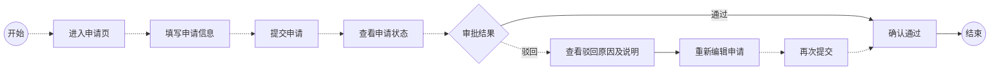
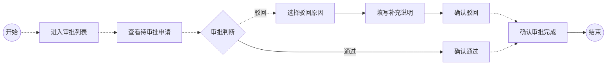

# 可视化用户旅程

## 0. 生成说明

- **输入优先级**：第 2 层（背景描述场景提取）
- **主要输入源**：source/background.md + source/requirement.md
- **补全策略**：从背景描述中提取"当前完整流程"骨架，将需求文档的改动点定位到对应位置

> ⚠️ 未基于体验蓝图生成（experience_blueprint.md 不存在）。当前旅程基于需求文档和背景描述推导，部分交互节点为推断补全。建议先运行 `generate-experience` 以获得更精确的交互流程定义。

## 1. 场景概览

| 属性 | 值 |
|---|---|
| **任务场景** | 企业内部权限申请审批流程 |
| **优先级** | 关键(Critical) |
| **用户目标** | "作为员工，我想要提交权限申请并获知审批结果（含驳回原因），以便根据反馈调整并重新申请" |
| **成功指标** | taskName `TRIP_PERMISSION_APPLY` 完成率、审批驳回重提率 |
| **涉及角色** | 员工、管理员 |
| **任务范围** | 审批驳回环节增加驳回原因填写和展示，驳回后支持重新编辑提交 |

## 2. 角色旅程总览

- 员工：进入申请页 [inferred] → 填写申请信息 [inferred] → 提交申请 [inferred] → 查看申请状态 [inferred] → 查看驳回结果及原因 [confirmed] → 重新编辑申请 [confirmed] → 再次提交 [inferred] → 确认申请通过 [inferred]
- 管理员：进入审批列表 [inferred] → 查看待审批申请 [inferred] → 判断是否通过 [inferred] → 填写驳回原因并驳回 [confirmed] / 通过申请 [inferred] → 确认审批完成 [inferred]

## 3. 旅程流程图

### 3.1 员工旅程

### 3.2 管理员旅程

## 4. 旅程节点详情

### 4.1 员工节点详情

#### N1：进入申请页 `[inferred]` `开始节点`

**用户动作：** 员工从导航或入口进入权限申请页面

**系统反馈：** 展示申请表单，包含权限类型选择、申请理由等字段

**成功标准：**
- [ ] 页面在 2 秒内加载完成
- [ ] 申请表单主要字段立即可见

**潜在摩擦：**
- 入口不明显 → 在导航中突出"权限申请"入口

---

#### N7：查看驳回原因及说明 `[confirmed]` `关键节点`

**用户动作：** 员工在申请详情页查看驳回结果

**系统反馈：** 展示驳回原因类型（信息不完整/权限范围不合理/不符合申请条件/其他）和补充说明文本

**成功标准：**
- [ ] 驳回原因和补充说明在详情页顶部清晰展示
- [ ] 员工能明确知道被驳回的具体原因

**潜在摩擦：**
- 驳回原因不够具体 → 管理员补充说明字段为选填，可能导致信息不足

---

#### N8：重新编辑申请 `[confirmed]` `关键节点`

**用户动作：** 查看驳回原因后点击"重新编辑"按钮

**系统反馈：** 跳转到申请编辑页，预填上次的申请信息，驳回原因作为参考展示

**成功标准：**
- [ ] 重新编辑按钮在驳回详情页可见
- [ ] 编辑页预填上次申请内容，减少重复输入

**潜在摩擦：**
- 员工不清楚哪些字段需要修改 → 驳回原因旁标注"请修改此项"

---

#### N0：开始 `[inferred]` `开始节点`
#### N2：填写申请信息 `[inferred]` `关键节点`
#### N3：提交申请 `[inferred]` `关键节点`
#### N4：查看申请状态 `[inferred]` `关键节点`
#### N5：审批结果判断 `[inferred]` `关键节点`
#### N6：确认通过 `[inferred]` `结束节点`
#### N9：再次提交 `[inferred]` `关键节点`
#### N10：结束 `[inferred]` `结束节点`

 

### 4.2 管理员节点详情

#### N25：选择驳回原因 `[confirmed]` `关键节点`

**用户动作：** 管理员在驳回原因下拉框中选择驳回原因类型

**系统反馈：** 下拉框展示四个选项：信息不完整、权限范围不合理、不符合申请条件、其他

**成功标准：**
- [ ] 驳回原因为必选，未选择时无法提交
- [ ] 选项语义清晰，管理员能快速判断应选哪个

**潜在摩擦：**
- 选项不够细化 → 提供"其他"+ 补充说明文本域支持自定义

---

#### N26：填写补充说明 `[confirmed]` `关键节点`

**用户动作：** 管理员在补充说明文本域中输入更详细的驳回说明

**系统反馈：** 文本域展开，支持多行输入

**成功标准：**
- [ ] 补充说明为选填，不强制
- [ ] 文本域有字数提示

**潜在摩擦：**
- 管理员不愿意填写 → 选填设计降低操作阻力

---

#### N27：确认驳回 `[confirmed]` `结束节点`

**用户动作：** 管理员选择驳回原因后点击确认驳回按钮

**系统反馈：** 提交驳回，接口返回成功后跳转回审批列表，toast 提示"已驳回"

**成功标准：**
- [ ] 驳回操作在 3 秒内完成
- [ ] 驳回后申请状态变更为"已驳回"

**潜在摩擦：**
- 误操作驳回 → 考虑是否需要二次确认（与本需求无关，暂不展开）

---

#### N20：开始 `[inferred]` `开始节点`
#### N21：进入审批列表 `[inferred]` `开始节点`
#### N22：查看待审批申请 `[inferred]` `关键节点`
#### N23：审批判断 `[inferred]` `关键节点`
#### N24：确认通过 `[inferred]` `关键节点`
#### N28：确认审批完成 `[inferred]` `结束节点`
#### N29：结束 `[inferred]` `结束节点`

## 5. 旅程缺口

- [ ] 缺少驳回后员工是否可多次重新提交的规则（次数限制、时间限制），影响"再次提交"节点表达
- [ ] 缺少驳回原因是否可作为后续审批参考（管理员再次审批时是否可见上次驳回原因）

## 附录：节点-埋点对照

| 节点标识 | 节点名称 | 角色 | 来源 | 节点类型 | 关联 taskNodeName |
|---|---|---|---|---|---|
| N1 | 进入申请页 | 员工 | inferred | 开始节点 | 进入申请页 |
| N2 | 填写申请信息 | 员工 | inferred | 关键节点 | 填写申请信息 |
| N3 | 提交申请 | 员工 | inferred | 关键节点 | 提交申请 |
| N4 | 查看申请状态 | 员工 | inferred | 关键节点 | 查看申请状态 |
| N5 | 审批结果判断 | 员工 | inferred | 关键节点 | — |
| N6 | 确认通过 | 员工 | inferred | 结束节点 | 查看通过结果 |
| N7 | 查看驳回原因及说明 | 员工 | confirmed | 关键节点 | 查看驳回原因 |
| N8 | 重新编辑申请 | 员工 | confirmed | 关键节点 | 重新编辑申请 |
| N9 | 再次提交 | 员工 | inferred | 关键节点 | 再次提交申请 |
| N21 | 进入审批列表 | 管理员 | inferred | 开始节点 | 进入审批列表 |
| N22 | 查看待审批申请 | 管理员 | inferred | 关键节点 | 查看待审批详情 |
| N23 | 审批判断 | 管理员 | inferred | 关键节点 | — |
| N24 | 确认通过 | 管理员 | inferred | 关键节点 | 确认审批通过 |
| N25 | 选择驳回原因 | 管理员 | confirmed | 关键节点 | 选择驳回原因 |
| N26 | 填写补充说明 | 管理员 | confirmed | 关键节点 | 填写补充说明 |
| N27 | 确认驳回 | 管理员 | confirmed | 结束节点 | 确认驳回 |
| N28 | 确认审批完成 | 管理员 | inferred | 结束节点 | 审批完成 |
