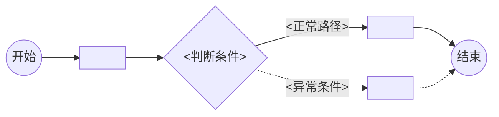
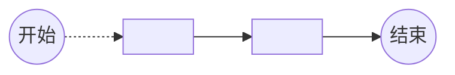

# 可视化用户旅程

> 本模板定义 `journey_visual.md` 的输出结构。
> 核心原则：以 Mermaid 流程图为主，文本路径列表为辅。所有节点展开详情（用户动作→系统反馈→成功标准→潜在摩擦），缺口不得自动补全。
> 参考 user-journeys skill 的体验评审结构，节点使用短语级表达，不展开为完整交互步骤。
> 每个节点标注来源属性：[confirmed] / [inferred] / [conflict]。
> 生成时请基于 `source/requirement.md` 中的实际角色、页面和交互路径填写，不得编造。

## 0. 生成说明

<!-- 说明本次使用的补全策略层级和输入源 -->

- **输入优先级**：第 <1/2/3> 层
- **主要输入源**：<experience_blueprint.md / background.md / requirement.md>
- **补全策略**：<已有体验蓝图复用 / 背景描述场景提取 / 纯需求推导 + 显式缺口>
- **降级提示**：<!-- 如果降级到第 2/3 层，输出以下提示 -->

> ⚠️ 未基于体验蓝图生成（experience_blueprint.md 不存在）。当前旅程基于需求文档和背景描述推导，部分交互节点为推断补全。建议先运行 `generate-experience` 以获得更精确的交互流程定义。

### 知识冲突说明

<!-- 仅在检测到冲突时填写，无冲突时可删除此小节 -->

| 冲突项 | 知识库规则 | 需求文档主张 | 影响节点 |
|---|---|---|---|
| <冲突描述> | <规则内容（引用 knowledge-root/raw/ 路径）> | <需求中的主张> | Nx, Ny |

> ⚠️ 以上冲突已按需求文档生成埋点，标记为 [conflict]。建议运行 `generate-business` 进行正式业务判断。

## 1. 场景概览

| 属性 | 值 |
|---|---|
| **任务场景** | <本次覆盖的完整任务场景描述> |
| **优先级** | 关键(Critical) / 重要(High) / 一般(Medium) |
| **用户目标** | "作为<角色>，我想要<目标>，以便<收益>" |
| **成功指标** | <如何衡量旅程完成，如 taskName 完成率、节点转化率> |
| **涉及角色** | <角色 A>、<角色 B> |
| **任务范围** | <本次需求覆盖的功能范围> |

## 2. 角色旅程总览

<!-- 每个角色一行，节点后标注 [confirmed] / [inferred] / [conflict] -->

```md
- <角色 A>：<进入入口> [confirmed] → <发起操作> [confirmed] → {判断条件} [inferred] → <结果确认> [confirmed]
- <角色 B>：<接收通知> [inferred] → <判断是否处理> [confirmed] → <处理操作> [confirmed] → <结果通知> [inferred]
```

## 3. 旅程流程图

<!-- 每个角色一个独立 Mermaid 图块 -->
<!-- 实线箭头 --> = confirmed，虚线箭头 -.-> = inferred/conflict -->
<!-- 分支用菱形 {}，始终点用圆角 () -->

### 3.1 <角色 A> 旅程



### 3.2 <角色 B> 旅程



## 4. 旅程节点详情

<!-- 所有节点展开详情，每个节点一个 block。按角色分组，标注节点类型。 -->

### 4.1 <角色 A> 节点详情

#### N1：<节点名称> `[confirmed]` `开始节点`

**用户动作：** <用户做了什么操作>

**系统反馈：** <系统如何响应，用户看到什么>

**成功标准：**
- [ ] <判断该节点完成的标准，如：页面在 2 秒内加载完成>
- [ ] <判断用户理解下一步的标准，如：主要操作按钮立即可见>

**潜在摩擦：**
- <可能卡住用户的问题> → <应对方案>

---

#### N2：<判断节点名称> `[inferred]` `关键节点`

**用户动作：** <用户做了什么判断或操作>

**系统反馈：** <系统根据判断给出的不同响应>

**成功标准：**
- [ ] <正常路径的判断标准>
- [ ] <异常路径的判断标准>

**潜在摩擦：**
- <可能的判断歧义> → <应对方案>

---

#### N3：<节点名称> `[confirmed]` `结束节点`

**用户动作：** <用户的最后操作>

**系统反馈：** <结果确认的反馈>

**成功标准：**
- [ ] <结果确认完成的标准>

**潜在摩擦：**
- <可能的困惑> → <应对方案>

<!-- 重复以上结构，为所有节点生成详情 -->

### 4.2 <角色 B> 节点详情

<!-- 同上结构，为每个角色的每个节点展开 -->

## 5. 旅程缺口

<!-- 仅当存在无法确定的信息时填写，不得编造 -->

- [ ] <缺少入口页面依据，影响 <角色> 的起点节点表达>
- [ ] <缺少结果通知规则，影响 <角色> 的结果确认节点>

## 6. 知识冲突项

<!-- 仅当检测到冲突时填写，无冲突可删除此章节。与 ## 0 中的冲突说明呼应。 -->

1. **<冲突标题>**
   - 知识库规则：<规则内容>（来源：`knowledge-root/raw/业务/<path>.md`）
   - 需求文档主张：<主张内容>
   - 当前处理：按需求生成，标记为 [conflict]
   - 影响节点：<Nx, Ny>
   - 影响埋点事件：<event_id_1, event_id_2>
   - 建议：运行 `generate-business` 做正式业务判断

## 附录：节点-埋点对照

<!-- 帮助读者快速定位每个旅程节点对应的埋点事件 -->

| 节点标识 | 节点名称 | 角色 | 来源 | 节点类型 | 关联 taskNodeName |
|---|---|---|---|---|---|
| N1 | <节点名称> | <角色> | confirmed | 开始节点 | <taskNodeName> |
| N2 | <判断节点名称> | <角色> | inferred | 关键节点 | <taskNodeName> |
| N3 | <节点名称> | <角色> | conflict | 结束节点 | <taskNodeName> |
