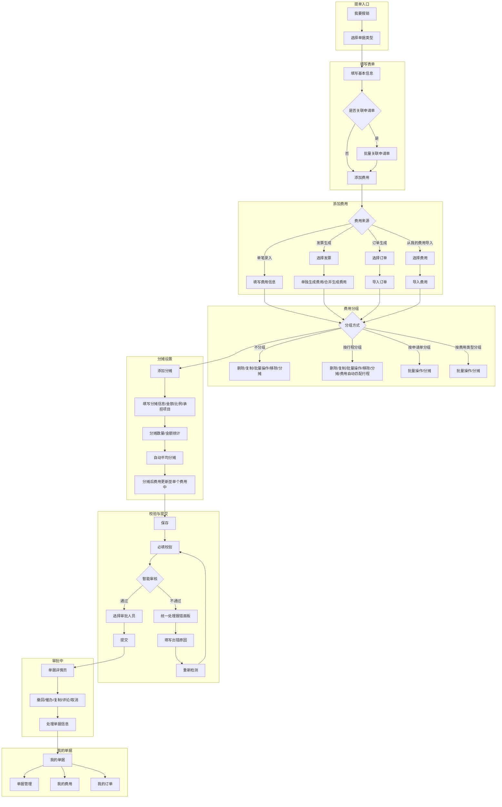
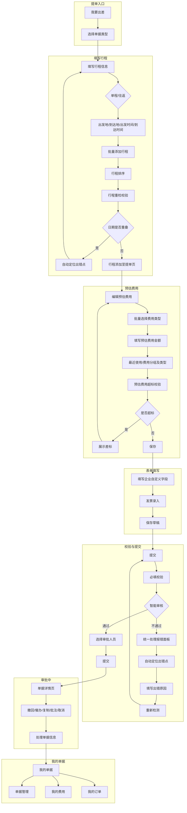
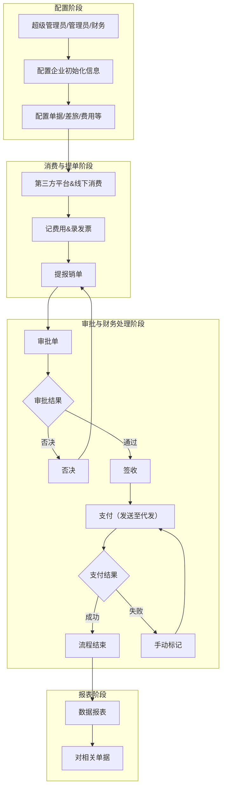

# 任务与路径

## 适用范围与维护边界

本文件记录费用管理的任务场景与端到端服务流程。

## 快速导航

- [任务场景](#任务场景)
- [服务流程](#服务流程)

## 任务场景

### 典型任务

- 员工发起报销：选择单据类型，填写表单，添加行程、发票和费用，处理校验后提交审批。
- 员工发起出差：填写出差申请，维护行程，按企业差旅政策进行预订、报销和结算。
- 财务审核单据：查看单据详情、费用明细、发票详情和审核结果，处理修改、变更、支付和台账。
- 管理员配置费用体系：配置费用类型、表单、管控规则、预算、支付、核算和界面展示。
- 企业管理商旅消费：开通商旅平台，管理员工预订、订单、月结对账和商务卡。
- 管理层查看费用数据：查看员工、部门、流程效率、合规、借款、订单和预算相关报表。

### 触发条件

- 员工存在差旅、日常报销、借款、费用申请或企业消费需求。
- 企业需要对费用标准、预算、发票、审批或支付进行管控。
- 财务需要完成审核、支付、记账、对账或台账管理。
- 管理员需要配置单据、表单、流程、预算、支付或核算规则。

### 参与角色

- 员工：发起申请、报销、借款、预订和费用提交。
- 审批人：审批、退回、否决、加签、转派或评论单据。
- 财务人员：审核、修改、签收发票、处理借还款、台账和支付。
- 管理员：配置费用体系、表单流程、预算、支付、核算和商旅平台。
- 管理层：查看费用、预算、流程效率和合规分析报表。

### 关键路径

- 差旅服务：出差申请 → 商旅预订 → 因公消费 → 自动生成报销单 → 审批 → 结算。
- 日常报销：填报销单 → 提交审批 → 发票核验 → 财务审核 → 支付打款。
- 对公报账：供应商对账 → 发起对公报账单 → 关联采购/合同 → 审批 → 支付。
- 员工提单：选择单据类型 → 填写表单 → 添加费用/发票/订单/合同 → 校验 → 提交审批。

### [GAP] / [CONFLICT] / [QUESTION]

- [GAP] 费用管理各子域之间的统一任务入口与跨端差异仍需结合产品页面继续核验。

## 服务流程

### 来源与边界

- 来源：`docs/yewuzhishi/费控知识/03_xft_expense_capabilities.codex.md`
- 版本：V1.0
- 日期：2026-05-20
- 本文件保留来源中的完整流程节点、分支与连接关系，仅修复来源缺失的 Markdown 代码围栏。
- “合并报销服务流程”只表达该流程内的费用来源分支，不承担费用管理整体“费用添加方式”的完整枚举。
- 费用管理整体员工提单中的费用添加能力见 [功能与操作清单](功能与操作清单.md#费用添加)。

### 合并报销服务流程

### 出差申请服务流程

### 费控总流程服务流程

### [GAP] / [CONFLICT] / [QUESTION]

- [QUESTION] “数据报表 → 对相关单据”的后续动作在来源中未继续定义，不补写推断流程。

## [GAP] / [CONFLICT] / [QUESTION]
