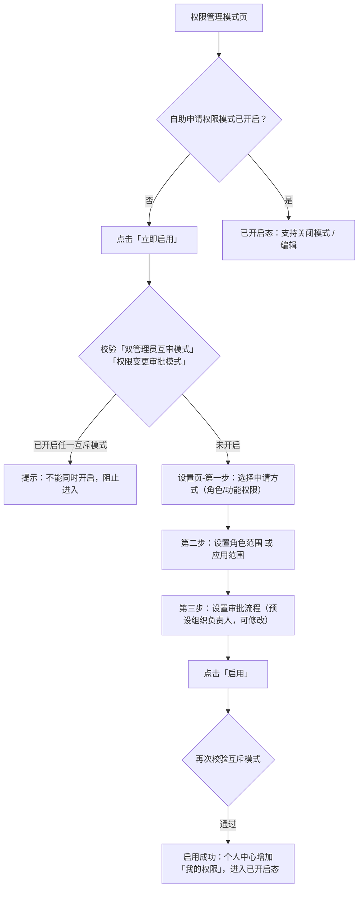
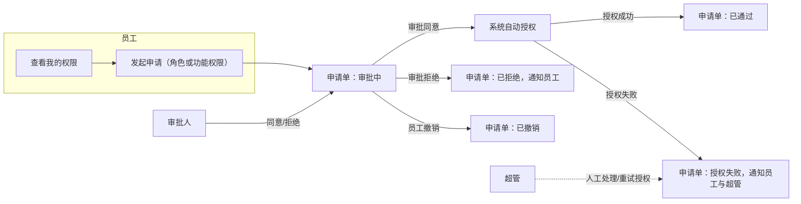
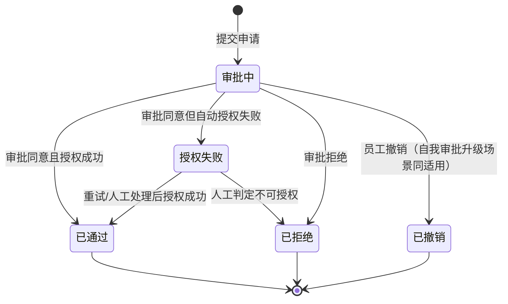
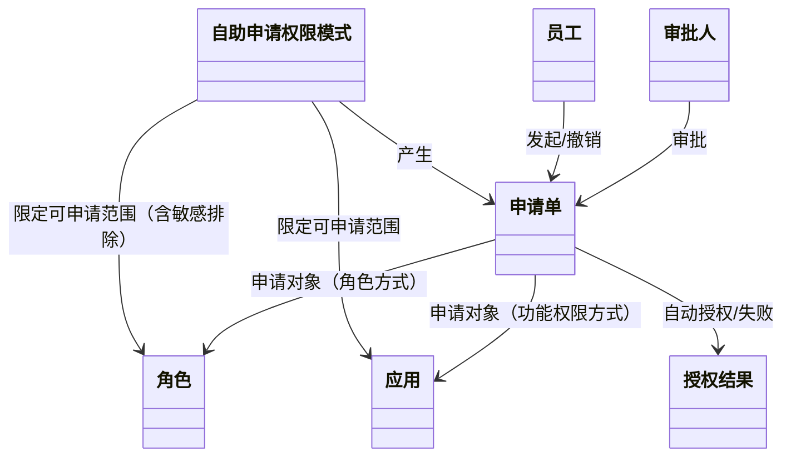

# 员工自助申请权限 PRD

## 0. 文档信息

| 字段 | 内容 |
|---|---|
| 文档标题 | 员工自助申请权限 PRD |
| 版本 | V1.0 |
| 作者 | 产品 |
| 创建日期 | 2026-08-09 |
| 最后更新 | 2026-08-09 |
| 状态 | 评审稿（核心规则已确认，少量假设见 §10） |
| 关联需求/任务 | 需求文档_员工自助申请权限2.md |

## 1. 背景与目标

### 1.1 业务背景

- **为什么现在做**：中大型企业员工多、流动大，当前权限分配与核对全部由权限管理员/超级管理员统一承担，分配与查询时效和效率有提升空间；将"申请与核对"分散到员工侧可显著降低管理员工作量。
- **当前现状**：权限由超管/权限管理员统一分配；员工无法自助查询自己的权限，也无法自助申请新权限；需新增权限时私下找管理员（大型企业中老板/管理员常为一人，存在沟通与教学成本）。
- **影响范围**：管理后台（超管配置）、个人中心（员工自助）、流程审批（审批人）、授权服务（自动分配）。

### 1.2 目标

- **业务目标**：提升权限分配与核对效率，将权限分配工作量从"集中"转为"分散"；首期新增 3 家使用企业（种子客户：诺思格(北京)医药科技股份有限公司）。目标期：3 个月（假设，待定）。
- **产品目标**：支持员工自助查询个人权限、自助申请角色/功能权限，经审批通过后系统自动分配权限；超管可配置启用范围与审批流程。
- **非目标（Out of Scope，本期 P0 不做）**：
  - 员工申请"部分数据权限"（仅默认申请功能的所有数据权限，部分数据权限需联系管理员授权）
  - 敏感组织维度的不可申请配置（仅支持敏感角色）
  - 申请记录导出、审批超时自动升级/催办（无强制 SLA）
  - 数据权限 tab 的自助申请

## 2. 用户与场景

### 2.1 用户角色

| 角色 | 入口 | 核心诉求 | 权限差异 |
|---|---|---|---|
| 超级管理员 | 管理后台-权限管理 | 配置/启用/关闭/编辑自助申请权限模式、维护敏感角色、查看操作记录 | 模式配置属超管专属功能，其他用户（含权限管理员）不可授予该权限 |
| 普通员工 | 个人中心 | 自助查询我的权限、申请角色/功能权限、撤销在途申请 | "我的权限"与"申请权限"为全员功能，无需单独授权 |
| 权限管理员 | 个人中心（作为企业成员身份） | 同普通员工自助能力 | 可自助查询/申请；**不可**配置自助申请权限模式 |
| 审批人（组织负责人） | 审批待办 | 审批员工申请，同意/拒绝 | 默认审批人；审批流程可由超管自定义 |
| 服务人员 | 无 | 不参与本功能 | "我的权限"与"申请权限"均无入口 |

### 2.2 核心场景

| 场景 ID | 场景名称 | 触发条件 | 成功结果 | 优先级 |
|---|---|---|---|---|
| S01 | 超管启用自助申请权限模式 | 企业权限管理模式中存在自助申请权限模式且未启用 | 配置申请方式/范围/审批流程并启用成功 | P0 |
| S02 | 员工查看我的权限 | 企业已开启模式，员工进入个人中心-我的权限 | 员工可查看功能权限/数据权限/角色 | P0 |
| S03 | 员工申请角色权限 | 模式申请方式为"申请角色"，员工发起申请 | 提交成功进入审批，通过后自动关联角色 | P0 |
| S04 | 员工申请功能权限 | 模式申请方式为"申请功能权限"，员工发起申请 | 提交成功进入审批，通过后自动授予功能权限 | P0 |
| S05 | 审批人审批申请 | 员工提交申请后生成审批待办 | 同意/拒绝并产生明确结果，触发自动授权或通知 | P0 |
| S06 | 员工撤销在途申请 | 申请处于审批中，员工点击撤销 | 申请单变更为已撤销 | P0 |
| S07 | 超管关闭模式 | 模式已开启，超管点击关闭 | 无在途流程时关闭成功，员工停止自助入口 | P0 |
| S08 | 超管维护敏感角色 | 超管配置不可申请角色 | 敏感角色移出员工可申请范围 | P0 |

### 2.3 关键流程图（管理端配置流程）

### 2.4 角色协作 / 责任关系图（员工申请与审批链路）

### 2.5 权限矩阵

| 角色 | 可查看 | 可创建 | 可编辑 | 可审批/推进 | 可删除/撤回 | 限制说明 |
|---|---|---|---|---|---|---|
| 超级管理员 | 模式设置、敏感角色、操作记录 | 模式配置 | 模式配置（编辑态） | 关闭/启用模式 | — | 模式配置属超管专属，不可授予他人 |
| 普通员工 | 我的权限（功能/数据/角色） | 权限申请单 | — | — | 撤销审批中的申请 | 仅能申请管理端开放的角色/应用范围 |
| 权限管理员 | 我的权限、申请记录 | 权限申请单 | — | — | 撤销审批中的申请 | 不可配置模式 |
| 审批人（组织负责人） | 审批待办 | — | — | 审批同意/拒绝 | — | 申请人=审批人时自动升级至其上级 |
| 服务人员 | 无 | 无 | — | — | — | 本功能无入口 |

> 对应后台增强产物：`AX01 权限矩阵` 已由本表覆盖。

## 3. 核心功能需求

### F01 自助申请权限模式（超管专属）

- 触发条件：超管进入权限管理模式，存在"自助申请权限模式"入口。
- 处理逻辑：
  1. 模式未开启时展示说明文案与「立即启用」入口；点击"了解更多"跳转帮助文档（链接待补充）。
  2. 点击「立即启用」校验「双管理员互审模式」「权限变更审批模式」是否开启，任一开启则提示"企业已开启「XX」，不能同时开启此模式"，阻止进入。
  3. 通过校验后进入设置页（仍为未开启状态）：
     - 第一步「选择员工申请权限的方式」：单选"申请角色 / 申请功能权限"，默认"申请角色"，必选；对应展示提示文案。
     - 第二步按第一步分支：
       - 申请角色 →「设置角色范围」：全部角色 / 部分角色（单选，默认全部）；部分角色弹窗支持搜索、展示角色名称/说明/状态、分页；范围含已启用+已停用角色；设置项"后续新增角色自动加入可申请范围"默认选中；另含敏感角色排除（见 F06）。
       - 申请功能权限 →「设置应用范围」：全部应用 / 部分应用（单选，默认全部）；部分应用弹窗支持搜索、展示应用名称/终端/启用状态、分页；范围含已添加（启用+停用）应用；设置项"后续新应用自动加入可申请范围"默认选中。
     - 第三步「设置审批流程」：提示预设审批人为"员工所在组织的组织负责人"；点击"修改审批流程"进入表单编辑页（F03）；返回后设置页不刷新。
  4. 点击「取消」返回权限管理模式页；点击「启用」再次校验互斥模式，通过则启用成功：toast 提示、个人中心增加"我的权限"入口、申请提交后发起审批流程、页面刷新为已开启态。
- 输出结果：模式配置落库；启用后员工侧出现自助入口。

### F02 自助申请权限模式-已开启/编辑/关闭态

- 触发条件：模式已启用。
- 处理逻辑：
  1. 已开启态不可编辑，展示提示语"此模式已开启，员工可以自助查询和申请个人权限。申请通过后，系统自动分配权限。"及"帮助文档"链接（待补充），并展示「关闭模式」「编辑」按钮。
  2. 点击「关闭模式」弹二次确认："关闭模式后，员工将无法自助查询和申请权限，请确认是否关闭自助申请模式？"（按钮：不关闭/确认关闭）。
  3. 确认关闭时校验是否存在在途流程；有在途则关闭失败，弹窗"当前有申请流程未完成审批，请联系审批人审批完成，再关闭模式"（按钮：知道了）；无在途则关闭成功，toast"关闭「自助申请权限模式」成功"。
  4. 点击「编辑」隐藏关闭/编辑按钮，进入可编辑态，底部出现「取消编辑」「确认编辑」；确认后 toast"编辑成功"。
- 输出结果：模式状态在启用/关闭/编辑之间正确迁移，员工侧入口随模式状态显示/隐藏。

### F03 表单编辑页（审批流程自定义）

- 触发条件：超管在设置页第三步点击"修改审批流程"。
- 处理逻辑：打开"表单编辑"子页面，可调整审批节点/流程；点返回回到设置页，页面不刷新。
- 输出结果：审批流程配置保存并生效（默认为组织负责人，可自定义）。

### F04 我的权限（员工）

- 触发条件：企业已开启自助申请权限模式；企业用户进入个人中心。
- 处理逻辑：
  1. 未开启模式的企业，用户不展示"我的权限"；服务人员无入口。
  2. "我的权限"无需授权，属全员功能；展示于"我的企业"下方。
  3. 进入独立页面，含 3 个 tab：功能权限、数据权限、角色（默认选中功能权限；文档原文"2个tab"为笔误，按 3 个 tab 实现）。
  4. 功能权限 tab：展示用户有权限的应用与功能权限列表（含全员应用与管理类应用、全员功能与管理类功能）。
  5. 数据权限 tab：展示用户拥有的数据权限，交互与数据对齐"用户授权-权限详情"。
  6. 角色 tab：展示用户关联的所有角色，交互与数据对齐"用户授权-权限详情"。
  7. tab 无数据时展示占位图与提示语："您没有功能权限 / 您没有数据权限 / 您没有关联的角色"。
- 输出结果：员工可自助查询个人权限全貌。

### F05 申请权限抽屉（员工）

- 触发条件：员工点击"申请权限"。
- 处理逻辑：
  1. 申请人：默认带出当前用户名称，不可编辑。
  2. 申请原因：必填，提示词"请填写申请原因"，最多 500 字。
  3. 抽屉内容按管理端配置的申请方式展示对应区块（管理端配置决定员工端可见范围）：
     - 申请功能权限：提示语"提交申请后，默认申请功能的所有数据权限。如需申请部分数据权限，请联系企业管理员授权。"；内容区复用功能权限设置组件，应用范围仅含管理端设置的"应用范围"。
     - 申请角色：表格展示勾选项、角色名称、角色说明；角色范围=管理端设置的"角色范围"中的**已启用**角色。
  4. 提交校验（任一不通过则阻止提交并提示原因）：
     - 为非资金用户授予"代发付款"类权限 → 资金用户校验失败；
     - 为子管理员授予子管理员模式权限 → 子管理员模式校验失败；
     - 特殊身份默认权限校验；
     - 实名要求校验。
  5. 申请记录（抽屉内区块）：
     - 筛选项：申请日期、审批状态（已通过/已拒绝/审批中/已撤销）。
     - 列表字段：申请时间（年月日 时分秒）、申请原因、申请内容（角色显示名称；功能权限显示"查看详情"链接，点击打开静态抽屉）、审批状态、操作（撤销，仅审批中可点）。
     - 分页展示。
- 输出结果：申请提交后生成申请单并发起审批流程；申请记录可查询、可筛选、在途可撤销。

### F06 敏感角色配置（超管）

- 触发条件：超管维护不可通过申请获得的角色。
- 处理逻辑：在自助申请权限模式设置页内提供敏感角色维护入口；被标记为敏感的角色自动移出员工可申请范围，且不受"全部角色/后续新增自动加入"影响。
- 输出结果：敏感角色不可被员工自助申请，形成防越权防线。

### F07 操作记录

- 触发条件：命中关键链路操作。
- 处理逻辑：记录以下操作并留痕——超管对模式的配置/启用/关闭/编辑、敏感角色维护、员工申请提交/撤销、审批通过/拒绝、自动授权结果（含失败原因）。
- 输出结果：操作日志可查可审计。

### F08 数据埋点

- 触发条件：命中关键行为。
- 处理逻辑：采集事件包括模式启用、申请提交、审批结果、授权结果、页面访问；字段对齐企业既有埋点规范（具体事件字段由数据组补充，见 §10 待确认）。
- 输出结果：埋点事件按既有规范上报。

## 4. 业务规则

| 规则 ID | 规则名称 | 适用范围 | 规则说明 | 异常/失败反馈 |
|---|---|---|---|---|
| R01 | 模式互斥 | 模式启用 | 与「双管理员互审模式」「权限变更审批模式」互斥，启用/进入前校验 | 提示"企业已开启「XX」，不能同时开启此模式" |
| R02 | 超管专属 | 模式配置 | 模式配置/启用/关闭/编辑仅超管可操作 | 其他角色不可见/不可授予 |
| R03 | 申请方式单选 | 模式设置 | "申请角色/申请功能权限"单选，决定员工端可见范围 | — |
| R04 | 角色范围 | 员工申请 | 可申请范围=超管配置角色范围；含已启用+已停用角色；排除敏感角色 | 超出范围角色不可选择 |
| R05 | 应用范围 | 员工申请 | 可申请范围=超管配置应用范围及对应功能权限 | 超出范围应用不可选择 |
| R06 | 后续自动加入 | 模式设置 | "后续新增角色/应用自动加入可申请范围"默认开启，可关闭 | — |
| R07 | 审批流程 | 审批 | 预设审批人=员工所在组织负责人；可自定义；申请人=审批人时自动升级至其上级（自我审批拦截） | 升级审批人待办 |
| R08 | 提交校验 | 申请提交 | 申请原因必填≤500字；资金用户/子管理员/特殊身份/实名校验不通过则阻止提交 | 阻断提交并提示具体校验失败原因 |
| R09 | 增量授权 | 授权 | 审批通过后为员工追加角色/功能权限，不覆盖已有权限 | — |
| R10 | 重新申请 | 申请生命周期 | 已拒绝/已撤销后允许重新发起新申请，无冷却期 | — |
| R11 | 撤销限制 | 申请生命周期 | 仅审批中的申请可撤销 | 其他状态撤销按钮不可点 |
| R12 | 关闭条件 | 模式关闭 | 关闭模式需无在途流程 | 有在途则关闭失败并提示 |
| R13 | 授权失败 | 授权 | 审批通过但自动授权失败时，申请单进入"授权失败"，通知员工与超管，可重试或人工处理 | 见 §5 异常流程 |
| R14 | 数据权限口径 | 申请 | MVP 不申请部分数据权限；通过后默认授予该功能所有数据权限 | 文案提示联系管理员申请部分数据权限 |
| R15 | 我的权限开放 | 我的权限 | 全员功能，无需授权；未开启模式企业不展示；服务人员无入口 | — |
| R16 | 敏感角色 | 申请范围 | 敏感角色不可被员工自助申请 | 敏感角色不出现在可申请列表 |
| R17 | 操作留痕 | 全链路 | 关键操作均记录操作日志 | — |

### 4.1 状态流转图（申请单生命周期）

> 说明："授权失败"为正式状态（非标签），表示审批已通过但自动分配未完成，可进入重试或人工处理。

### 4.2 状态流转表

| 对象 | 当前状态 | 触发动作 | 下一状态 | 可操作角色 | 校验/限制 | 反馈/通知 |
|---|---|---|---|---|---|---|
| 申请单 | 无（新单） | 提交申请 | 审批中 | 员工 | 提交校验通过（R08） | 生成审批待办 |
| 申请单 | 审批中 | 审批同意 | 已通过/授权失败 | 审批人 | 审批人通过且授权成功→已通过；授权失败→授权失败 | 通知员工 |
| 申请单 | 审批中 | 审批拒绝 | 已拒绝 | 审批人 | 拒绝需留审批结果 | 通知员工 |
| 申请单 | 审批中 | 撤销 | 已撤销 | 员工 | 仅审批中可撤销（R11） | toast 撤销成功 |
| 申请单 | 授权失败 | 重试授权 | 已通过 | 超管/系统 | 重试成功后 | 通知员工 |
| 申请单 | 授权失败 | 人工判定 | 已通过/已拒绝 | 超管 | 人工处理 | 通知员工 |

## 5. 异常流程

| 异常场景 | 触发条件 | 处理方式 | 通知对象/反馈 |
|---|---|---|---|
| 模式互斥校验失败 | 已开启互斥模式时启用/进入 | 阻止进入，提示具体互斥模式名 | 超管 |
| 关闭模式有在途流程 | 关闭时存在审批中申请 | 关闭失败，弹窗提示先完成审批 | 超管 |
| 提交校验失败 | 资金用户/实名/子管理员等不通过 | 阻止提交并提示具体失败原因 | 员工 |
| 自动授权失败 | 审批通过但系统自动分配权限失败 | 申请单进入"授权失败"，可重试/人工处理 | 员工、超管 |
| 自我审批 | 申请人为组织负责人本人 | 自动升级至其上级审批 | 上级审批人 |
| 敏感角色申请 | 员工尝试申请被标记角色 | 敏感角色不出现/不可选 | 员工（列表不可见） |
| 员工无数据 | tab 无数据 | 展示占位图与对应提示语 | 员工 |

> 对应后台增强产物：`AX04 异常与审计矩阵` 由本表 + §3 F07 覆盖。

## 6. 页面清单

| 页面 ID | 页面名称 | 工作面类型 | 路由/位置 | 用户目标 | 入口/出口 | 关键状态 | 优先级 |
|---|---|---|---|---|---|---|---|
| P01 | 权限管理模式页 | page | 管理后台-权限管理 | 超管查看权限管理模式并进入自助申请配置 | 入口：权限管理；出口：进入 P02 | 默认 / 已开启态 | P0 |
| P02 | 自助申请权限模式设置页 | step flow / configuration panel | P01 内"立即启用" | 超管配置申请方式、范围、审批流程并启用 | 入口：P01；出口：取消返回 P01 / 启用进入已开启态 | 未开启 / 已开启 / 编辑态 / 互斥校验失败 | P0 |
| P03 | 表单编辑页（审批流程） | full page edit | P02"修改审批流程" | 超管自定义审批流程 | 入口：P02；出口：返回 P02 不刷新 | 默认 / 保存 | P0 |
| P04 | 我的权限 | page | 个人中心-我的权限 | 员工查看功能权限/数据权限/角色 | 入口：个人中心"我的权限"；出口：返回个人中心 | 默认 / 空态（无权限提示）/ 未开启企业不展示 | P0 |
| P05 | 申请权限抽屉 | drawer | 个人中心-申请权限 | 员工提交角色或功能权限申请、查看申请记录 | 入口：个人中心"申请权限"；出口：关闭抽屉 | 默认 / 校验失败 / 提交成功 / 申请记录列表（空态/分页） | P0 |
| P06 | 敏感角色配置 | modal | P02 设置页内 | 超管维护不可申请角色 | 入口：P02；出口：确认返回 | 默认 / 空态 | P0 |

## 7. 依赖与风险

### 7.1 依赖

| 依赖项 | 类型 | 说明 | 状态 |
|---|---|---|---|
| 流程引擎 / OA 审批 | 系统/接口 | 审批流程对接；审批单由系统发起，不依赖 OA 手工发起人逻辑 | 已确认复用既有能力 |
| 自动授权服务 | 系统/接口 | 审批通过后系统自动分配角色/功能权限，含失败回执 | 需确认授权接口的失败反馈能力 |
| 用户授权-权限详情 | 页面/数据 | "我的权限"数据权限、角色 tab 复用其交互与数据 | 已确认复用 |
| 功能权限设置组件 | 组件 | 申请功能权限区块复用 | 已确认复用 |
| 组织架构服务 | 系统/接口 | 审批人=组织负责人、自我审批升级上级 | 已确认 |
| 权限系统角色/应用数据 | 数据 | 角色范围、应用范围（含已停用） | 已确认 |

### 7.2 风险与假设

| 类型 | 内容 | 影响 | 应对方式 |
|---|---|---|---|
| 待确认 | 帮助文档链接（"了解更多"/"帮助文档"） | 低 | 上线前补充链接 |
| 待确认 | 埋点具体事件字段对齐规范 | 低 | 由数据组按既有埋点规范补充 |
| 待确认 | 审批无强制 SLA、无超时升级/催办 | 中 | 本期按无 SLA 处理；如客户反馈审批滞后，后续版本补 PB01 SLA 机制 |
| 假设 | 目标期 3 个月、首期 3 家客户 | 中 | 以运营口径为准 |
| 假设 | 权限管理员在员工侧可自助（作为企业成员） | 低 | 如需限制可按客户配置 |
| 假设 | 模式关闭后员工侧"我的权限"入口隐藏，历史权限不变 | 低 | 关闭只停自助，不清除已授权 |

## 8. 关键对象关系图

## 9. 验收标准

| 场景/能力 | 输入或前置条件 | 预期结果 | 通过标准 |
|---|---|---|---|
| 模式互斥校验 | 已开启双管理员互审模式，超管进入自助申请模式 | 提示不能同时开启，阻止进入 | 提示文案正确且无法继续启用 |
| 启用成功 | 未开启互斥模式，完成三步配置后点启用 | 启用成功、个人中心出现"我的权限" | toast 出现、入口出现、页面进入已开启态 |
| 角色范围生效 | 配置"部分角色"，员工发起申请 | 员工仅能看到可申请角色 | 列表不出现未授权角色与敏感角色 |
| 申请提交校验 | 非资金用户提交代发付款类权限 | 提交被阻止并提示资金用户校验失败 | 无法提交且提示明确 |
| 审批通过授权 | 审批人同意，系统授权成功 | 申请单变更为已通过，员工自动关联角色/功能权限 | 状态正确、授权生效 |
| 授权失败处理 | 审批同意但授权失败 | 申请单进入授权失败，员工与超管收到通知 | 状态为授权失败、可重试/人工处理 |
| 自我审批升级 | 申请人为组织负责人本人 | 审批自动升级至其上级 | 上级收到待办 |
| 撤销申请 | 申请审批中，员工点撤销 | 申请单变更为已撤销 | 状态正确、撤销按钮仅审批中可点 |
| 关闭模式有在途 | 存在审批中申请时关闭 | 关闭失败并提示 | 提示文案正确、模式仍开启 |
| 我的权限空态 | 员工无任何功能权限 | 展示占位图与"您没有功能权限" | 提示语正确 |

## 10. 待确认项与下一步

- **当前待确认**：
  1. 帮助文档链接（两处"了解更多"/"帮助文档"）
  2. 数据埋点具体事件字段（对齐企业既有规范）
  3. 审批是否需 SLA/超时升级（本期假设无）
  4. 目标期与客户数口径（假设 3 个月 / 3 家）
- **推荐下一步**：
  1. 评审本 PRD，确认 §2.1 角色边界与 §4 业务规则；
  2. 由后端确认自动授权接口的失败回执能力（依赖项）；
  3. 如需进入页面生成，可将本 PRD 作为输入发起 `hiui-page-workflow`，产出页面清单与页面级提示词。

---

## 附录：后台增强产物覆盖说明

| 产物 ID | 名称 | 覆盖位置 | 状态 |
|---|---|---|---|
| AX01 | 权限矩阵 | §2.5 权限矩阵 | 已确认 |
| AX02 | 状态流转表 | §4.1 / §4.2 申请单生命周期 | 已确认 |
| AX04 | 异常与审计矩阵 | §5 异常流程 + §3 F07 操作记录 | 已确认 |
| AX03 | 字段字典 | 本期以 §3 功能说明为准，如需字段级字典另行补充 | 可延后 |
| AX05 | 批量/导入导出规范 | 本期不涉及批量、导入导出 | 不适用 |
| AX06 | 存量系统改造与发布策略 | 本期为新增功能，无存量迁移 | 不适用 |

> 命中 Playbook：主 `PB01 工单/审批/SLA`（申请单审批流、自我审批拦截、审批人责任）；补充 `PB03 账号/组织/权限`（超管专属、数据权限口径、敏感角色防越权）。
