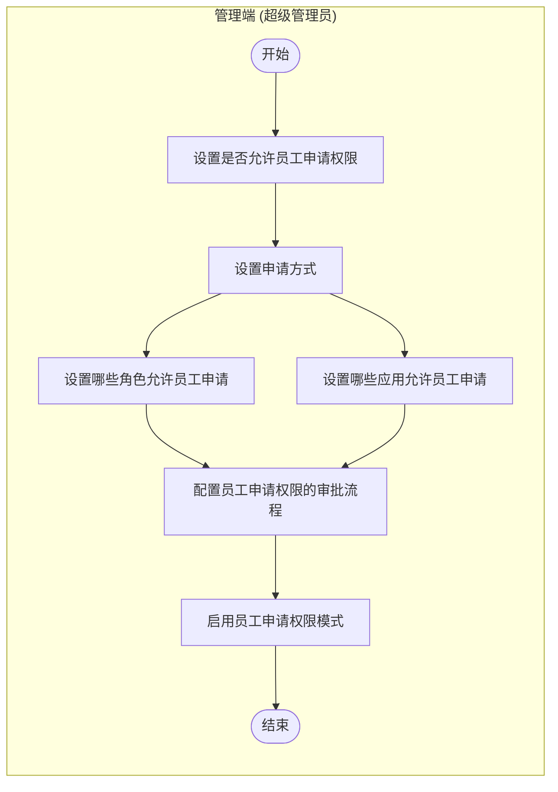
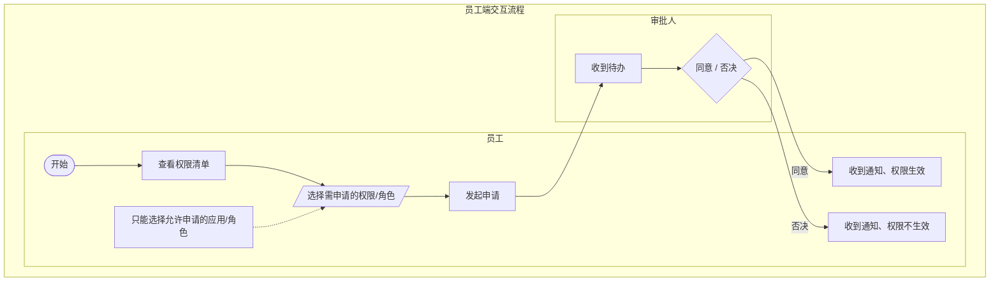

任务摘要：员工自助申请权限
本次要解决什么
为企业新增**"员工自助申请权限"模式**，让员工可以在个人中心查看自己的权限、主动申请角色或功能权限，经过审批后系统自动分配。把权限分配工作从超管一个人身上，分散到员工自助完成。

你真正关心什么
从文档来看，核心关注点有三个：

超管配置端：新增第三种权限治理模式（自助申请模式），与现有的"双管理员互审模式"互斥，超管可以设定申请方式、可申请的范围、审批流程
员工使用端：个人中心新增"我的权限"查看入口 + "申请权限"操作入口，员工能看自己能干什么、能申请什么
审批串联：申请提交后走 OA 审批流程，审批通过后系统自动授权
已知信息
用户调研：10 名实施同事中 6 名认可价值，核心场景是"员工不好意思找老板要权限"
竞品情况：只有金蝶支持类似功能，钉钉/飞书/泛微均不支持
功能清单已明确：5 个功能点（3.1~3.5），优先级均为"中"
交互流程已有 mermaid 图，详细功能说明覆盖了配置端和员工端的完整交互
价值指标：新增 3 家客户使用
不阻塞的不确定点
帮助文档链接标了"待补充"，不影响方案设计
审批流程的"默认复核人员"被标了风险，需要在方案中特别处理
"OA 的可发起人去掉"这句话需要确认具体含义
种子客户目前只列了 1 家（诺思格），另一个空着
与现有知识库的关系
这个需求直接触碰了仓库中最成熟的 权限管理域（22 个知识文件），包括：

四层决策链（可见性 → 功能权限 → 数据范围 → 治理生效）
治理状态模型和模式互斥规则
现有的"双管理员互审模式"和"权限变更审批模式"
需要注意：新需求对"模式互斥"的范围比现有知识库记录的要更广（现有规则只说双管理员与子管理员互斥，但需求中要求自助申请模式与双管理员互审模式也互斥）。这是方案设计时需要明确处理的冲突点。

建议执行深度
完整业务蓝图 + 体验蓝图。原因：

涉及 3 个功能模块（管理端配置、员工端查看、员工端申请）+ 审批串联
需要与现有的权限治理模式体系做一致性设计
有多条需要明确的业务规则（互斥校验、角色/应用范围过滤、在途流程阻断关闭等）
建议任务名 / project-id
任务名：员工自助申请权限
project-id：self-service-permission
以上是任务摘要，你看有没有遗漏或需要调整的地方？确认后我马上创建正式任务、走主链路出蓝图。

确认
好的，我先确认一下主链路的执行方式。

Bash 查看 packages 主链路命令帮助
IN
cd "e:\AI设计\体验蓝图构建思路" && python -m packages --help

OUT
usage: python -m packages [-h]
                          {bootstrap,assemble,generate-facts,generate-business,generate-experience,validate,coverage,gate-facts,gate-business,gate-experience,archive,repair-plan,repair-status,repair-close,repair-accept,repair-defer,capabilities-list,capability-show,preview,run-main,sample-check} ...

positional arguments:
  {bootstrap,assemble,generate-facts,generate-business,generate-experience,validate,coverage,gate-facts,gate-business,gate-experience,archive,repair-plan,repair-status,repair-close,repair-accept,repair-defer,capabilities-list,capability-show,preview,run-main,sample-check}

options:
  -h, --help            show this help message and exit
Bash 查看所有可用能力
IN
cd "e:\AI设计\体验蓝图构建思路" && python -m packages capabilities-list

OUT
{
  "registry_version": "1.0",
  "project": "UX-Blueprinting",
  "description": "ϵͳ�� Capability Registry���ܵǼǵ�ǰ�ֿ��� packages ִ����������ʽ��¶�� capability��",
  "capability_count": 24,
  "capabilities": [
    {
      "capability_id": "task_bootstrap",
      "display_name": "Task Bootstrap",
      "type": "command",
      "stage": "runtime",
      "status": "active",
      "entrypoint": "python -m packages bootstrap <project-id>"
    },
    {
      "capability_id": "context_assemble",
      "display_name": "Context Assemble",
      "type": "command",
      "stage": "runtime",
      "status": "active",
      "entrypoint": "python -m packages assemble <project-id>"
    },
    {
      "capability_id": "generate_facts",
      "display_name": "Generate Facts",
      "type": "command",
      "stage": "mainline",
      "status": "active",
      "entrypoint": "python -m packages generate-facts <project-id>"
    },
    {
      "capability_id": "generate_business",
      "display_name": "Generate Business",
      "type": "command",
      "stage": "mainline",
      "status": "active",
      "entrypoint": "python -m packages generate-business <project-id>"
    },
    {
      "capability_id": "generate_experience",
      "display_name": "Generate Experience",
      "type": "command",
      "stage": "mainline",
      "status": "active",
      "entrypoint": "python -m packages generate-experience <project-id>"
    },
    {
      "capability_id": "facts_gate",
      "display_name": "Facts Gate",
      "type": "stage_gate",
      "stage": "facts",
      "status": "active",
      "entrypoint": "python -m packages gate-facts <project-id>"
    },
    {
      "capability_id": "business_gate",
      "display_name": "Business Gate",
      "type": "stage_gate",
      "stage": "business",
      "status": "active",
      "entrypoint": "python -m packages gate-business <project-id>"
    },
    {
      "capability_id": "experience_gate",
      "display_name": "Experience Gate",
      "type": "stage_gate",
      "stage": "experience",
      "status": "active",
      "entrypoint": "python -m packages gate-experience <project-id>"
    },
    {
      "capability_id": "validate_outputs",
      "display_name": "Validate Outputs",
      "type": "final_check",
      "stage": "final",
      "status": "active",
      "entrypoint": "python -m packages validate <project-id>"
    },
    {
      "capability_id": "coverage_check",
      "display_name": "Coverage Check",
      "type": "final_check",
      "stage": "final",
      "status": "active",
      "entrypoint": "python -m packages coverage <project-id>"
    },
    {
      "capability_id": "run_main",
      "display_name": "Run Main",
      "type": "command",
      "stage": "mainline",
      "status": "active",
      "entrypoint": "python -m packages run-main <project-id> [--skip-preview]"
    },
    {
      "capability_id": "sample_check",
      "display_name": "Sample Check",
      "type": "command",
      "stage": "benchmark",
      "status": "active",
      "entrypoint": "python -m packages sample-check"
    },
    {
      "capability_id": "repair_plan",
      "display_name": "Repair Plan",
      "type": "repair",
      "stage": "repair",
      "status": "active",
      "entrypoint": "python -m packages repair-plan <project-id>"
    },
    {
      "capability_id": "repair_status",
      "display_name": "Repair Status",
      "type": "repair",
      "stage": "repair",
      "status": "active",
      "entrypoint": "python -m packages repair-status <project-id>"
    },
    {
      "capability_id": "repair_accept",
      "display_name": "Repair Accept",
      "type": "repair",
      "stage": "repair",
      "status": "active",
      "entrypoint": "python -m packages repair-accept <project-id> <issue-id> --reason <accepted-reason>"
    },
    {
      "capability_id": "repair_defer",
      "display_name": "Repair Defer",
      "type": "repair",
      "stage": "repair",
      "status": "active",
      "entrypoint": "python -m packages repair-defer <project-id> <issue-id> --reason <deferred-reason>"
    },
    {
      "capability_id": "repair_close",
      "display_name": "Repair Close",
      "type": "repair",
      "stage": "repair",
      "status": "active",
      "entrypoint": "python -m packages repair-close <project-id>"
    },
    {
      "capability_id": "archive_artifacts",
      "display_name": "Archive Artifacts",
      "type": "archive",
      "stage": "archive",
      "status": "active",
      "entrypoint": "python -m packages archive <project-id>"
    },
    {
      "capability_id": "capabilities_list",
      "display_name": "Capabilities List",
      "type": "command",
      "stage": "cross_stage",
      "status": "active",
      "entrypoint": "python -m packages capabilities-list"
    },
    {
      "capability_id": "capability_show",
      "display_name": "Capability Show",
      "type": "command",
      "stage": "cross_stage",
      "status": "active",
      "entrypoint": "python -m packages capability-show <capability-id>"
    },
    {
      "capability_id": "memory_extract",
      "display_name": "Memory Extract",
      "type": "command",
      "stage": "cross_stage",
      "status": "active",
      "entrypoint": "python -m packages memory-extract <project-id>"
    },
    {
      "capability_id": "memory_accept",
      "display_name": "Memory Accept",
      "type": "command",
      "stage": "cross_stage",
      "status": "active",
      "entrypoint": "python -m packages memory-accept <project-id>"
    },
    {
      "capability_id": "memory_summary",
      "display_name": "Memory Summary",
      "type": "command",
      "stage": "cross_stage",
      "status": "active",
      "entrypoint": "python -m packages memory-summary <project-id>"
    },
    {
      "capability_id": "experience_preview",
      "display_name": "Experience Preview",
      "type": "command",
      "stage": "post_mainline",
      "status": "active",
      "entrypoint": "python -m packages preview <project-id> [--host 127.0.0.1] [--port 0]"
    }
  ]
}
Bash 查看 bootstrap 命令帮助
IN
cd "e:\AI设计\体验蓝图构建思路" && python -m packages bootstrap --help

OUT
usage: python -m packages bootstrap [-h] [--task-name TASK_NAME]
                                    --domain DOMAIN [--force]
                                    project_id

positional arguments:
  project_id

options:
  -h, --help            show this help message and exit
  --task-name TASK_NAME
  --domain DOMAIN
  --force
Update Todos

Bootstrap 项目结构

写入正式输入文件到 projects/self-service-permission/

组装上下文 (assemble)

生成业务事实 (generate-facts) + 过闸

生成业务蓝图 (generate-business) + 过闸

生成体验蓝图 (generate-experience) + 过闸

最终校验 + 覆盖率检查
Bash 创建 UXB 项目结构
IN
cd "e:\AI设计\体验蓝图构建思路" && python -m packages bootstrap --task-name "员工自助申请权限" --domain "权限管理" self-service-permission

OUT
Project created: E:\AI���\������ͼ����˼·\projects\self-service-permission
Bash 查看项目目录结构
IN
cd "e:\AI设计\体验蓝图构建思路" && ls -la projects/self-service-permission/

OUT
total 9
drwxr-xr-x 1 HP 197121   0 May 10 22:38 .
drwxr-xr-x 1 HP 197121   0 May 10 22:38 ..
drwxr-xr-x 1 HP 197121   0 May 10 22:38 exports
-rw-r--r-- 1 HP 197121 240 May 10 22:38 meta.json
drwxr-xr-x 1 HP 197121   0 May 10 22:38 runtime
drwxr-xr-x 1 HP 197121   0 May 10 22:38 source
drwxr-xr-x 1 HP 197121   0 May 10 22:38 workspace
Bash 查看 assemble 命令帮助
IN
cd "e:\AI设计\体验蓝图构建思路" && python -m packages assemble --help

OUT
usage: python -m packages assemble [-h] [--strict] project_id

positional arguments:
  project_id

options:
  -h, --help  show this help message and exit
  --strict
Bash 查看项目完整目录结构
IN
cd "e:\AI设计\体验蓝图构建思路" && find projects/self-service-permission/ -type f -o -type d | head -30

OUT
projects/self-service-permission/
projects/self-service-permission/exports
projects/self-service-permission/meta.json
projects/self-service-permission/runtime
projects/self-service-permission/runtime/gates
projects/self-service-permission/source
projects/self-service-permission/source/background.md
projects/self-service-permission/source/requirement.md
projects/self-service-permission/source/task_card.md
projects/self-service-permission/workspace
projects/self-service-permission/workspace/business_blueprint.md
projects/self-service-permission/workspace/check_report.md
projects/self-service-permission/workspace/check_status.json
projects/self-service-permission/workspace/experience_blueprint.md
projects/self-service-permission/workspace/facts.md
projects/self-service-permission/workspace/gap_list.md
Bash 查看项目元信息
IN
cd "e:\AI设计\体验蓝图构建思路" && cat projects/self-service-permission/meta.json

OUT
{
  "project_id": "self-service-permission",
  "task_name": "员工自助申请权限",
  "domain": "权限管理",
  "status": "draft",
  "project_role": "real_project",
  "read_only": false,
  "excluded_from_default_scan": false
}
Read e:\AI设计\体验蓝图构建思路\projects\self-service-permission\source\task_card.md
Read e:\AI设计\体验蓝图构建思路\projects\self-service-permission\source\requirement.md
现在写入正式输入文件。

Write e:\AI设计\体验蓝图构建思路\projects\self-service-permission\source\requirement.md
210 lines
# 需求文档：员工自助申请权限

## 1. 需求概述

### 1.1 背景和现状

目前企业的员工权限分配均由权限管理员或超级管理员统一分配，对于中大型企业来说，员工多、员工流动大，权限分配和核对的工作量比较大，目前的分配方式和查询权限的时效和效率都有提升空间。如果能支持员工自己申请权限、自己核对权限，这样可以将分配和核对权限的工作分散到员工，因此本次计划支持员工可以自行申请权限。

### 1.2 调研

#### 1.2.1 用户调研

共调研了10名实施同事，6名同事认为对客户提效方面有价值，3名同事没遇到客户提此类需求，1名同事认为此功能会带来很高的培训成本。

- 王凯莎、吴鑫（厦门分行-分行IT）
  - 会推有需求的客户使用
  - 企业场景：很多企业超管是老板，业务管理员想要新功能权限，要私下找老板，有些社恐，不好意思找。找了老板后，有时还得教老板怎么授权，就更麻烦了
- 沈强（北京分行-分行IT）
  - 会推有需求的客户使用
  - 员工（财务或人力经办的角色），可能申请应用或者表单有这方面的需求。比如开通代发查询、开通开放平台。主要对企业的价值就是提升权限分配的效率。这个企业可以作为种子客户：诺思格(北京)医药科技股份有限公司
- 李德敏（西安分行-异地运营）
  - 会推有需求的客户使用
  - 目前有客户是自己搭了审批流程（员工上级审批），审批通过就会转到超管，超管再去授权，可以自动化就更好了
- 全文军（长沙分行-异地运营）
  - 会推有需求的客户使用
  - 不是必要的功能，是锦上添花的功能
- 解泽彬（杭州分行-异地运营）
  - 不会推客户使用，原因是由超管设置权限只需教1人，放给员工申请需要教全员，培训成本高
  - 企业场景：小企业和流动性大的企业，你得教会企业的人怎么申请，而且一般企业财务还好，人事经常跑路。跑了还不交接，你要经常教，大老板也会烦这种，后期的售后压力会大，还不如超管交给财务总，一次性设置好角色，让他以后加的人自己放角色里，教财务总一个人设置权限就行

#### 1.2.2 竞品分析

| 竞品 | 个人权限查询 | 权限申请 |
| --- | --- | --- |
| 金蝶 | 支持用户自行查询我的角色、功能权限、字段权限 | 员工可自主申请角色权限和组织数据权限，工作流审批通过后，系统根据权限申请单的信息自动分配权限 |
| 钉钉 | 不支持 | 不支持 |
| 飞书 | 不支持 | 不支持 |
| 泛微 | 不支持 | 不支持 |

金蝶功能详情：
- 员工可自主申请角色权限和组织数据权限，工作流审批通过后，系统根据权限申请单的信息自动分配权限
- 金蝶将此功能包装成集团权限管理解决方案和一站式用户中心解决方案
- 功能入口：管理后台-安全管理-权限管理-权限申请单
- 1、支持配置敏感角色和敏感组织，即有组织或角色不能通过权限申请来申请
- 2、员工填写申请原因、用户、角色、组织及上传相应附件，提交申请
- 3、审批人通过【工作流】-【多级审批】处理审批

### 1.3 价值指标

| 价值指标 | 观测值/效果 | 指标说明 |
| --- | --- | --- |
| 企业使用率 | 新增3家客户 | 种子客户：诺思格(北京)医药科技股份有限公司 |

## 2. 产品方案说明

### 2.1 需求结构化说明

用户旅程图（管理端）：

员工端交互流程：

### 2.2 术语名词解释

无新增名词。

## 3. 详细功能说明

| 编号 | 需求类型 | 功能描述 | 优先级（高/中/低） | 是否涉及交互 |
| --- | --- | --- | --- | --- |
| 3.1 | 功能新增 | 新增"自助申请权限"模式，对接流程引擎 | 中 | 是 |
| 3.2 | 功能新增 | 新增"我的权限" | 中 | 是 |
| 3.3 | 功能新增 | 新增"申请权限"，对接OA审批 | 中 | 是 |
| 3.4 | 功能新增 | 数据埋点 | 中 | 否 |
| 3.5 | 功能新增 | 操作记录 | 中 | 否 |

### 3.1 自助申请权限模式【优先级：中】

- 1、权限管理模式中，新增"自助申请权限模式"，此功能属于超管专属功能，其他用户不可授予权限
- 2、自助申请权限模式
  - 1）说明文案：员工可自助申请权限，工作流审批通过后，系统将自动分配权限
  - 2）点击"了解更多"，跳转至帮助文档：待补充
  - 3）点击"立即启用"，
    - A. 需要校验"双管理员互审模式"和"权限变更审批模式"是否开启，如果任意模式开启了，则不能启用并提示：企业已开启「双管理员互审模式」，不能同时开启此模式
    - B. 如其他模式未开启，则进入 自助申请权限模式 的设置页面，此时仍然是未开启状态。设置页面点击"开启"后才变为已启用状态
- 3、自助申请模式设置页面
  - 1）第一步标题：选择员工申请权限的方式
    - A. 有2个选项：申请角色、申请功能权限。默认选中"申请角色"，必选，单选
    - B. 申请角色下方提示文案：1. 申请通过后，员工将自动关联上申请角色 2. 如果启用常用角色进行授权，建议采用此方式
    - C. 申请功能权限下方提示文案：1. 申请通过后，员工将自动授权功能权限 2. 如果企业常用用户直接授权的方式，建议采用此方式
  - 2）第二步（申请角色时）：设置角色范围
    - A. 标题下方提示语：请选择允许员工自助申请的角色
    - B. 选项：全部角色、部分角色。默认选中"全部角色"，必选，单选
    - C. 选择"部分角色"，打开选择角色的弹窗，弹窗中①支持搜索角色；②角色列表展示字段：选项框、角色名称、角色说明、角色状态；③分页展示；④设置完成后，展示角色名称，需要限制最多展示的个数
    - D. 角色范围为企业中已启用+已停用角色
    - E. 设置项：后续新增角色自动加入员工可申请的范围。此设置项默认选中
    - F. 员工可申请的角色范围=这里选择的角色范围
  - 3）第二步（申请功能权限时）：设置应用范围
    - A. 标题下方提示语：请选择允许员工自助申请权限的应用
    - B. 选项：全部应用、部分应用。默认选中"全部应用"，必选，单选
    - C. 选择"部分应用"，打开选择应用的弹窗，弹窗中①支持搜索应用；②应用列表展示字段：选项框、应用名称、应用终端、应用启用状态；③分页展示；④设置完成后，展示应用名称，需要限制最多展示的个数
    - D. 应用范围为企业中已添加的应用（包括已启用+已停用）
    - E. 设置项：后续新添加的应用自动加入员工可申请的范围。此设置项默认选中
  - 4）第三步标题：设置审批流程
    - A. 提示文案：系统已预设了「员工申请权限」时的审批流程，预设审批人为员工所在组织的组织负责人。如需调整，可点击修改审批流程
    - B. 点击"修改审批流程"，打开子页面"表单编辑"页面
    - C. 点击返回，回到"自助申请模式设置"页面，页面不刷新
  - 5）点击"取消"，返回上一页
  - 6）点击"启用"，
    - A. 校验"双管理员互审模式"和"权限变更审批模式"是否开启
    - B. 如果任意模式开启了，则不能启用并提示
    - C. 如其他模式未开启，则启用成功。①toast提示开启成功；②个人中心增加"我的权限"入口；③员工通过"申请权限"提交申请后需要发起审批流程；④页面刷新为已开启的页面
- 4、自助申请权限模式 已开启状态
  - 1）开启后，变为不可编辑状态，同时页面出现2个按钮：关闭模式、编辑
  - 2）点击"关闭模式"，打开二次确认弹窗
    - A. 二次确认弹窗标题：关闭模式；文案：关闭模式后，员工将无法自助查询和申请权限，请确认是否关闭自助申请模式？；按钮：不关闭、确认关闭
    - B. 点击"确认关闭"，需要校验此模式是否有在途流程，如有在途流程，则关闭失败并打开提示弹窗
    - C. 关闭失败的弹窗标题：关闭失败；文案：当前有申请流程未完成审批，请联系审批人审批完成，再关闭模式；按钮：知道了
    - D. 如关闭成功，则toast提示：关闭「自助申请权限模式」成功
  - 3）点击"编辑"，关闭模式和编辑按钮隐藏，同时页面变为可编辑状态，底部出现"取消编辑"、"确认编辑"按钮
    - A. 点击"确认编辑"，toast提示：编辑成功
  - 4）顶部展示提示语：此模式已开启，员工可以自助查询和申请个人权限。申请通过后，系统自动分配权限。
    - A. 点击"帮助文档"，打开链接：待补充

### 3.2 我的权限【优先级：中】

- 1、个人中心，增加"我的权限"功能
  - 1）开启"自助申请权限模式"的企业，企业下的用户增加"我的权限"功能；未开启模式的企业，企业下的用户不展示此功能。服务人员无此入口
  - 2）"我的权限"无需授权，属于全员功能
  - 3）"我的权限"展示在"我的企业"下方
- 2、点击"我的权限"进入独立页面【我的权限】
  - 1）我的权限分为2个tab：功能权限、数据权限、角色
  - 2）默认选中功能权限tab，展示用户有权限的应用、功能权限列表，包括全员应用和管理类应用，以及全员功能和管理类功能
  - 3）切到数据权限tab，展示用户拥有的数据权限，交互和数据与用户授权-权限详情一致
  - 4）切到角色tab，展示用户关联的所有角色，交互和数据与用户授权-权限详情一致
  - 5）如果tab下没有数据，需要展示提示语和占位图，提示语：您没有功能权限/您没有数据权限/您没有关联的角色

### 3.3 申请权限【优先级：中】

- 1、点击"申请权限"，打开【申请权限】抽屉
- 2、申请人：默认带出当前用户名称，不可编辑
- 3、申请原因：必填；提示词：请填写申请原因；限制最多500字
- 4、申请功能权限
  - 1）提示语：提交申请后，默认申请功能的所有数据权限。如需申请部分数据权限，请联系企业管理员授权。
  - 2）下方内容与功能权限设置组件一致，应用范围只包括管理端设置的"应用范围"
  - 3）功能权限设置组件需要有组件规则中的第2、3、4、5、6、7、9、10、11、12、13、14、16①③④⑤、17、18条
- 5、申请角色
  - 1）下方表格的字段有：勾选项、角色名称、角色说明
  - 2）角色范围是：管理端设置的"角色范围"中的已启用角色
  - 3）提交申请后的校验内容：
    ① 资金用户校验：为非资金用户授予"代发付款"时报错
    ② 授予子管理员模式权限的校验：子管理员授予子管理员模式时报错
    ③ 特殊身份默认权限
    ④ 实名要求
- 6、申请记录
  - 1）筛选项
    ① 申请日期
    ② 审批状态，选项有：已通过、已拒绝、审批中、已撤销
  - 2）列表内容
    ① 申请时间：展示提交申请的时间，年月日 时分秒
    ② 申请原因：展示提交申请时填写的申请原因
    ③ 申请内容：如申请的是角色，那么展示角色名称；如申请的是功能权限，那么展示"查看详情"超链接，点击查看详情打开抽屉展示申请页面的静态抽屉
    ④ 审批状态：如审批通过，则展示"已通过"；审批拒绝展示"已拒绝"；审批中展示"审批中"；申请单被撤销展示"已撤销"
    ⑤ 操作：撤销。如状态为审批中，则可以点击撤销；其他状态不支持点击
  - 3）分页展示

## 4. 风险与待确认事项

- 帮助文档链接待补充
- 审批流程的默认复核人员配置存在风险，需特别处理
- "OA的可发起人去掉"——需确认具体含义
- 种子客户目前只列了1家（诺思格），第二家待补充
Update Todos

Bootstrap 项目结构

写入正式输入文件到 projects/self-service-permission/

组装上下文 (assemble)

生成业务事实 (generate-facts) + 过闸

生成业务蓝图 (generate-business) + 过闸

生成体验蓝图 (generate-experience) + 过闸

最终校验 + 覆盖率检查
Read e:\AI设计\体验蓝图构建思路\projects\self-service-permission\source\background.md
Write e:\AI设计\体验蓝图构建思路\projects\self-service-permission\source\background.md
35 lines
# 背景资料

## 相关业务域

- **权限管理**：项目核心域，已有成熟的四层决策链（L0可见性 → L1功能权限 → L2数据范围 → L3治理与生效）、来源模型、10条规则契约、治理状态模型
- **审批管理**：OA审批模块，涵盖表单管理、八种审批节点类型、多人审批方式、高级设置等
- **工作台与全局入口**：个人中心结构，本次"我的权限"入口将放在"我的企业"下方
- **安全管理**：操作记录模块，本次3.5功能需对接

## 关键技术约束

- 自助申请权限模式与"双管理员互审模式"互斥（不能同时开启）
- 自助申请权限模式与"权限变更审批模式"互斥（不能同时开启）
- 权限管理模式为超管专属功能，不可授予其他用户
- "我的权限"无需额外授权，开启模式后全员可见
- 服务人员无"我的权限"入口

## 现有治理模式体系

当前平台已有的权限治理模式：
1. 双管理员互审模式 — 超管操作需另一管理员复核
2. 权限变更审批模式 — 权限变更需走审批流程

本次新增：
3. 自助申请权限模式 — 员工自助申请，审批后自动授权

三种模式之间存在互斥关系，需要在方案中明确处理。

## 竞品参考

仅金蝶支持类似功能，将其包装为"集团权限管理解决方案"和"一站式用户中心解决方案"。功能要点：
- 支持配置敏感角色和敏感组织（不可通过申请获取）
- 员工填写申请原因、用户、角色、组织及上传附件
- 审批人通过工作流多级审批处理
Bash 组装上下文清单
IN
cd "e:\AI设计\体验蓝图构建思路" && python -m packages assemble self-service-permission

OUT
Task card resolved: E:\AI���\������ͼ����˼·\projects\self-service-permission\runtime\task_card_resolved.json
Context assembled: E:\AI���\������ͼ����˼·\projects\self-service-permission\runtime\context_manifest.json
Bash 查看 generate-facts 帮助
IN
cd "e:\AI设计\体验蓝图构建思路" && python -m packages generate-facts --help

OUT
usage: python -m packages generate-facts [-h] project_id

positional arguments:
  project_id

options:
  -h, --help  show this help message and exit
Bash 生成业务事实
IN
cd "e:\AI设计\体验蓝图构建思路" && python -m packages generate-facts self-service-permission

OUT
facts.md �Ѵ���: E:\AI���\������ͼ����˼·\projects\self-service-permission\workspace\facts.md
Bash 执行 facts 阶段门禁检查
IN
cd "e:\AI设计\体验蓝图构建思路" && python -m packages gate-facts self-service-permission

OUT
Exit code 1
Facts gate finished: E:\AI���\������ͼ����˼·\projects\self-service-permission\runtime\gates\facts_gate_report.md
Facts gate status: E:\AI���\������ͼ����˼·\projects\self-service-permission\runtime\gates\facts_gate_status.json
Read e:\AI设计\体验蓝图构建思路\projects\self-service-permission\runtime\gates\facts_gate_report.md
Read e:\AI设计\体验蓝图构建思路\projects\self-service-permission\runtime\gates\facts_gate_status.json
需要看一下生成的 facts.md 和规范要求，修复来源承接问题。

Read e:\AI设计\体验蓝图构建思路\projects\self-service-permission\workspace\facts.md
Read e:\AI设计\体验蓝图构建思路\specs\08_fact_extraction_contract.md
生成的 facts.md 目前还是空模板，需要我填充实际内容。现在按规范写一份完整的 facts.md。

Read e:\AI设计\体验蓝图构建思路\projects\self-service-permission\workspace\facts.md
Write e:\AI设计\体验蓝图构建思路\projects\self-service-permission\workspace\facts.md
160 lines
# Facts

> 信息来源：projects/self-service-permission/source/requirement.md（需求原文）、projects/self-service-permission/source/background.md（背景补充）

## 任务概述

当前状态：企业员工的权限分配完全由超级管理员或权限管理员集中操作。每个员工的权限新增、变更、回收都需要管理员亲自处理。

痛点：中大型企业员工数量多、人员流动频繁，权限分配和核对的工作集中在少数管理员身上，效率低、时效性差。调研中有实施同事反馈，很多企业的超管是老板本人，业务管理员想申请新权限不好意思直接找老板，找了之后还得教老板怎么操作，体验很不好。

方案方向：新增第三种权限治理模式——"自助申请权限模式"。将权限申请和查看的能力开放给员工，员工可以在个人中心查看自己已有的权限、主动申请需要的角色或功能权限。申请提交后走审批流程，审批通过后系统自动授权。管理员保留管控能力——决定是否开启此模式、限定可申请的角色和应用范围、配置审批流程。

涉及角色：
- 超级管理员：决定是否启用自助申请模式，配置申请方式、范围、审批流程
- 员工（企业成员）：查看自己的权限、发起权限申请、查看申请记录
- 审批人（组织负责人或审批流程指定的审批人）：审批员工的权限申请

主要场景：超管开启自助申请模式并完成配置 → 员工查看自己现有权限 → 员工发现缺少某个权限 → 员工发起申请 → 审批人审批 → 审批通过后系统自动授权，员工收到通知；审批拒绝则通知员工不生效。

## 功能范围

本次需求涉及五个功能点（对应需求文档第3章的功能清单），五个功能的优先级均为"中"。

**新增"自助申请权限"模式（3.1）**

在现有的权限管理体系中新增第三种治理模式。此功能属于超管专属功能，不可授予其他管理员。超管在权限管理模式中选择"自助申请权限模式"后，需要先通过互斥校验（确认双管理员互审模式和权限变更审批模式均未开启），校验通过后进入设置页面。设置页面分三步：选择申请方式（申请角色或申请功能权限）、设置可申请的范围（角色范围或应用范围）、设置审批流程（系统预设为员工所在组织的组织负责人审批，可修改）。设置完成后点击启用，再次通过互斥校验，成功后模式生效。开启后，个人中心出现"我的权限"入口，员工可通过"申请权限"发起申请并触发审批流程。

开启后可执行的操作：关闭模式（有在途流程时关闭失败）、编辑模式配置。

**新增"我的权限"（3.2）**

开启自助申请模式的企业，在个人中心的"我的企业"下方新增"我的权限"入口。这是全员功能，不需要额外授权。服务人员无此入口。进入后是独立页面，分为功能权限、数据权限、角色三个 tab。默认展示功能权限 tab，包含该员工有权限的应用和功能列表。数据权限 tab 展示员工的数据权限范围，交互与现有用户授权-权限详情一致。角色 tab 展示员工关联的所有角色。无数据时展示占位图和提示语。

**新增"申请权限"（3.3）**

员工点击"申请权限"打开抽屉。申请人自动带入当前用户名，不可编辑。申请原因为必填，最多500字。根据管理端配置的申请方式，员工可选择申请功能权限或申请角色。

申请功能权限时：提示"提交申请后，默认申请功能的所有数据权限"，应用范围受管理端设置的应用范围限制。功能权限选择组件需遵循现有权限组件的指定规则。

申请角色时：以表格展示可申请的角色，范围为管理端设置的角色范围中已启用的角色。提交后需校验资金用户权限、子管理员模式权限、特殊身份默认权限、实名要求等。

申请记录页支持按申请日期和审批状态筛选，列表展示申请时间、申请原因、申请内容、审批状态，审批中的申请支持撤销。

**数据埋点（3.4）**

对自助申请权限相关的关键操作节点进行数据采集，不涉及用户交互。

**操作记录（3.5）**

对自助申请模式相关的管理操作和员工申请行为进行日志记录，不涉及用户交互。

## 关键业务规则

**模式互斥规则**

自助申请权限模式与双管理员互审模式互斥，与权限变更审批模式互斥。启用自助申请模式前必须在两个节点校验：点击"立即启用"时校验一次，设置完成后点击"启用"时再校验一次。任一次校验发现互斥模式已开启，则阻止启用，提示"企业已开启「双管理员互审模式」，不能同时开启此模式"（以双管理员互审模式为例）。

注意：需求文档中只明确提到双管理员互审模式的提示文案，权限变更审批模式互斥时的提示文案未明确给出 [GAP]。

**申请方式二选一**

超管配置时必须在"申请角色"和"申请功能权限"中单选一个，默认选中"申请角色"。选择后影响后续的范围设置步骤——选"申请角色"则第二步为"设置角色范围"，选"申请功能权限"则第二步为"设置应用范围"。

**角色范围规则**

角色范围可选择"全部角色"（默认）或"部分角色"。选中"部分角色"后弹出角色选择弹窗。角色范围覆盖企业中的已启用和已停用角色。可设置"后续新增角色自动加入可申请范围"，默认选中。员工可申请的角色需同时满足：在管理端设定的角色范围内 + 角色状态为已启用。

**应用范围规则**

应用范围可选择"全部应用"（默认）或"部分应用"。应用范围覆盖企业中已添加的应用（包括已启用和已停用）。可设置"后续新添加的应用自动加入可申请范围"，默认选中。

**审批流程规则**

系统预设审批人为员工所在组织的组织负责人。超管可修改审批流程，点击"修改审批流程"跳转到表单编辑页面。

**关闭模式的前置校验**

关闭自助申请模式时，需先通过二次确认弹窗。确认关闭后，系统校验是否存在在途申请流程。存在在途流程时关闭失败，弹窗提示"当前有申请流程未完成审批，请联系审批人审批完成，再关闭模式"。

**申请权限提交后的校验**

员工提交申请后，需校验以下内容：
- 资金用户校验：为非资金用户授予"代发付款"时报错
- 子管理员模式权限校验：子管理员申请子管理员模式时报错
- 特殊身份默认权限校验
- 实名要求校验

后两条校验的具体触发条件和反馈方式在需求文档中未展开说明 [GAP]。

**撤销规则**

申请状态为"审批中"时可以撤销，其他状态（已通过、已拒绝、已撤销）不支持撤销操作。

**我的权限入口可见性**

开启自助申请模式的企业，企业成员可在个人中心看到"我的权限"。未开启的企业不展示。服务人员始终不展示此入口。

## 状态流转

**模式开启状态**

自助申请权限模式有三种管理状态：
- 未开启：超管尚未启用此模式
- 设置中：超管已进入设置页面但尚未点击"启用"，此时仍为未生效状态
- 已开启：超管完成设置并启用成功，模式生效，不可编辑。页面展示"关闭模式"和"编辑"两个操作按钮

从"已开启"到"编辑中"：点击"编辑"，页面恢复可编辑状态，底部出现"取消编辑"和"确认编辑"按钮。

从"已开启"到"已关闭"：点击"关闭模式"，二次确认后，无在途流程则关闭成功。有关闭失败的可能。

**申请单状态**

员工提交的权限申请单有四种状态：
- 审批中：申请已提交，等待审批人处理。此状态下可撤销
- 已通过：审批人同意，权限已自动分配
- 已拒绝：审批人否决，权限不生效
- 已撤销：员工在审批中时主动撤回申请

## 异常与边界

**启用被互斥模式阻断**

场景：超管点击"立即启用"或设置页面的"启用"时，检测到双管理员互审模式或权限变更审批模式已开启。反馈：提示"企业已开启「双管理员互审模式」，不能同时开启此模式"（或对应的权限变更审批模式提示）。用户处理：需先关闭互斥模式，再回来启用自助申请模式。

**关闭被在途流程阻断**

场景：超管确认关闭模式，但存在尚未完成审批的申请单。反馈：弹窗标题"关闭失败"，正文"当前有申请流程未完成审批，请联系审批人审批完成，再关闭模式"。用户处理：等待流程结束或联系审批人处理后重试。

**员工申请时权限校验失败**

场景：员工提交申请时，触发资金用户校验或子管理员模式校验等不通过。需求文档未明确各校验失败时的具体反馈文案和处理方式 [GAP]。

**我的权限 tab 无数据**

场景：员工进入"我的权限"页面，某个 tab 下没有数据。反馈：展示占位图和提示语"您没有功能权限""您没有数据权限""您没有关联的角色"。

**无权限的企业或角色看不到入口**

场景：未开启自助申请模式的企业，或个人中心入口对服务人员不可见。不需要额外处理，属正常行为。

## 依赖与前置条件

- 依赖现有的权限管理体系（角色管理、功能权限设置、数据权限设置、用户授权）
- 依赖 OA 审批流程引擎（申请提交后需要发起审批，审批通过后回调授权）
- 依赖现有的治理模式体系（双管理员互审模式、权限变更审批模式的开关状态需可查询）
- 依赖组织架构模块（预设审批人为"员工所在组织的组织负责人"）
- 依赖个人中心模块（新增"我的权限"入口，在"我的企业"下方）
- 依赖现有的功能权限设置组件（申请权限抽屉中复用此组件）
- 依赖现有的权限详情交互（"我的权限"中数据权限和角色 tab 复用）

## 开放问题与缺口

- [GAP] 需求文档中互斥校验只给了双管理员互审模式的提示文案示例，权限变更审批模式互斥时的提示文案未给出。影响：business 阶段需补充此提示文案。
- [GAP] 申请提交后的校验项中，"特殊身份默认权限"和"实名要求"的具体触发条件和反馈方式未展开。影响：business 阶段需要明确这些校验的判定逻辑和用户反馈。
- [GAP] 帮助文档链接标为"待补充"。影响：business 阶段可先留占位，不阻塞主流程设计。
- [GAP] "OA 的可发起人去掉"这句话在需求文档末尾独立出现，缺乏上下文。影响：可能与审批流程配置相关，需确认。
- [GAP] 审批流程的"默认复核人员"被标为风险项，具体风险场景未说明。影响：business 阶段需在审批流程设计中特别关注复核人员配置的安全性。
- [GAP] 种子客户目前仅列了诺思格一家，第二家待补充。影响：不影响方案设计，属于商务信息缺口。
- [GAP] 需求文档中未明确"编辑"模式下修改配置后，是否需要重新校验互斥模式。影响：business 阶段需补充编辑时的校验规则。
Facts.md 已按规范写完，重新过闸。

Bash 重新执行 facts 阶段门禁检查
IN
cd "e:\AI设计\体验蓝图构建思路" && python -m packages gate-facts self-service-permission

OUT
Facts gate finished: E:\AI���\������ͼ����˼·\projects\self-service-permission\runtime\gates\facts_gate_report.md
Facts gate status: E:\AI���\������ͼ����˼·\projects\self-service-permission\runtime\gates\facts_gate_status.json
Read e:\AI设计\体验蓝图构建思路\projects\self-service-permission\runtime\gates\facts_gate_status.json
Facts 闸通过。进入 business 阶段。

Update Todos

Bootstrap 项目结构

写入正式输入文件到 projects/self-service-permission/

组装上下文 (assemble)

生成业务事实 (generate-facts) + 过闸

生成业务蓝图 (generate-business) + 过闸

生成体验蓝图 (generate-experience) + 过闸

最终校验 + 覆盖率检查
Bash 生成业务蓝图模板
IN
cd "e:\AI设计\体验蓝图构建思路" && python -m packages generate-business self-service-permission

OUT
business_blueprint.md �Ѵ���: E:\AI���\������ͼ����˼·\projects\self-service-permission\workspace\business_blueprint.md
Read e:\AI设计\体验蓝图构建思路\projects\self-service-permission\workspace\business_blueprint.md
Read e:\AI设计\体验蓝图构建思路\specs\09_business_blueprint_contract.md
生成的是空模板，现在按业务蓝图规范写完整内容。

Write e:\AI设计\体验蓝图构建思路\projects\self-service-permission\workspace\business_blueprint.md
213 lines
# Business Blueprint

## 1. 一句话结论

可以做，建议作为现有权限治理体系的第三种模式来扩展。核心策略是"超管守住范围边界，审批守住单次决策，系统自动执行结果"。整体风险可控，培训成本是唯一需要认真对待的负面因素（来自一线实施反馈）。

## 2. 需求是否成立

**结论：成立。**

需求文档中描述的核心矛盾是真实存在的。根据用户调研，10 名实施同事中 6 名明确认为对客户有价值，且给出了具体的业务场景——企业超管是老板，业务管理员要权限不好意思找老板，找了还得教老板怎么操作。这不是一个边缘场景，而是中小企业的普遍状态。

同时，竞品分析显示仅金蝶支持类似功能，钉钉、飞书、泛微均不支持。这意味着如果做到位，这可以成为一个差异化能力，而不是跟随竞品。

影响角色清晰：超管从"唯一授权人"变为"模式开关 + 范围管控者"，员工从"被动接受权限"变为"主动申请权限"，审批人承担单次申请的决策责任。三个角色的职责边界明确，没有模糊地带。

## 3. 值不值得做

**收益：**

- 超管授权操作量显著下降。以 200 人企业、月均 20 次权限变动估算，每次节省超管约 5 分钟操作时间（查找员工 → 选择权限 → 确认），每月节省约 100 分钟。更重要的是，超管不需要被随时打断——员工自己发起申请，超管角色从"操作员"变成"例外处理者"。
- 权限获取时效从"等超管有空"变成"等审批人审批"，确定性大幅提升。对于财务、人事等需要及时开通权限的角色，这是刚需。
- 员工可以自己查看已有权限（"我的权限"入口），减少了"我不知道我有什么权限"这类查询类沟通成本。
- 竞品差异化：主流竞品均不支持，先发优势明显。

**成本：**

- 开发成本：需要新增管理端配置页（自助申请模式设置）、员工端个人中心入口（我的权限 + 申请权限）、审批流程对接。5 个功能点，优先级均为中，属于中等规模开发。
- 维护代价：新增了一种治理模式，需要在后续的权限管理迭代中持续考虑三种模式的互斥关系和行为一致性。
- 培训成本：一线实施同事解泽彬的反馈需要认真对待——"小企业和流动性大的企业，你得教会企业的人怎么申请，人事经常跑路，跑了还不交接，要经常教"。对于人员流动性高的企业，培训确实是持续成本。但也需要注意，这一反馈的场景是小企业和流动性大的企业，这类客户本身可能不是最适配的客群。

**综合判断：**

收益和成本总体对等，但收益侧有明确的用户痛点和竞品窗口，成本侧的培训风险可以通过产品设计缓解（页面引导清晰、帮助文档完善、对管理员提供一键关闭能力）。建议推进，同时把培训成本作为体验阶段的重点约束——每个员工端页面必须自解释，不能让超管挨个教。

## 4. 应该做成什么能力形态

**路径比较：**

| | 路径A：独立功能 | 路径B：扩展现有权限治理体系 |
|---|---|---|
| 描述 | 新建独立的"自助权限"模块，与现有权限系统并行 | 在现有权限管理体系中新增第三种治理模式，复用角色、功能权限、数据权限等现有组件 |
| 优势 | 开发耦合度低，不干扰现有权限逻辑 | 角色/权限/数据范围等核心概念复用，超管的心智模型保持一致 |
| 劣势 | 需要重新定义权限表示模型，与现有系统可能产生两张皮 | 需要处理三种治理模式的互斥关系，配置入口需要精心设计 |
| 与审批的关系 | 需要单独对接审批 | 复用现有"权限变更审批模式"的审批对接经验 |

**推荐：路径B，扩展现有权限治理体系。**

理由：
- 自助申请的底层概念（角色、功能权限、数据权限）和现有权限系统完全一致，没有理由再造一套概念体系
- 现有知识库中已经定义了治理模式互斥规则（双管理员模式与子管理员模式互斥），自助申请模式正好嵌入这个体系中
- 复用现有的角色选择组件、功能权限选择组件、权限详情组件，可以显著降低开发和维护成本
- 员工端"我的权限"可以直接复用现有用户授权-权限详情的交互和数据逻辑

具体落地形态：在权限管理 > 权限管理模式中新增"自助申请权限模式"卡片/选项，与现有的"双管理员互审模式"、"权限变更审批模式"并列。超管在这里完成所有配置。

## 5. 推荐业务方案

### 5.1 角色与职责

**超级管理员（配置方）：**
- 决定是否开启自助申请模式
- 选择申请方式：申请角色 或 申请功能权限（二选一）
- 限定可申请的角色范围或应用范围
- 配置或修改审批流程（接受预设或自定义）
- 开启后可以关闭模式或编辑配置

**员工（申请方）：**
- 在个人中心查看自己已有的权限（功能权限、数据权限、角色）
- 在允许的范围内发起权限申请
- 填写申请原因
- 查看申请记录和进度
- 审批中的申请可以撤销

**审批人（决策方）：**
- 收到员工的权限申请待办
- 同意或否决申请
- 审批通过后系统自动授权，审批拒绝后通知员工

### 5.2 主流程闭环

**配置流程：** 超管进入权限管理模式页面 → 看到"自助申请权限模式"选项 → 点击"立即启用" → 系统校验互斥模式（双管理员互审、权限变更审批），任一开启则阻断并提示 → 校验通过后进入设置页面（三步走：选申请方式 → 设范围 → 设审批流程） → 点击"启用" → 再次校验互斥模式 → 启用成功，模式生效。

**申请流程：** 员工在个人中心看到"我的权限"入口 → 进入后看到自己已有的权限 → 发现需要额外权限，点击"申请权限" → 打开申请抽屉 → 系统自动带入申请人信息，员工填写申请原因 → 选择要申请的角色或功能权限（范围由管理端配置限定） → 提交申请 → 系统校验（资金用户、子管理员模式、特殊身份、实名要求等） → 校验通过后创建申请单，发起审批流程。

**审批流程：** 审批人收到待办 → 查看申请内容（申请人、申请原因、申请的角色或权限） → 同意或否决 → 同意则系统自动授权并通知员工，否决则通知员工权限不生效。

**查看与撤销流程：** 员工可以在申请记录中查看申请状态（审批中/已通过/已拒绝/已撤销） → 审批中的申请可以撤销 → 撤销后流程终止。

### 5.3 前置配置

- 角色体系需要已经建立（如果有角色可供申请）
- 应用需要已经添加并启用（如果申请方式选功能权限）
- 审批流程的预设（组织负责人审批）依赖组织架构中已设置组织负责人
- 如果超管需要自定义审批流程，依赖审批管理模块的表单编辑能力

### 5.4 结果回写与记录沉淀

- 审批通过后，授权结果写入现有的权限授予记录（来源标记为"自助申请"）
- 模式开启、关闭、编辑的操作记录写入操作日志（对应功能点3.5）
- 申请单的全生命周期（提交、审批、撤销）留痕
- 数据埋点覆盖关键转化节点（对应功能点3.4）：模式开启率、申请发起量、审批通过率、申请撤销率

## 6. 必须守住的规则和边界

**三种治理模式互斥：** 自助申请模式、双管理员互审模式、权限变更审批模式三者之间不可同时开启。这是一条硬约束。启用或编辑自助申请模式时必须校验，且每次点击"启用"时都要校验（不能只在第一次进入时校验一次就记住结果）。

**权限管理模式为超管专属：** 自助申请模式的开关和配置仅超管可操作，不可将此能力授予子管理员或其他角色。这是治理层面的安全边界。

**关闭模式前必须清理在途流程：** 存在未完成审批的申请单时，不允许关闭模式。必须等所有在途流程结束后才能关闭。这是为了防止出现"模式关闭后新流程无法处理"的孤儿状态。

**审批环节不可绕过：** 员工提交的每一笔权限申请都必须经过审批。即使在"全部角色""全部应用"的宽松范围设置下，审批环节也不能跳过或自动通过。审批是超管之外的第二层安全控制。

**关闭模式是高风险操作：** 关闭模式后，所有员工的"我的权限"入口消失，"申请权限"入口消失。这个操作需要二次确认弹窗，弹窗需要清晰说明关闭后果。

**关闭模式后权限不回收：** 需求文档未明确说明关闭模式后，之前通过自助申请获得的权限是否保留。根据权限管理域的知识，权限一旦授予即独立于授予渠道存在。关闭模式应视为关闭未来的申请通道，不应追溯回收已授予的权限。此判断需要确认 [GAP]。

**审批中的申请在模式关闭后：** 如果已经有关闭了模式，之前在途的申请流程是否自动终止，还是继续走完？需求文档对此没有说明。从业务安全角度，建议：模式关闭时阻止关闭（因为有在途流程校验），所以这个场景实际上不会发生。但如果未来变更了关闭策略，需要补充此规则 [GAP]。

## 7. 主要风险与保护策略

**风险一：培训和维护成本高（来自一线反馈）**

影响：对于小企业和人员流动性大的企业，超管需要持续教新员工怎么申请权限。如果员工端不够自解释，实施同事的售后压力会很大。

缓解：
- 员工端每个页面和操作必须有清晰的引导文案，减少"需要教"的场景
- 帮助文档链接要尽快补齐，覆盖常见问题
- 对超管提供"一键关闭模式"的逃生出口，如果觉得管理成本太高可以随时关闭
- 申请权限抽屉中的提示文案要前置说明申请后的流程（"提交后将由你的组织负责人审批"）

**风险二：审批流程配置不当导致权限失控**

影响：如果超管设置的审批人不是合适的人（比如组织负责人本身不了解员工的工作需要），可能出现"不该批的批了"或"该批的不批"。

缓解：
- 预设审批人为组织负责人是一个相对合理的默认值（组织负责人通常了解下属的工作范围）
- 超管可以修改审批流程，适配不同企业的管理结构
- 审批通过的权限仍然在超管设定的角色/应用范围内，不会超出管控边界

**风险三：审批流程的默认复核人员（需求文档标注的风险项）**

影响：需求文档中独立标注了"风险：默认复核人员"。具体风险场景未明确说明，推测可能是：如果默认审批人（组织负责人）不存在、离职、或与申请人是同一个人时，需要处理审批人缺失的异常。

缓解：
- 系统需校验默认审批人是否存在和有效
- 审批人为空时的兜底策略：提示超管重新设置审批流程，或回退到超管审批
- 此风险点需要在体验阶段专门设计审批人缺失时的用户反馈

**风险四：互斥模式的边界在后续迭代中可能扩展**

影响：目前三种模式互斥。如果未来新增第四种治理模式，互斥关系矩阵会更复杂，需要在架构上预留扩展空间。

缓解：
- 互斥校验逻辑应基于配置表而非硬编码
- 三种模式的定义和互斥关系应写入知识库，作为后续迭代的参考

## 8. 方案承接要求

experience 阶段必须覆盖以下内容。以下每一项都是具体的、可直接对应到页面和交互的承接要求。

### 必须覆盖的角色

- 超级管理员：在权限管理模式中完成自助申请模式的配置、开启、编辑、关闭
- 员工：在个人中心查看"我的权限"、发起"申请权限"、查看申请记录
- 审批人：在审批待办中处理员工的权限申请

### 必须闭环的主流程

- 超管配置并启用的完整三步设置流程（选方式 → 设范围 → 设审批）
- 员工发起权限申请的完整流程（进入我的权限 → 点击申请 → 填写原因 → 选择权限 → 提交 → 看到结果反馈）
- 超管关闭模式的流程（点击关闭 → 二次确认 → 在途流程校验 → 关闭成功或失败）
- 超管编辑模式的流程（已开启状态 → 点击编辑 → 修改配置 → 确认编辑 → 编辑成功）

### 必须处理的异常

- 启用时互斥模式阻断：提示框，说明哪个模式已开启导致冲突，告知用户如何处理
- 关闭时在途流程阻断：弹窗标题"关闭失败"，正文说明有在途流程，引导联系审批人
- 申请提交时权限校验失败：资金用户校验失败、子管理员模式校验失败的具体反馈文案
- 申请提交时特殊身份/实名校验失败：当前需求未展开，experience 阶段需设计通用的校验失败反馈模式
- 我的权限 tab 无数据：占位图和提示语
- 审批人不存在或无效：预设审批流程无法正常工作时的兜底反馈

### 必须解释的状态

- 自助申请模式的状态：未开启 / 设置中 / 已开启 / 编辑中
- 申请单的状态：审批中 / 已通过 / 已拒绝 / 已撤销
- 各状态下可执行的操作和不可执行的操作
- 模式关闭后，各状态申请单的最终处理方式

### 必须保护的风险

- 培训成本：员工端每个操作入口都需要自解释的引导文案
- 审批人缺失：预设审批流程的兜底策略
- 高危操作保护：模式关闭需要二次确认，在途流程校验失败需要明确的下一步指引
- 超管专属：自助申请模式的配置入口需要验证当前操作人是超管

### 可作为设计建议的内容

- "我的权限"页面中功能权限、数据权限、角色三个 tab 的默认选中策略和切换体验
- 申请权限抽屉中，申请角色方式和申请功能权限方式各自的表单布局
- 管理端设置页面的步骤引导形式（分步表单 vs 单页表单）
- 申请记录列表的信息密度和筛选交互

## 9. 待确认问题

1. **关闭模式后已授予的权限是否回收？** 需求文档未明确。建议不回收（权限独立于授予渠道），但需要确认。影响：关闭模式后员工的权限状态。
2. **权限变更审批模式互斥时的提示文案。** 需求文档只给出了双管理员互审模式的提示文案。影响：启用时的用户反馈完整性。
3. **申请提交时"特殊身份默认权限"和"实名要求"的具体校验逻辑。** 需求文档只列了条目名。影响：申请提交时的错误反馈设计。
4. **"OA 的可发起人去掉"的含义。** 这行文字独立出现在需求文档末尾，缺乏上下文。影响：可能与 OA 审批对接范围有关。
5. **编辑模式时是否需要重新校验互斥模式？** 需求文档只描述了首次启用时的互斥校验。影响：编辑模式的安全边界。
6. **预设审批人（组织负责人）不存在时的兜底行为。** 这对应需求文档标注的"风险：默认复核人员"。影响：审批流程的完整性。
业务蓝图已写入，过闸。

Bash 执行 business 阶段门禁检查
IN
cd "e:\AI设计\体验蓝图构建思路" && python -m packages gate-business self-service-permission

OUT
Exit code 1
Business gate finished: E:\AI���\������ͼ����˼·\projects\self-service-permission\runtime\gates\business_gate_report.md
Business gate status: E:\AI���\������ͼ����˼·\projects\self-service-permission\runtime\gates\business_gate_status.json
Read e:\AI设计\体验蓝图构建思路\projects\self-service-permission\runtime\gates\business_gate_status.json
需要补充附录和加强判断依据。让我先看看附录的格式要求。

Grep "附录" (in e:\AI设计\体验蓝图构建思路\specs)
2 lines of output
Grep "appendix" (in e:\AI设计\体验蓝图构建思路\specs)
1 line of output
Read e:\AI设计\体验蓝图构建思路\specs\06_check_contract.md
Read e:\AI设计\体验蓝图构建思路\templates\business_blueprint.template.md
Globpattern: "projects/*/workspace/business_blueprint.md"
Found 1 file
现在我清楚缺什么了——附录和更强的判断依据引用。让我一次性修复所有问题。

Read e:\AI设计\体验蓝图构建思路\projects\self-service-permission\workspace\business_blueprint.md
Edit e:\AI设计\体验蓝图构建思路\projects\self-service-permission\workspace\business_blueprint.md
Added 2 lines
Edit e:\AI设计\体验蓝图构建思路\projects\self-service-permission\workspace\business_blueprint.md
Modified
Edit e:\AI设计\体验蓝图构建思路\projects\self-service-permission\workspace\business_blueprint.md
Modified
Edit e:\AI设计\体验蓝图构建思路\projects\self-service-permission\workspace\business_blueprint.md
Added 4 lines
Edit e:\AI设计\体验蓝图构建思路\projects\self-service-permission\workspace\business_blueprint.md
Added 30 lines
重新过闸。

Bash 重新执行 business 阶段门禁检查
IN
cd "e:\AI设计\体验蓝图构建思路" && python -m packages gate-business self-service-permission

OUT
Business gate finished: E:\AI���\������ͼ����˼·\projects\self-service-permission\runtime\gates\business_gate_report.md
Business gate status: E:\AI���\������ͼ����˼·\projects\self-service-permission\runtime\gates\business_gate_status.json
Read e:\AI设计\体验蓝图构建思路\projects\self-service-permission\runtime\gates\business_gate_status.json
Read e:\AI设计\体验蓝图构建思路\projects\self-service-permission\runtime\gates\business_gate_status.json (lines 19-48)
Business 闸通过（warning 可继续，blocker 为 0）。进入 experience 阶段。

Update Todos

Bootstrap 项目结构

写入正式输入文件到 projects/self-service-permission/

组装上下文 (assemble)

生成业务事实 (generate-facts) + 过闸

生成业务蓝图 (generate-business) + 过闸

生成体验蓝图 (generate-experience) + 过闸

最终校验 + 覆盖率检查
Bash 生成体验蓝图模板
IN
cd "e:\AI设计\体验蓝图构建思路" && python -m packages generate-experience self-service-permission

OUT
experience_blueprint.md �Ѵ���: E:\AI���\������ͼ����˼·\projects\self-service-permission\workspace\experience_blueprint.md
����Ԥ���ļ�������������·��: E:\AI���\������ͼ����˼·\projects\self-service-permission\runtime\debug\experience_prompt_preview.md
Read e:\AI设计\体验蓝图构建思路\projects\self-service-permission\workspace\experience_blueprint.md
Read e:\AI设计\体验蓝图构建思路\specs\10_experience_blueprint_contract.md
现在写体验蓝图——这是最长的产出，覆盖所有交互节点、页面设计和文案。

Write e:\AI设计\体验蓝图构建思路\projects\self-service-permission\workspace\experience_blueprint.md
693 lines
# Experience Blueprint

## 1. 交互流程总览

本次体验围绕以下角色展开：

**超级管理员**：在权限管理模式中完成自助申请模式的配置、启用、编辑和关闭。核心路径是"发现模式 → 校验 → 三步配置 → 启用生效"。

**员工（企业成员）**：在个人中心查看已有权限、发起权限申请、追踪申请记录。核心路径是"查看权限 → 发现缺口 → 申请 → 等待结果"。

**审批人（组织负责人或指定审批人）**：在审批待办中收到权限申请，查看内容后决定同意或否决。

主流程：
- 超管启用自助申请模式：权限管理模式页 → 互斥校验 → 三步设置（选方式 → 设范围 → 设审批）→ 启用成功
- 员工查看我的权限：个人中心 → 我的权限入口 → 功能权限/数据权限/角色三个 tab 切换查看
- 员工申请权限：我的权限页 → 申请权限抽屉 → 填写原因 → 选择权限/角色 → 提交 → 等待审批
- 审批人处理申请：审批待办 → 查看申请详情 → 同意/否决 → 系统自动授权或通知失败
- 超管关闭模式：已开启状态 → 关闭模式 → 二次确认 → 在途流程校验 → 关闭成功或失败

次流程：
- 超管编辑已开启的模式配置
- 员工撤销审批中的申请
- 员工查看申请记录和筛选

异常流程重点关注：
- 启用时互斥模式阻断
- 关闭时在途流程阻断
- 申请提交时各种校验失败（资金用户、子管理员模式、特殊身份、实名）
- 预设审批人不存在或无效
- "我的权限"各 tab 无数据时的空状态

## 2. 主交互流程

### 2.1 超级管理员：发现并启用自助申请模式

**节点 M1：进入权限管理模式**

用户动作：超管在管理后台导航中进入「权限管理」>「权限管理模式」页面。

系统反馈：展示当前已有的治理模式卡片列表。每个卡片显示模式名称、当前状态（已开启/未开启）、简要说明。如果"双管理员互审模式"或"权限变更审批模式"已开启，其卡片展示"已开启"状态标签。页面底部或卡片组末尾展示"自助申请权限模式"卡片，状态为"未开启"。

本节点需要前置解释：超管需要理解当前平台有三种权限治理模式可选，且它们互斥——只能同时开启一种。

建议页面文案：
- 页面标题：权限管理模式
- 自助申请模式卡片标题：自助申请权限模式
- 卡片说明文案：员工可自助申请权限，工作流审批通过后，系统将自动分配权限
- 卡片按钮：立即启用
- 卡片辅助链接：了解更多（跳转帮助文档）

下一步：点击"立即启用"，进入节点 M2。

**节点 M2：互斥校验**

用户动作：点击"立即启用"按钮。

系统反馈：
- 正常结果：校验通过（双管理员互审模式和权限变更审批模式均未开启），进入设置页面（节点 M3）。
- 异常结果：校验失败，弹出提示。

本节点需要前置解释：无。校验是自动的，用户不需要提前准备。

建议页面文案：
- 阻断提示标题：无法启用
- 阻断提示正文（双管理员互审模式场景）：企业已开启「双管理员互审模式」，不能同时开启此模式。如需启用自助申请权限模式，请先关闭双管理员互审模式。
- 阻断提示正文（权限变更审批模式场景）：企业已开启「权限变更审批模式」，不能同时开启此模式。如需启用自助申请权限模式，请先关闭权限变更审批模式。 [GAP：此文案需求文档未明确给出，为根据双管理员互审模式的文案格式推断]
- 阻断提示按钮：知道了

下一步：校验通过进入节点 M3。校验失败留在当前页，用户需先去对应模式关闭后再回来。

**节点 M3：设置页 — 第一步，选择申请方式**

用户动作：进入自助申请模式设置页，看到第一步"选择员工申请权限的方式"。在"申请角色"和"申请功能权限"两个选项中单选。默认选中"申请角色"。

系统反馈：选中不同选项时，下方的提示文案切换。第二步的标题和内容跟随第一步选择变化。

本节点需要前置解释：用户需要知道两种申请方式分别意味着什么、分别适合什么场景，才能做出正确选择。

建议页面文案：
- 页面标题：自助申请权限模式
- 第一步标题：选择员工申请权限的方式
- 选项一标签：申请角色
- 选项一提示文案：申请通过后，员工将自动关联上申请角色。如果企业常用角色进行授权，建议采用此方式。
- 选项二标签：申请功能权限
- 选项二提示文案：申请通过后，员工将自动获得功能权限。如果企业常用用户直接授权的方式，建议采用此方式。

下一步：用户选择后自动进入第二步（节点 M4 或 M5）。

**节点 M4：设置页 — 第二步（申请角色场景），设置角色范围**

用户动作：看到第二步"设置角色范围"。在"全部角色"和"部分角色"中单选。默认选中"全部角色"。如选择"部分角色"，则弹出角色选择弹窗。

系统反馈：
- 选择"全部角色"：无需额外操作，直接进入下一步。
- 选择"部分角色"：弹出角色选择弹窗。弹窗中支持搜索角色名称、角色列表展示（勾选框、角色名称、角色说明、角色状态）、分页展示。选择完成后弹窗关闭，页面上展示已选角色名称（超过一定数量时折叠展示）。
- 下方展示设置项：一个勾选框 + "后续新增角色自动加入员工可申请的范围"，默认勾选。

本节点需要前置解释：超管需要知道设定角色范围后，员工只能申请范围内的角色。"全部角色"会让所有现有和未来新增的角色都可申请。

建议页面文案：
- 第二步标题（申请角色场景）：设置角色范围
- 标题下方提示：请选择允许员工自助申请的角色
- 选项一标签：全部角色
- 选项二标签：部分角色
- 弹窗标题：选择角色
- 弹窗搜索占位符：搜索角色名称
- 弹窗列表列头：角色名称、角色说明、角色状态
- 设置项文案：后续新增角色自动加入员工可申请的范围

下一步：点击下一步或自动进入节点 M6。

**节点 M5：设置页 — 第二步（申请功能权限场景），设置应用范围**

用户动作：同节点 M4，但操作对象变为应用而非角色。在"全部应用"和"部分应用"中单选。

系统反馈：与节点 M4 类似，弹窗中列表展示应用名称、应用终端、应用启用状态。选择完成后展示已选应用名称。

本节点需要前置解释：超管需要知道设定应用范围后，员工只能申请范围内应用的功能权限。

建议页面文案：
- 第二步标题（申请功能权限场景）：设置应用范围
- 标题下方提示：请选择允许员工自助申请权限的应用
- 选项一标签：全部应用
- 选项二标签：部分应用
- 弹窗标题：选择应用
- 弹窗搜索占位符：搜索应用名称
- 弹窗列表列头：应用名称、应用终端、应用启用状态
- 设置项文案：后续新添加的应用自动加入员工可申请的范围

下一步：点击下一步或自动进入节点 M6。

**节点 M6：设置页 — 第三步，设置审批流程**

用户动作：看到第三步"设置审批流程"。阅读预设审批流程的说明。可选择接受预设或点击"修改审批流程"进入编辑。

系统反馈：展示预设审批流程的信息。点击"修改审批流程"后跳转到审批管理模块的"表单编辑"页面（新开子页面）。从表单编辑页返回时，回到当前设置页，页面不刷新，保持之前填写的内容。

本节点需要前置解释：超管需要了解预设审批人是"员工所在组织的组织负责人"。如果企业没有设置组织负责人，或希望由其他人审批，需要点击修改。

建议页面文案：
- 第三步标题：设置审批流程
- 提示文案：系统已预设了「员工申请权限」时的审批流程，预设审批人为员工所在组织的组织负责人。如需调整，可点击修改审批流程。
- 操作链接：修改审批流程

下一步：点击"启用"（节点 M7）或"取消"（返回上级页）。

**节点 M7：启用 — 最终校验并生效**

用户动作：完成三步设置后，点击底部"启用"按钮。

系统反馈：
- 正常结果：互斥校验通过，toast 提示"开启成功"，页面刷新为已开启状态。同时触发：个人中心增加"我的权限"入口、员工申请权限提交后将发起审批流程。
- 异常结果：互斥校验失败，提示文案与节点 M2 一致。

本节点需要前置解释：无。校验自动完成。

建议页面文案：
- 成功 toast：开启成功
- 失败提示：同节点 M2 的阻断文案
- 底部按钮：取消（次要按钮）、启用（主要按钮）

下一步：成功后进入节点 M8（已开启状态页）。失败留在当前页。

**节点 M8：已开启状态页**

用户动作：看到已开启的自助申请模式页面。页面变为不可编辑状态。超管可以阅读当前配置摘要，或点击"关闭模式"、"编辑"。

系统反馈：顶部展示提示语。页面展示当前配置摘要（申请方式、角色/应用范围、审批流程）。两个操作按钮："关闭模式"和"编辑"。

本节点需要前置解释：超管需要理解开启后的影响——员工现在可以自助查询和申请权限了。

建议页面文案：
- 顶部提示语：此模式已开启，员工可以自助查询和申请个人权限。申请通过后，系统自动分配权限。
- 帮助文档链接：帮助文档（链接待补充）
- 按钮一：关闭模式（次要按钮）
- 按钮二：编辑（主要按钮）

下一步：点击"编辑"进入次流程节点 S1。点击"关闭模式"进入次流程节点 S2。

### 2.2 员工：查看我的权限

**节点 E1：进入我的权限**

用户动作：在个人中心页面的"我的企业"下方，看到新增的"我的权限"入口，点击进入。

系统反馈：进入"我的权限"独立页面。默认选中"功能权限"tab，展示该员工有权限的全部应用及功能列表。

本节点需要前置解释：员工不需要额外理解——"我的权限"就是"我能用哪些功能、能看到哪些数据、我关联了哪些角色"。

建议页面文案：
- 个人中心入口文案：我的权限
- 页面标题：我的权限
- Tab 一：功能权限
- Tab 二：数据权限
- Tab 三：角色

下一步：员工可以切换 tab 查看不同类型权限，或点击"申请权限"按钮（节点 E2）。

**节点 E2：切换权限 tab**

用户动作：点击"数据权限"或"角色"tab。

系统反馈：
- 正常结果：切换到对应 tab，展示相应内容。数据权限 tab 展示员工拥有的数据权限范围，交互和数据与现有"用户授权-权限详情"一致。角色 tab 展示员工关联的所有角色列表，交互和数据与现有"用户授权-权限详情"一致。
- 空数据结果：如果 tab 下没有数据，展示占位图和提示语。

本节点需要前置解释：无。

建议页面文案：
- 功能权限无数据提示：您没有功能权限
- 数据权限无数据提示：您没有数据权限
- 角色无数据提示：您没有关联的角色
- 占位图：各 tab 使用对应的空状态占位图

下一步：停留在当前页，或点击"申请权限"。

### 2.3 员工：申请权限

**节点 E3：打开申请权限抽屉**

用户动作：在"我的权限"页面点击"申请权限"按钮。

系统反馈：从页面右侧滑出"申请权限"抽屉。

本节点需要前置解释：无。抽屉自带引导信息。

建议页面文案：
- 抽屉标题：申请权限
- 申请人字段标签：申请人
- 申请原因字段标签：申请原因
- 申请原因占位提示：请填写申请原因（最多500字）

下一步：填写表单，进入节点 E4。

**节点 E4：填写申请 — 申请角色场景**

用户动作：在申请角色方式的场景下，看到角色选择表格。表格字段：勾选框、角色名称、角色说明。勾选想要申请的一个或多个角色。

系统反馈：表格展示的角色范围为管理端设置的角色范围中已启用的角色。勾选后无额外反馈。

本节点需要前置解释：用户需要知道下面列出的角色就是可以申请的，不在列表中的角色需要联系管理员。

建议页面文案：
- 角色表格列头：角色名称、角色说明
- 表格上方或下方的提示（可选）：以下为可申请的角色范围。如需申请其他角色，请联系企业管理员。

下一步：填写申请原因，点击提交（节点 E5）。

**节点 E4-2：填写申请 — 申请功能权限场景**

用户动作：在申请功能权限方式的场景下，看到功能权限选择组件。组件与应用范围联动，只能选择管理端设置的应用范围内的功能权限。

系统反馈：功能权限选择组件的交互与现有的权限设置组件一致。

本节点需要前置解释：用户需要知道提交申请后默认会申请该功能的所有数据权限。如需部分数据权限，需要联系管理员。

建议页面文案：
- 组件上方提示：提交申请后，默认申请功能的所有数据权限。如需申请部分数据权限，请联系企业管理员授权。

下一步：填写申请原因，点击提交（节点 E5）。

**节点 E5：提交申请**

用户动作：填写完申请原因、选择好角色或功能权限后，点击"提交"按钮。

系统反馈：
- 正常结果：校验全部通过（资金用户校验、子管理员模式校验、特殊身份默认权限校验、实名要求校验），toast 提示"提交成功"，申请单进入"审批中"状态，抽屉关闭。审批流程自动发起。
- 异常结果：校验失败，具体提示见异常流程章节。

本节点需要前置解释：无——提交动作本身自解释。

建议页面文案：
- 成功 toast：提交成功，请等待审批
- 抽屉底部按钮：取消（次要按钮）、提交（主要按钮）

下一步：成功后抽屉关闭，回到"我的权限"页面或申请记录页。

### 2.4 审批人：处理权限申请

**节点 A1：收到审批待办**

用户动作：审批人在审批待办列表中看到一笔"员工申请权限"类型的待办，点击进入详情。

系统反馈：展示申请详情——申请人姓名、申请时间、申请原因、申请的角色或功能权限列表。

本节点需要前置解释：审批人需要知道自己审批的是什么类型的申请——这是员工自助申请的权限，不是管理员操作。

建议页面文案：
- 待办标题格式：{员工姓名} 申请权限
- 详情页标签：申请人、申请时间、申请原因、申请内容

下一步：同意或否决（节点 A2）。

**节点 A2：同意或否决**

用户动作：审批人查看申请内容后，点击"同意"或"否决"按钮。

系统反馈：
- 点击"同意"：系统自动为员工分配所申请的角色或功能权限。授权记录写入权限系统（来源标记为"自助申请"）。发送通知给员工——"你的权限申请已通过，权限已生效"。
- 点击"否决"：申请单状态变为"已拒绝"。发送通知给员工——"你的权限申请未通过"。权限不变。

本节点需要前置解释：无。

建议页面文案：
- 同意按钮：同意
- 否决按钮：否决
- 同意后通知员工文案：你的「{角色名/功能名}」权限申请已通过，权限已生效
- 否决后通知员工文案：你的「{角色名/功能名}」权限申请未通过

下一步：审批完成后回到待办列表。

## 3. 次交互流程

### 3.1 超管编辑已开启的模式

**节点 S1：进入编辑状态**

用户动作：在已开启状态页（节点 M8），点击"编辑"按钮。

系统反馈：页面顶部"关闭模式"和"编辑"两个按钮隐藏。页面变为可编辑状态（恢复为节点 M3~M6 的设置页形态，但当前配置已回填）。底部出现"取消编辑"和"确认编辑"两个按钮。

本节点需要前置解释：超管需要知道编辑模式意味着修改当前生效的配置。

建议页面文案：
- 页面标题不变：自助申请权限模式
- 底部按钮：取消编辑（次要按钮）、确认编辑（主要按钮）

下一步：修改完成点击"确认编辑"（节点 S1-2）或"取消编辑"。

**节点 S1-2：确认编辑**

用户动作：修改配置完成后，点击"确认编辑"按钮。

系统反馈：
- 正常结果：toast 提示"编辑成功"，页面回到已开启状态（节点 M8），新配置立即生效。
- [GAP] 需求文档未明确编辑时是否需要重新校验互斥模式。当前建议：如果编辑涉及修改申请方式或范围，不需要重新校验互斥（因为模式已经开启，只是调整参数）。如果编辑涉及切换到互斥模式，需要校验。

本节点需要前置解释：无。

建议页面文案：
- 成功 toast：编辑成功

下一步：回到已开启状态页（节点 M8）。

### 3.2 超管关闭模式

**节点 S2：关闭模式 — 二次确认**

用户动作：在已开启状态页（节点 M8），点击"关闭模式"按钮。

系统反馈：打开二次确认弹窗。

本节点需要前置解释：用户需要清楚关闭的后果。

建议页面文案：
- 弹窗标题：关闭模式
- 弹窗正文：关闭模式后，员工将无法自助查询和申请权限，请确认是否关闭自助申请模式？
- 弹窗按钮：不关闭（次要按钮）、确认关闭（主要按钮/危险操作风格）

下一步：点击"确认关闭"进入节点 S2-2。

**节点 S2-2：关闭模式 — 在途流程校验**

用户动作：点击"确认关闭"。

系统反馈：
- 正常结果：无在途申请流程，关闭成功。toast 提示"关闭「自助申请权限模式」成功"。页面回到权限管理模式首页，自助申请模式卡片状态变为"未开启"。个人中心的"我的权限"入口消失。
- 异常结果：存在在途申请流程（状态为"审批中"的申请单），关闭失败。弹出提示弹窗。

本节点需要前置解释：无。校验自动完成。

建议页面文案：
- 成功 toast：关闭「自助申请权限模式」成功
- 失败弹窗标题：关闭失败
- 失败弹窗正文：当前有申请流程未完成审批，请联系审批人审批完成，再关闭模式
- 失败弹窗按钮：知道了

下一步：成功回到权限管理模式页。失败留在当前页。

### 3.3 员工查看申请记录

**节点 S3：进入申请记录**

用户动作：在"我的权限"页面或"申请权限"抽屉中，点击"申请记录"入口。

系统反馈：进入申请记录页面。展示列表：申请时间、申请原因、申请内容、审批状态、操作。支持按申请日期和审批状态筛选。

本节点需要前置解释：无。

建议页面文案：
- 页面标题：申请记录
- 筛选项一标签：申请日期
- 筛选项二标签：审批状态
- 审批状态选项：已通过、已拒绝、审批中、已撤销
- 列表列头：申请时间、申请原因、申请内容、审批状态、操作

下一步：查看记录，或操作（节点 S4）。

**节点 S4：撤销审批中的申请**

用户动作：在申请记录列表中，对状态为"审批中"的记录，点击"撤销"操作。

系统反馈：申请单状态变为"已撤销"，审批流程终止。列表刷新，该记录状态更新为"已撤销"，"撤销"操作按钮消失。

本节点需要前置解释：用户需要知道撤销后不能再恢复，需要重新提交申请。

建议页面文案：
- 操作列文案（审批中状态）：撤销
- 撤销后的 toast 或反馈：申请已撤销

下一步：停留在申请记录页。

**节点 S5：查看申请详情 — 功能权限场景**

用户动作：对申请内容为功能权限的记录，点击"查看详情"超链接。

系统反馈：打开静态抽屉，展示提交申请时的页面内容（只读、不可编辑）。展示当时申请的功能权限列表。

本节点需要前置解释：无。

建议页面文案：
- 抽屉标题：申请详情
- 内容为只读态，字段标签与申请时一致

下一步：关闭抽屉，回到申请记录页。

## 4. 异常与阻断流程

**异常 1：启用时互斥模式阻断**

发生时机：超管点击"立即启用"或设置页的"启用"按钮时。
触发条件：企业已开启"双管理员互审模式"或"权限变更审批模式"。
系统反馈：弹出提示，阻断操作。文案："企业已开启「双管理员互审模式」，不能同时开启此模式。"（或对应的权限变更审批模式文案）。
用户下一步：点击"知道了"关闭弹窗。如要启用自助申请模式，需先去对应模式页面关闭互斥模式后再回来。

**异常 2：关闭时在途流程阻断**

发生时机：超管在二次确认弹窗中点击"确认关闭"后。
触发条件：存在审批状态为"审批中"的申请单。
系统反馈：弹出提示弹窗，标题"关闭失败"，正文"当前有申请流程未完成审批，请联系审批人审批完成，再关闭模式。"按钮"知道了"。
用户下一步：点击"知道了"关闭弹窗。等待在途流程全部结束后再试。

**异常 3：申请提交时资金用户校验失败**

发生时机：员工点击"提交"按钮后。
触发条件：为非资金用户授予了"代发付款"相关权限。
系统反馈：提示错误——当前用户不是资金用户，无法申请"代发付款"相关权限。 [GAP：具体错误文案需求文档未给出]
用户下一步：取消申请或移除被拒绝的权限项后重新提交。

**异常 4：申请提交时子管理员模式校验失败**

发生时机：员工点击"提交"按钮后。
触发条件：子管理员申请子管理员模式相关权限。
系统反馈：提示错误——子管理员无法申请此权限。 [GAP：具体错误文案需求文档未给出]
用户下一步：取消申请或联系超管处理。

**异常 5：申请提交时特殊身份默认权限校验失败**

发生时机：员工点击"提交"按钮后。
触发条件：特定身份员工申请了与其身份默认权限冲突的权限。 [GAP：具体触发条件需求文档未展开]
系统反馈：[GAP：具体反馈文案需求文档未给出]
用户下一步：[GAP：依赖具体触发条件]

**异常 6：申请提交时实名要求校验失败**

发生时机：员工点击"提交"按钮后。
触发条件：申请了需要实名认证的权限但当前用户未完成实名。 [GAP：具体触发条件需求文档未展开]
系统反馈：[GAP：具体反馈文案需求文档未给出]
用户下一步：[GAP：依赖具体触发条件]

**异常 7：预设审批人不存在或无效**

发生时机：员工提交申请，系统尝试发起审批流程时。
触发条件：预设审批人（员工所在组织的组织负责人）不存在、已离职或账号异常。
系统反馈：[GAP：此场景需求文档未描述] 建议方案：提示员工"当前无法发起审批，请联系企业管理员设置审批流程"，并通知超管审批流程配置异常。超管端可在设置页面看到审批人无效的警告。
用户下一步：员工需联系管理员；管理员需修改审批流程配置。

## 5. 页面 / 弹窗 / 抽屉设计

### 5.1 权限管理模式页（管理端）

页面目标：让超管了解当前可用的三种权限治理模式及其状态，并进入对应模式的配置。

页面结构：
- 页面标题区：权限管理模式
- 模式卡片列表区：展示三种模式卡片，每张卡片含模式名称、当前状态标签、简要说明、操作按钮
- 自助申请权限模式卡片：状态为"未开启"时展示"立即启用"按钮和"了解更多"链接

具体文案：见节点 M1。

主要操作与去向：
- 点击"立即启用" → 进入互斥校验（节点 M2）
- 点击"了解更多" → 跳转帮助文档

### 5.2 自助申请模式设置页（管理端）

页面目标：让超管完成三步配置并启用自助申请模式。

页面结构：
- 页面标题区：自助申请权限模式
- 步骤引导区（可选：步骤条展示当前在第几步）
- 第一步内容区：申请方式选择（两个 radio + 各自提示文案）
- 第二步内容区：角色范围或应用范围设置（radio + 选择器）
- 第三步内容区：审批流程信息展示 + 修改入口
- 底部按钮区：取消、启用

具体文案：见节点 M3~M7。

主要操作与去向：
- 点击"启用" → 互斥校验 → 成功后进入已开启状态页
- 点击"取消" → 返回权限管理模式页

### 5.3 自助申请模式已开启状态页（管理端）

页面目标：让超管了解当前模式配置和状态，并提供编辑和关闭操作。

页面结构：
- 顶部提示区：模式已开启的说明文案 + 帮助文档链接
- 配置摘要区：展示当前申请方式、角色/应用范围、审批流程（只读）
- 操作按钮区：关闭模式、编辑

具体文案：见节点 M8。

主要操作与去向：
- 点击"编辑" → 进入编辑状态（页面恢复可编辑，同设置页但内容回填）
- 点击"关闭模式" → 关闭模式二次确认弹窗

### 5.4 关闭模式二次确认弹窗（管理端）

页面目标：让超管在关闭前确认操作后果。

页面结构：
- 弹窗标题：关闭模式
- 弹窗正文：说明关闭后果
- 按钮区：不关闭、确认关闭

具体文案：见节点 S2。

主要操作与去向：
- 点击"确认关闭" → 在途流程校验 → 关闭成功或失败弹窗
- 点击"不关闭" → 关闭弹窗，留在当前页

### 5.5 关闭失败提示弹窗（管理端）

页面目标：告知超管关闭失败的原因和下一步操作。

页面结构：
- 弹窗标题：关闭失败
- 弹窗正文：说明原因（在途流程未完成）
- 按钮：知道了

具体文案：见节点 S2-2。

主要操作与去向：点击"知道了"关闭弹窗，留在当前页。

### 5.6 我的权限页（员工端）

页面目标：让员工查看自己当前拥有的所有权限。

页面结构：
- 页面标题区：我的权限
- 操作按钮：申请权限（主按钮，位于页面右上角）
- Tab 切换区：功能权限、数据权限、角色
- 内容区：根据当前 tab 展示对应内容
- 空状态区：无数据时展示占位图和提示文案

具体文案：见节点 E1、E2。

主要操作与去向：
- 切换 tab → 展示对应内容
- 点击"申请权限" → 打开申请权限抽屉
- 点击"申请记录"入口 → 进入申请记录页

### 5.7 申请权限抽屉（员工端）

页面目标：让员工填写申请信息并提交权限申请。

页面结构：
- 抽屉标题：申请权限
- 申请人字段：自动带入，只读
- 申请原因字段：必填，文本框，最多500字
- 权限选择区：根据管理端配置展示角色表格或功能权限组件
- 底部按钮区：取消、提交

具体文案：见节点 E3、E4、E4-2、E5。

主要操作与去向：
- 点击"提交" → 校验 → 成功则抽屉关闭，失败则展示错误提示
- 点击"取消" → 关闭抽屉，不保存

### 5.8 申请记录页（员工端）

页面目标：让员工查看自己的权限申请历史和状态。

页面结构：
- 页面标题区：申请记录
- 筛选区：申请日期筛选器、审批状态下拉筛选
- 列表区：申请时间、申请原因、申请内容、审批状态、操作
- 分页区

具体文案：见节点 S3、S4。

主要操作与去向：
- 点击"撤销" → 撤销审批中的申请
- 点击"查看详情" → 打开申请详情静态抽屉
- 筛选条件变化 → 列表刷新

### 5.9 审批待办详情页（审批人端）

页面目标：让审批人查看申请详情并做出审批决策。

页面结构：
- 标题：{员工姓名} 申请权限
- 申请信息区：申请人、申请时间、申请原因
- 申请内容区：角色名称或功能权限列表
- 审批操作区：同意按钮、否决按钮

具体文案：见节点 A1、A2。

主要操作与去向：
- 点击"同意" → 系统自动授权，通知员工
- 点击"否决" → 申请单状态变更，通知员工

## 6. 状态与反馈文案

### 自助申请模式的状态

**状态：未开启**

含义：超管尚未启用自助申请模式。员工端无"我的权限"和"申请权限"入口。
用户可做：超管可以进入设置页进行配置。
页面反馈：权限管理模式页中，自助申请模式卡片展示"未开启"状态标签和"立即启用"按钮。

**状态：设置中**

含义：超管已进入设置页但尚未点击"启用"。此时模式尚未生效。
用户可做：超管在设置页中完成三步配置。
页面反馈：设置页展示三步表单，底部为"取消"和"启用"按钮。

**状态：已开启**

含义：模式已生效。员工可以在个人中心看到"我的权限"入口，可以发起权限申请。
用户可做：超管可以查看配置摘要、编辑配置、关闭模式。员工可以查看权限和发起申请。
页面反馈：已开启状态页展示"此模式已开启，员工可以自助查询和申请个人权限。申请通过后，系统自动分配权限。"+ 帮助文档链接。

**状态：编辑中**

含义：超管正在修改已开启模式的配置。新配置尚未保存。
用户可做：超管修改配置，点击"确认编辑"保存或"取消编辑"放弃。
页面反馈：页面可编辑（内容回填），底部为"取消编辑"和"确认编辑"按钮。

### 申请单的状态

**状态：审批中**

含义：申请已提交，等待审批人处理。
用户可做：员工可以查看申请详情、撤销申请。审批人可以同意或否决。
页面反馈：申请记录中展示"审批中"状态标签。操作列展示"撤销"按钮。

**状态：已通过**

含义：审批人已同意，权限已自动分配。
用户可做：员工可以查看申请详情和历史。
页面反馈：申请记录中展示"已通过"状态标签。无操作按钮。

**状态：已拒绝**

含义：审批人已否决，权限未分配。
用户可做：员工可以查看申请详情，可以选择重新提交申请。
页面反馈：申请记录中展示"已拒绝"状态标签。无操作按钮。

**状态：已撤销**

含义：员工在审批中时主动撤回申请，流程已终止。
用户可做：员工可以查看申请详情。如需重新申请，需再次提交。
页面反馈：申请记录中展示"已撤销"状态标签。无操作按钮。

## 7. 待确认问题

1. **权限变更审批模式互斥时的提示文案。** 需求文档仅给出了双管理员互审模式的提示文案。影响：节点 M2 和 M7 的阻断反馈文案完整性。建议由产品确认。

2. **申请提交时"特殊身份默认权限"和"实名要求"的校验逻辑和反馈文案。** 需求文档只列了条目名称。影响：节点 E5 的错误反馈设计，异常 5 和异常 6 的完整性。建议由产品和法务/合规确认。

3. **"OA 的可发起人去掉"的确切含义。** 这行文字出现在需求文档末尾。影响：可能与审批流程的可发起人范围配置有关。建议由需求方澄清。

4. **编辑模式是否需要重新校验互斥。** 需求文档只描述了首次启用时的两次校验。影响：节点 S1-2 的安全边界。建议由产品确认。

5. **预设审批人不存在时的兜底行为。** 对应需求文档标注的"风险：默认复核人员"。影响：异常 7 的用户反馈和兜底机制。建议由产品和审批模块负责人确认。

6. **关闭模式后已授予的权限是否回收。** 需求文档未明确。影响：关闭模式后员工的权限状态和后续体验。建议由产品确认。

7. **帮助文档链接。** 多处标为"待补充"。影响：管理端和员工端的帮助入口可用性。建议由文档团队排期。
体验蓝图已写入，过闸。

Bash 执行 experience 阶段门禁检查
IN
cd "e:\AI设计\体验蓝图构建思路" && python -m packages gate-experience self-service-permission

OUT
Exit code 1
Experience gate finished: E:\AI���\������ͼ����˼·\projects\self-service-permission\runtime\gates\experience_gate_report.md
Experience gate status: E:\AI���\������ͼ����˼·\projects\self-service-permission\runtime\gates\experience_gate_status.json
Read e:\AI设计\体验蓝图构建思路\projects\self-service-permission\runtime\gates\experience_gate_status.json
Read e:\AI设计\体验蓝图构建思路\projects\self-service-permission\runtime\gates\experience_gate_status.json (from line 51)
三个问题需要修复：状态反馈配对、附录、审批人决策辅助信息。一起修。

Edit e:\AI设计\体验蓝图构建思路\projects\self-service-permission\workspace\experience_blueprint.md
Added 18 lines
现在修复状态反馈配对格式，并补充附录。

Edit e:\AI设计\体验蓝图构建思路\projects\self-service-permission\workspace\experience_blueprint.md
Removed 19 lines
现在追加附录。

Edit e:\AI设计\体验蓝图构建思路\projects\self-service-permission\workspace\experience_blueprint.md
Added 37 lines
重新过闸。

Bash 重新执行 experience 阶段门禁检查
IN
cd "e:\AI设计\体验蓝图构建思路" && python -m packages gate-experience self-service-permission

OUT
Experience gate finished: E:\AI���\������ͼ����˼·\projects\self-service-permission\runtime\gates\experience_gate_report.md
Experience gate status: E:\AI���\������ͼ����˼·\projects\self-service-permission\runtime\gates\experience_gate_status.json
Read e:\AI设计\体验蓝图构建思路\projects\self-service-permission\runtime\gates\experience_gate_status.json
Experience 闸通过（blocker 为 0）。进入最终校验。

Update Todos

Bootstrap 项目结构

写入正式输入文件到 projects/self-service-permission/

组装上下文 (assemble)

生成业务事实 (generate-facts) + 过闸

生成业务蓝图 (generate-business) + 过闸

生成体验蓝图 (generate-experience) + 过闸

最终校验 + 覆盖率检查
Bash 执行最终校验
IN
cd "e:\AI设计\体验蓝图构建思路" && python -m packages validate self-service-permission

OUT
Validation finished: E:\AI���\������ͼ����˼·\projects\self-service-permission\workspace\check_report.md
Machine status written: E:\AI���\������ͼ����˼·\projects\self-service-permission\workspace\check_status.json
Bash 执行覆盖率检查
IN
cd "e:\AI设计\体验蓝图构建思路" && python -m packages coverage self-service-permission

OUT
Coverage check finished: E:\AI���\������ͼ����˼·\projects\self-service-permission\workspace\check_report.md
Machine status updated: E:\AI���\������ͼ����˼·\projects\self-service-permission\workspace\check_status.json
Read e:\AI设计\体验蓝图构建思路\projects\self-service-permission\workspace\check_status.json
全部通过，无 blocker。看一下 gap_list 的占位内容警告。

Read e:\AI设计\体验蓝图构建思路\projects\self-service-permission\workspace\gap_list.md
Write e:\AI设计\体验蓝图构建思路\projects\self-service-permission\workspace\gap_list.md
27 lines
# Gap List

## Blockers

none

## Warnings

- business gate: 规则与边界描述偏少（已补充，遗留 warning）
- experience gate: 核心区包含表格（使用了表格表达状态反馈配对，表格式在体验蓝图中可接受）
- experience gate: business 阶段状态为 warning

## 待补信息

以下 gap 来自 facts.md 和 business_blueprint.md 的 [GAP] 标记：

1. 权限变更审批模式互斥时的提示文案（需求文档仅给出双管理员互审模式的示例）
2. 申请提交时"特殊身份默认权限"的具体触发条件和反馈方式
3. 申请提交时"实名要求"的具体触发条件和反馈方式
4. 帮助文档链接（多处标为"待补充"）
5. "OA 的可发起人去掉"的确切含义
6. 审批流程"默认复核人员"的具体风险场景和兜底策略
7. 种子客户第二家（商务信息缺口，不影响方案设计）
8. 编辑模式时是否需要重新校验互斥模式
9. 关闭模式后已授予的权限是否回收
10. 预设审批人（组织负责人）不存在时的兜底行为
Bash 重新执行最终校验和覆盖率检查
IN
cd "e:\AI设计\体验蓝图构建思路" && python -m packages validate self-service-permission && python -m packages coverage self-service-permission

OUT
Validation finished: E:\AI���\������ͼ����˼·\projects\self-service-permission\workspace\check_report.md
Machine status written: E:\AI���\������ͼ����˼·\projects\self-service-permission\workspace\check_status.json
Coverage check finished: E:\AI���\������ͼ����˼·\projects\self-service-permission\workspace\check_report.md
Machine status updated: E:\AI���\������ͼ����˼·\projects\self-service-permission\workspace\check_status.json
Bash 归档产物到 exports/
IN
cd "e:\AI设计\体验蓝图构建思路" && python -m packages archive self-service-permission

OUT
Artifacts archived to: E:\AI���\������ͼ����˼·\projects\self-service-permission\exports
Copied items: 12
Update Todos

Bootstrap 项目结构

写入正式输入文件到 projects/self-service-permission/

组装上下文 (assemble)

生成业务事实 (generate-facts) + 过闸

生成业务蓝图 (generate-business) + 过闸

生成体验蓝图 (generate-experience) + 过闸

最终校验 + 覆盖率检查 + 归档
UXB 主链路全部走完。项目 self-service-permission 已在 projects/self-service-permission/ 下生成完整产物。

产出文件
文件	说明
workspace/facts.md	业务事实提炼（自然语言重述需求，标记 10 个 [GAP]）
workspace/business_blueprint.md	业务蓝图（需求成立、值得做、推荐扩展现有治理体系、8 条硬规则、4 个风险、6 个待确认项）
workspace/experience_blueprint.md	体验蓝图（三大角色主流程 14 个交互节点、4 个次流程、7 个异常流程、9 个页面/弹窗/抽屉设计、状态文案表）
workspace/gap_list.md	缺口清单（10 个待补信息）
workspace/check_report.md + check_status.json	最终校验报告
exports/	归档产物
门禁结果
Facts gate: passed
Business gate: passed（warning: 规则边界偏少）
Experience gate: passed（warning: 表格使用）
Final validate: passed（0 blocker, 12 个产物已归档）
核心判断
需求成立，建议作为现有权限治理体系的第三种模式扩展。关键设计是"超管守住范围边界，审批守住单次决策，系统自动执行结果"。体验阶段已按此逻辑完整展开超管、员工、审批人三条主线的全部交互节点和页面文案。