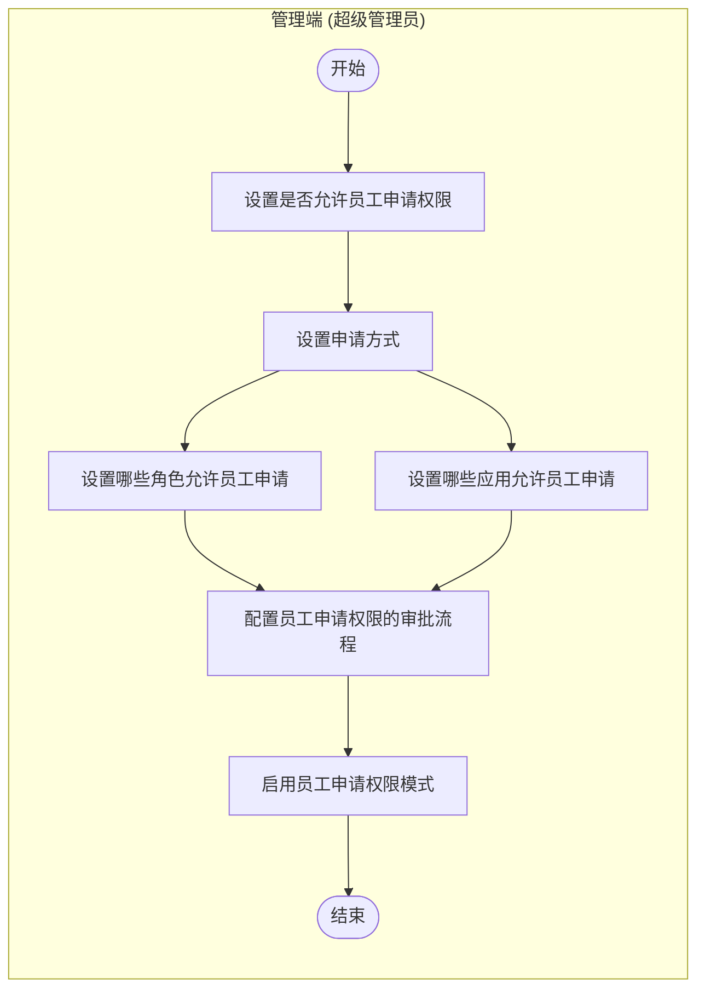
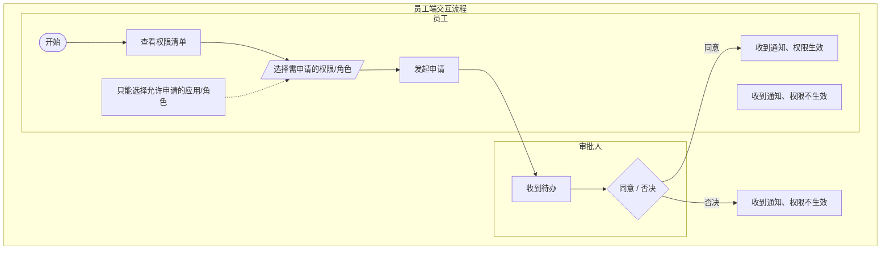

# Experience Map Input Package

## 1. Task
- project_id: 005
- task_goal: 把 business 的当前结论转成可读的流程方案、页面任务分工、状态反馈与文案职责。
- task_boundary: 围绕当前输入推导出的主流程、节点、页面、状态与解释责任展开，不预设固定页面集合。

## 2. Raw Requirement Key Sections
以下为原始需求关键片段（包含页面、流程、状态、异常、文案语义）：

### requirement.md
# 权限需求文档

## 1. 需求概述

### 1.1 背景和现状

目前企业的员工权限分配均由权限管理员或超级管理员统一分配，对于中大型企业来说，员工多、员工流动大，权限分配和核对的工作量比较大，目前的分配方式和
查询权限的时效和效率都有提升空间。如果能支持员工自己申请权限、自己核对权限，这样可以将分配和核对权限的工作分散到员工，因此本次计划支持员工可以自行申请权限。

### 1.2 调研

#### 1.2.1 用户调研

共调研了10名实施同事，6名同事认为对客户提效方面有价值，3名同事没遇到客户提此类需求，1名同事认为此功能会带来很高的培训成本

- 王凯莎、吴鑫（厦门分行-分行IT）
  - 会推有需求的客户使用
  - 企业场景：很多企业超管是老板，业务管理员想要新功能权限，要私下找老板，有些社恐，不好意思找。找了老板后，有时还得教老板怎么授权，就更麻烦了
- 沈强（北京分行-分行IT）
  - 会推有需求的客户使用
  - 员工（财务或人力经办的角色），可能申请应用或者表单有这方面的需求。比如开通代发查询、开通开放平台。主要对企业的价值就是提升权限分配的效率。这个企业可以作为种子客户：诺思格(北京)医药科技股份有限公司
- 李德敏（西安分行-异地运营）
  - 会推有需求的客户使用
  - 目前有客户是自己搭了审批流程（员工上级审批），审批通过就会转到超管，超管再去授权，可以自动化就更好了
- 全文军（长沙分行-异地运营）
  - 会推有需求的客户使用
  - 不是必要的功能，是锦上添花的功能
- 解泽彬（杭州分行-异地运营）
  - 不会推客户使用，原因是由超管设置权限只需教1人，放给员工申请需要教全员，培训成本高
  - 企业场景：小企业和流动性大的企业，你得教会企业的人怎么申请，而且一般企业财务还好，人事经常跑路。跑了还不交接，你要经常教，大老板也会烦这种，后期的售后压力会大，还不如超管交给财务总，一次性设置好角色，让他以后加的人自己放角色里，教财务总一个人设置权限就行

#### 1.2.2 竞品分析

竞品
个人权限查询
权限申请
金蝶
支持用户自行查询我的角色、功能权限、字段权限
- 1、我的组织及权限
- 2、我的组织及角色
- 3、我的功能权限
- 4、我的字段权限
员工可自主申请角色权限和组织数据权限，工作流审批通过后，系统根据权限申请单的信息自动分配权限
金蝶将此功能包装成集团权限管理解决方案和一站式用户中心解决方案
功能入口：管理后台-安全管理-权限管理-权限申请单
- 1、支持配置敏感角色和敏感组织，即有组织或角色不能通过权限申请来申请
- 2、员工填写申请原因、用户、角色、组织及上传相应附件，提交申请
- 3、审批人通过【工作流】-【多级审批】处理审批
钉钉
飞书
不支持
不支持
泛微
不支持
不支持

#### 1.2.2 竞品分析

竞品
个人权限查询
权限申请
金蝶
支持用户自行查询我的角色、功能权限、字段权限
- 1、我的组织及权限
- 2、我的组织及角色
- 3、我的功能权限
- 4、我的字段权限
员工可自主申请角色权限和组织数据权限，工作流审批通过后，系统根据权限申请单的信息自动分配权限
金蝶将此功能包装成集团权限管理解决方案和一站式用户中心解决方案
功能入口：管理后台-安全管理-权限管理-权限申请单
- 1、支持配置敏感角色和敏感组织，即有组织或角色不能通过权限申请来申请
- 2、员工填写申请原因、用户、角色、组织及上传相应附件，提交申请
- 3、审批人通过【工作流】-【多级审批】处理审批
钉钉
飞书
不支持
不支持
泛微
不支持
不支持

### 1.4 价值指标

| 价值指标 | 观测值/效果 | 指标说明 |
| --- | --- | --- |
| 企业使用率 | 新增3家客户 | 种子客户：诺思格(北京)医药科技股份有限公司、 |

## 2. 产品方案说明

### 2.1 需求结构化说明

- 1、用户旅程图

### 2.3 术语名词解释

无新增名词

## 3. 详细功能说明

| 编号 | 需求类型 | 功能描述 | 优先级（高/中/低） | 是否涉及交互 |
| --- | --- | --- | --- | --- |
| 3.1 | 功能新增 | 新增"自助申请权限"模式，对接流程引擎 | 中 | 是 |
| 3.2 | 功能新增 | 新增"我的权限" | 中 | 是 |
| 3.3 | 功能新增 | 新增"申请权限"，对接OA审批 | 中 | 是 |
| 3.4 | 功能新增 | 数据埋点 | 中 | 否 |
| 3.5 | 功能新增 | 操作记录 | 中 | 否 |

### 3.1 自助申请权限模式【优先级：中】

- 1、权限管理模式中，新增"自助申请权限模式"，此功能属于超管专属功能，其他用户不可授予权限
- 2、自助申请权限模式
  - 1）说明文案：员工可自助申请权限，工作流审批通过后，系统将自动分配权限
  - 2）点击"了解更多"，跳转至帮助文档：待补充
  - 3）点击"立即启用"，
    - A. 需要校验"双管理员互审模式"和"权限变更审批模式"是否开启，如果任意模式开启了，则不能启用并提示：企业已开启「双管理员互审模式」，不能同时开启此模式
    - B. 如其他模式未开启，则进入 自助申请权限模式 的设置页面，此时仍然是未开启状态。设置页面点击"开启"后才变为已启用状态
- 3、自助申请模式设置页面
  - 1）第一步标题：选择员工申请权限的方式
    - A. 有2个选项：申请角色、申请功能权限。默认选中"申请角色"，必选，单选
    - B. 申请角色下方提示文案：1. 申请通过后，员工将自动关联上申请角色 2. 如果启用常用角色进行授权，建议采用此方式
    - C. 申请功能权限下方提示文案：1. 申请通过后，员工将自动授权功能权限 2. 如果企业常用用户直接授权的方式，建议采用此方式
  - 2）第二步标题：设置角色范围
    - A. 如果第一步选了"申请角色"，那么第二步为设置角色范围
    - B. 标题下方提示语：请选择允许员工自助申请的角色
    - C. 选项：全部角色、部分角色。默认选中"全部角色"，必选，单选
    - D. 选择"部分角色"，打开选择角色的弹窗，弹窗中①支持搜索角色；②角色列表展示字段：选项框、角色名称、角色说明、角色状态；③分页展示；④设置完成后，展示角色名称，需要限制最多展示的个数
    - E. 角色范围为企业中已启用+已停用角色
    - F. 设置项：后续新增角色自动加入员工可申请的范围。此设置项默认选中
    - G. 员工可申请的角色范围=这里选择的角色范围
  - 3）第二步标题：设置应用范围
    - A. 如果第一步选了"申请功能权限"，那么第二步为设置应用范围
    - B. 标题下方提示语：请选择允许员工自助申请权限的应用
    - C. 选项：全部应用、部分应用。默认选中"全部应用"，必选，单选
    - D. 选择"部分应用"，打开选择应用的弹窗，弹窗中①支持搜索应用；②应用列表展示字段：选项框、应用名称、应用终端、应用启用状态；③分页展示；④设置完成后，展示应用名称，需要限制最多展示的个数
    - E. 应用范围为企业中已添加的应用（包括已启用+已停用）
    - F. 设置项：后续新添加的应用自动加入员工可申请的范围。此设置项默认选中
    - G. 员工可申请的功能权限范围=这里选择的应用及对应的功能权限
  - 4）第三步标题：设置审批流程
    - A. 提示文案：系统已预设了「员工申请权限」时的审批流程，预设审批人为员工所在组织的组织负责人。如需调整，可点击修改审批流程
    - B. 点击"修改审批流程"，打开子页面"表单编辑"页面
    - C. 点击返回，回到"自助申请模式设置"页面，页面不刷新
  - 5）点击"取消"，返回上一页，设置权限管理模式宣传页、或 自助申请权限模式宣传页
  - 6）点击"启用"，
    - A. 校验"双管理员互审模式"和"权限变更审批模式"是否开启
    - B. 如果任意模式开启了，则不能启用并提示：企业已开启「双管理员互审模式」，不能同时开启此模式
    - C. 如其他模式未开启，则启用成功。①toast提示开启成功；②个人中心增加"我的权限"入口；③员工通过"申请权限"提交申请后需要发起审批流程；④页面刷新为已开启的页面
- 4、自助申请权限模式 已开启状态
  - 1）开启后，变为不可编辑状态，同时页面出现2个按钮：关闭模式、编辑
  - 2）点击"关闭模式"，打开二次确认弹窗
    - A. 二次确认弹窗标题：关闭模式；文案：关闭模式后，员工将无法自助查询和申请权限，请确认是否关闭自助申请模式？；按钮：不关闭、确认关闭
    - B. 点击"确认关闭"，需要校验此模式是否有在途流程，如有在途流程，则关闭失败并打开提示弹窗
    - C. 关闭失败的弹窗标题：关闭失败；文案：当前有申请流程未完成审批，请联系审批人审批完成，再关闭模式；按钮：知道了
    - D. 如关闭成功，则toast提示：关闭「自助申请权限模式」成功
  - 3）点击"编辑"，关闭模式和编辑按钮隐藏，同时页面变为可编辑状态，底部出现"取消编辑"、"确认编辑"按钮
    - A. 点击"确认编辑"，toast提示：编辑成功
  - 3）顶部展示提示语：此模式已开启，员工可以自助查询和申请个人权限。申请通过后，系统自动分配权限。帮助文档
    - A. 点击"帮助文档"，打开链接：待补充
oa的可发起人去掉
风险：默认复核人员

### 3.2 我的权限【优先级：中】

- 1、个人中心，增加"我的权限"功能
  - 1）开启"自助申请权限模式"的企业，企业下的用户增加"我i的权限"功能；未开启模式的企业，企业下的用户不展示此功能。服务人员无此入口
  - 2）"我的权限"无需授权，属于全员功能
  - 3）"我的权限"展示在"我的企业"下方
- 2、点击"我的权限"进入独立页面【我的权限】
  - 1）我的权限分为2个tab：功能权限、数据权限、角色
  - 2）默认选中功能权限tab，展示用户有权限的应用、功能权限列表，包括全员应用和管理类应用，以及全员功能和管理类功能
  - 3）切到数据权限tab，展示用户拥有的数据权限，交互和数据与用户授权-权限详情一致
  - 4）切到角色tab，展示用户关联的所有角色，交互和数据与用户授权-权限详情一致
  - 5）如果tab下没有数据，需要展示提示语和占位图，提示语：您没有功能权限/您没有数据权限/您没有关联的角色

### 3.3 申请权限【优先级：中】

- 1、点击"申请权限"，打开【申请权限】抽屉
- 2、申请人：默认带出当前用户名称，不可编辑
- 3、申请原因：必填；提示词：请填写申请原因；限制最多500字
- 4、申请功能权限
  - 1）提示语：提交申请后，默认申请功能的所有数据权限。如需申请部分数据权限，请联系企业管理员授权。
  - 2）下方内容与功能权限设置组件一致，应用范围只包括管理端设置的"应用范围"
  - 3）功能权限设置组件需要有组件规则中的第2、3、4、5、6、7、9、10、11、12、13、14、16①③④⑤、17、18，组件规则：权限组件：功能权限/数据权限/权限详情
- 5、申请角色
  - 1）下方表格的字段有：勾选项、角色名称、角色说明
  - 2）角色范围是：管理端设置的"角色范围"中的已启用角色
  - 3）提交申请后的，校验内容：
①资金用户校验：为非资金用户授予"代发付款"时报错
②授予子管理员模式权限的校验：子管理员授予子管理员模式时报错
③特殊身份默认权限
④实名要求
- 6、申请记录
  - 1）筛选项
①申请日期
②审批状态，选项有：已通过、已拒绝、审批中、已撤销
  - 2）列表内容
①申请时间：展示提交申请的时间，年月日 时分秒
②申请原因：展示提交申请时填写的申请原因
③申请内容：如申请的是角色，那么展示角色名称；如申请的是功能权限，那么展示"查看详情"超链接，点击查看详情

[...内容过长，已截断用于输入包展示...]

### background.md
# Background

- 当前企业权限分配主要依赖权限管理员或超级管理员集中处理；在中大型企业中，员工规模与流动性带来较高分配、核对与沟通成本。
- 本任务目标是支持员工自助申请权限与自助查询权限，通过审批流完成权限授予，提升分配效率与可追踪性。
- 调研结论显示：多数实施同事认可提效价值，但存在培训成本与推广阻力，需要在方案中显式评估认知负担与实施成本。
- 竞品参考：金蝶支持“权限申请单 + 多级审批 + 自动分配”；钉钉、飞书、泛微在对应能力上支持较弱或不支持。
- 已知风险与待确认项：
  - 帮助文档链接待补充。
  - 关闭模式时在途流程处理策略需要明确。
  - OA 可发起人范围、默认复核人员策略需进一步确认。

## 3. Facts Summary
- F-AC01：1、支持配置敏感角色和敏感组织，即有组织或角色不能通过权限申请来申请
- F-AC02：2、员工填写申请原因、用户、角色、组织及上传相应附件，提交申请
- F-AC03：1、支持配置敏感角色和敏感组织，即有组织或角色不能通过权限申请来申请
- F-AC04：2、员工填写申请原因、用户、角色、组织及上传相应附件，提交申请
- F-AC05：M4_1 --> M5[配置员工申请权限的审批流程]
- F-AC06：E1([开始]) --> E2[查看权限清单]
- F-AC07：E2 --> E3[/选择需申请的权限/角色/]
- F-AC08：note1["只能选择允许申请的应用/角色"] -.-> E3
- F-S01：M5 --> M6[启用员工申请权限模式]
- F-S02：A1[收到待办]
- F-S03：2）点击"了解更多"，跳转至帮助文档：待补充
- F-S04：3）点击"立即启用"，

## 4. Business Judgments
- J-01 问题与意图是否足以支撑当前改造：成立
- J-02 当前输入与命中知识是否形成稳定基线：较稳定
- J-03 治理与依赖是否已经进入判断链：是
- J-04 状态、结果与异常是否形成闭环：形成闭环

## 5. Experience Model Summary
### pages
- P-01 支持配置敏感角色配置 支持配置主页面：配置 支持配置
- P-02 支持配置敏感角色配置 支持配置结果说明页：理解结果、状态与下一步
- P-03 目前企业的员工权限分配均由权限管理员提交 目前企业的员工权限分配均由权限主页面：提交 目前企业的员工权限分配均由权限
- P-04 目前企业的员工权限分配均由权限管理员提交 目前企业的员工权限分配均由权限结果说明页：理解结果、状态与下一步
- P-05 目前企业的员工权限分配均由权限管理员配置 配置员工申请权限的审批流程主页面：配置 配置员工申请权限的审批流程
- P-06 目前企业的员工权限分配均由权限管理员配置 配置员工申请权限的审批流程结果说明页：理解结果、状态与下一步
- P-07 目前企业的员工权限分配均由权限管理员查看 查看权限主页面：查看 查看权限
- P-08 目前企业的员工权限分配均由权限管理员查看 查看权限结果说明页：理解结果、状态与下一步

### flows
- TF-01 配置 支持配置：权限需求文档 / 1. 需求概述 / 1.2 调研 / 1.2.2 竞品分析 -> 配置 支持配置 -> 1、支持配置敏感角色和敏感组织，即有组织或角色不能通过权限申请来申请
- TF-02 提交 目前企业的员工权限分配均由权限：权限需求文档 / 1. 需求概述 / 1.2 调研 / 1.2.2 竞品分析 -> 提交 目前企业的员工权限分配均由权限 -> 2、员工填写申请原因、用户、角色、组织及上传相应附件，提交申请
- TF-03 配置 支持配置：权限需求文档 / 1. 需求概述 / 1.2 调研 / 1.2.2 竞品分析 -> 配置 支持配置 -> 1、支持配置敏感角色和敏感组织，即有组织或角色不能通过权限申请来申请
- TF-04 提交 目前企业的员工权限分配均由权限：权限需求文档 / 1. 需求概述 / 1.2 调研 / 1.2.2 竞品分析 -> 提交 目前企业的员工权限分配均由权限 -> 2、员工填写申请原因、用户、角色、组织及上传相应附件，提交申请
- TF-05 配置 配置员工申请权限的审批流程：权限需求文档 / 2. 产品方案说明 / 2.1 需求结构化说明 -> 配置 配置员工申请权限的审批流程 -> M4_1 --> M5[配置员工申请权限的审批流程]
- TF-06 查看 查看权限：权限需求文档 / 2. 产品方案说明 / 2.1 需求结构化说明 -> 查看 查看权限 -> E1([开始]) --> E2[查看权限清单]

### states
- S-01 启用：支持配置敏感角色配置 支持配置主页面 需要显式显示“启用”与其上下文含义。
- S-02 未命名状态（需补充）：支持配置敏感角色配置 支持配置主页面 需要显式显示“未命名状态（需补充）”与其上下文含义。
- S-03 未命名状态（需补充）：支持配置敏感角色配置 支持配置主页面 需要显式显示“未命名状态（需补充）”与其上下文含义。

### copy
- COPY-01 支持配置敏感角色配置 支持配置主页面：解释为什么当前流程要在这里完成，以及用户现在要做什么。
- COPY-02 支持配置敏感角色配置 支持配置结果说明页：解释为什么当前流程要在这里完成，以及用户现在要做什么。
- COPY-03 目前企业的员工权限分配均由权限管理员提交 目前企业的员工权限分配均由权限主页面：解释为什么当前流程要在这里完成，以及用户现在要做什么。
- COPY-04 目前企业的员工权限分配均由权限管理员提交 目前企业的员工权限分配均由权限结果说明页：解释为什么当前流程要在这里完成，以及用户现在要做什么。
- COPY-05 启用：解释当前状态意味着什么，以及用户下一步可以做什么。
- COPY-06 未命名状态（需补充）：解释当前状态意味着什么，以及用户下一步可以做什么。
- COPY-07 未命名状态（需补充）：解释当前状态意味着什么，以及用户下一步可以做什么。

### risks
- RSK-01 失败：在 P-01 / P-02 / P-03 中显式提供阻断解释、处理方向与来源追踪入口。
- RSK-02 失败：在 P-01 / P-02 / P-03 中显式提供阻断解释、处理方向与来源追踪入口。
- RSK-03 异常场景3：在 P-01 / P-02 / P-03 中显式提供阻断解释、处理方向与来源追踪入口。

## 6. Design Principles
### business knowledge hits
- 无

### guideline hits
- 无

## 7. Required Output
- 主输出：interaction_map.json
- 可选输出：interaction_map_draft.md
- 严禁仅输出自由 Markdown 作为主结果

## 8. Grounding Materials Snapshot
### facts.md（截断）
# Facts

## 任务意图

- 任务目标：基于《权限需求文档》，从零建立“员工自助申请与查询权限能力”的结构化事实、业务判断与体验方案
- 任务边界：不得臆造业务事实
- 输出用途：为 business judgment 与 experience translation 提供可追踪、可回链的当前任务事实。

## 事实来源说明

- 主输入：
- E:/AI设计/体验蓝图构建思路/projects/005/source/requirement.md
- E:/AI设计/体验蓝图构建思路/projects/005/source/background.md
- 任务合同：
- projects/005/runtime/task_card_resolved.json
- projects/005/runtime/context_manifest.json
- 显式引用：
- knowledge/wiki/summaries/business/permission/00_domain_overview.md
- knowledge/wiki/summaries/business/permission/01_scope_and_boundary.md
- knowledge/wiki/summaries/business/permission/02_glossary.md
- knowledge/wiki/summaries/business/permission/03_business_objects.md
- knowledge/wiki/summaries/business/permission/04_object_relations.md
- knowledge/wiki/summaries/business/permission/README.md
- 知识校准命中：
- KN-01: 00_domain_overview -> page_id: PG-SUMMARY-BUSINESS-BUSINESS-PERMISSION-00_DOMAIN_OVERVIEW；page_type: summary；source_path: knowledge/raw/business/permission/00_domain_overview.md
- KN-02: 01_scope_and_boundary -> page_id: PG-SUMMARY-BUSINESS-BUSINESS-PERMISSION-01_SCOPE_AND_BOUNDARY；page_type: summary；source_path: knowledge/raw/business/permission/01_scope_and_boundary.md
- KN-03: 02_glossary -> page_id: PG-SUMMARY-BUSINESS-BUSINESS-PERMISSION-02_GLOSSARY；page_type: summary；source_path: knowledge/raw/business/permission/02_glossary.md
- KN-04: 03_business_objects -> page_id: PG-SUMMARY-BUSINESS-BUSINESS-PERMISSION-03_BUSINESS_OBJECTS；page_type: summary；source_path: knowledge/raw/business/permission/03_business_objects.md
- KN-05: 04_object_relations -> page_id: PG-SUMMARY-BUSINESS-BUSINESS-PERMISSION-04_OBJECT_RELATIONS；page_type: summary；source_path: knowledge/raw/business/permission/04_object_relations.md
- KN-06: permission -> page_id: PG-SUMMARY-BUSINESS-BUSINESS-PERMISSION-README；page_type: summary；source_path: knowledge/raw/business/permission/README.md
- 使用边界：
  - facts 的业务事实只从 requirement.md / background.md 抽取
  - task_card_resolved.json / context_manifest.json 仅用于任务意图、任务边界与执行约束说明
  - wiki 只做术语与边界校准，不替代当前任务事实

## 术语与对象边界

| term_id | 术语 | 当前任务中的含义 | 边界说明 | 来源 |
| --- | --- | --- | --- | --- |
| T-01 | 目前企业的员工权限分配均由权限 | 目前企业的员工权限分配均由权限管理员或超级管理员统一分配，对于中大型企业来说，员工多、员工流动大，权限分配和核对的工作量比较大，目前的分配方式和 | 当前任务中的直接承接对象，需要与其上下游关系分开理解。 | E:/AI设计/体验蓝图构建思路/projects/005/source/requirement.md |
| T-02 | 查询权限 | 查询权限的时效和效率都有提升空间。如果能支持员工自己申请权限、自己核对权限，这样可以将分配和核对权限的工作分散到员工，因此本次计划支持员工可以自行申请权限。 | 当前任务中的直接承接对象，需要与其上下游关系分开理解。 | E:/AI设计/体验蓝图构建思路/projects/005/source/requirement.md |
| T-03 | 如果能支持员工自己申请权限 | 查询权限的时效和效率都有提升空间。如果能支持员工自己申请权限、自己核对权限，这样可以将分配和核对权限的工作分散到员工，因此本次计划支持员工可以自行申请权限。 | 当前任务中的直接承接对象，需要与其上下游关系分开理解。 | E:/AI设计/体验蓝图构建思路/projects/005/source/requirement.md |
| T-04 | 自己核对权限 | 查询权限的时效和效率都有提升空间。如果能支持员工自己申请权限、自己核对权限，这样可以将分配和核对权限的工作分散到员工，因此本次计划支持员工可以自行申请权限。 | 当前任务中的直接承接对象，需要与其上下游关系分开理解。 | E:/AI设计/体验蓝图构建思路/projects/005/source/requirement.md |
| T-05 | 00_domain_overview | page_id: PG-SUMMARY-BUSINESS-BUSINESS-PERMISSION-00_DOMAIN_OVERVIEW；page_type: summary；source_path

[...内容过长，已截断用于输入包展示...]

### business_blueprint.md（截断）
# Business Blueprint

## 1. 一句话结论

- 结论：当前更适合定位为“单独做成一个完整功能”。
- 建议方向：单独做成一个完整功能

## 2. 为什么要做

- 业务问题：本次任务场景：围绕员工自助申请权限模式、我的权限、申请权限三块需求进行全链路建模
- 变更意图：基于《权限需求文档》，从零建立“员工自助申请与查询权限能力”的结构化事实、业务判断与体验方案
- 目标与边界：先完成业务判断，再沉淀业务蓝图，让 business blueprint 成为当前任务的可读结论与承接输入。

## 3. 值不值得做

- 收益与价值：
- 单独做成一个完整功能：边界清晰，便于持续迭代
- 放到已有功能里扩展：沿用现有入口，使用和维护成本更低
- 不单独做页面，只做成配置项：可以降低页面与流程复杂度
- 信息还不够，先不定方案：避免过早定论
- 成本与代价：
- 单独做成一个完整功能：模块数量与建模成本会上升
- 放到已有功能里扩展：如果边界没写清楚，容易和现有能力混在一起
- 不单独做页面，只做成配置项：表达力可能不足，体验层承载空间变小
- 信息还不够，先不定方案：短期无法给出强推进结论

## 4. 怎么做更合理

- 当前建议：单独做成一个完整功能
- 可对照方案：
- 单独做成一个完整功能：当前最优（适用条件：适合对象、规则、状态和输出结构都需要单独建模时）
- 放到已有功能里扩展：可对照方案（适用条件：适合当前变化更像既有能力增强而不是新能力时）
- 不单独做页面，只做成配置项：可对照方案（适用条件：适合动作较少、规则较多、更多是边界治理时）
- 信息还不够，先不定方案：可对照方案（适用条件：适合信息缺口较多、知识命中较弱时）
- 关键判断：
- 问题与意图是否足以支撑当前改造：成立
- 当前输入与命中知识是否形成稳定基线：较稳定
- 治理与依赖是否已经进入判断链：是
- 状态、结果与异常是否形成闭环：形成闭环

## 5. 哪些不能随便做

### 关键规则限制
- 1.2.1 用户调研规则 ， 员工（财务或人力经办的角色），可能申请应用或者表单有这方面的需求。比如开通代发查询、开通开放平台。主要对企业的价值就是提升权限分配的效率。这个企业可以作为种子客户：诺思格(北京)医药科技股份有限公司
- 1.2.1 用户调研规则 ， 不会推客户使用，原因是由超管设置权限只需教1人，放给员工申请需要教全员，培训成本高
- 1.2.2 竞品分析规则 ， 1、支持配置敏感角色和敏感组织，即有组织或角色不能通过权限申请来申请
- 1.2.2 竞品分析规则 ， 2、员工填写申请原因、用户、角色、组织及上传相应附件，提交申请

### 前置条件与限制
- 会推有需求的客户使用 ， 会推有需求的客户使用
- 会推有需求的客户使用 ， 会推有需求的客户使用
- 会推有需求的客户使用 ， 会推有需求的客户使用
- 会推有需求的客户使用 ， 会推有需求的客户使用

## 6. 主要风险

- 风险：异常或阻断未被业务层接住；影响：体验设计可能无法清楚说明失败原因、处理方式和下一步。；建议：把异常条件写进业务判断，并在后续设计中明确失败提示和处理路径。
- 风险：异常或阻断未被业务层接住；影响：体验设计可能无法清楚说明失败原因、处理方式和下一步。；建议：把异常条件写进业务判断，并在后续设计中明确失败提示和处理路径。

## 7. 体验设计要注意什么

- 体验层承接要求：
- 体验层必须承接当前最终立场，而不是重新发明业务答案。
- 页面与流程要围绕当前事实中的真实闭环、真实状态与真实异常展开。
- 命中知识如何影响了承载方式、优先级与解释责任，需要在体验层继续可见。
- 立场理由：
- 本次调整类型更接近：新增能力 / 引入新机制。
- 现有对象数=8、流程数=6、规则数=6，说明这次需求需要完整方案承接。
- 命中知识已经参与基线建立与路径比较，因此结论具备当前任务语境下的可解释性。

## 附录 A：事实承接

- 评审对象：当前任务要求形成的业务能力与其承载方式，不预设固定结论。
- 评审边界：本次只评审当前输入能否支撑稳定的业务立场，以及知识如何影响这个立场。
- 变更类型：新增能力 / 引入新机制
- 触发背景：当前任务需要同时给出可读结论和可追溯依据，并保持与输入事实一致。
- F-xx 承接列表：
- F-A01
- F-A02
- F-A03
- F-A04
- F-A05
- F-A06
- F-A07
- F-A08
- F-O01
- F-O02
- F-O03
- F-O04
- DEP-xx 原始依赖项：
- DEP-01: 会推有需求的客户使用 -> 会推有需求的客户使用
- DEP-02: 会推有需求的客户使用 -> 会推有需求的客户使用
- DEP-03: 会推有需求的客户使用 -> 会推有需求的客户使用
- DEP-04: 会推有需求的客户使用 -> 会推有需求的客户使用

## 附录 B：命中知识与来源

- 命中知识：
- KN-01 00_domain_overview
- KN-02 00_domain_overview
- KN-03 01_scope_and_boundary
- KN-04 02_glossary
- KN-05 03_business_objects
- KN-06 04_object_relations
- KN-07 10_capability_map

| baseline_id | 基线结论 | source_path |
| --- | --- | --- |
| BL-01 | 00_domain_overview：page_id: PG-SUMMARY-BUSINESS-BUSINESS-PERMISSION-00_DOMAIN_OVERVIEW | KN-01, knowledge/wiki/summaries/business/permission/00_domain_overview.md |
| BL-02 | 00_domain_overview：可见性 | KN-02, knowledge/raw/business/permission/00_domain_overview.md |
| BL-03 | 01_scope_and_boundary：主体、资源、动作、范围、来源、治理因子等核心对象定义 | KN-03, knowledge/raw/business/permission/01_scope_and_boundary.md |
| BL-04 | 02_glossary：**subject**：权限判定的主体，如用户、成员、子管理员 | KN-04, knowledge/raw/business/permission/02_glossary.md |
| BL-05 | 03_business_objects：定义：权限结果的承受者或操作者 | KN-05, knowledge/raw/business/permission/03_business_objects.md |
| B

[...内容过长，已截断用于输入包展示...]

