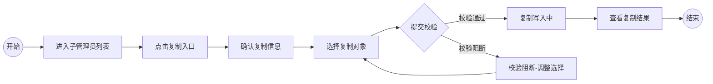

# 可视化用户旅程

> 基于体验蓝图 `spark-output/experience_blueprint.md` 生成。

## 0. 生成说明

- **输入优先级**：第 1 层
- **主要输入源**：experience_blueprint.md
- **补全策略**：已有体验蓝图复用，交互节点和文案均从蓝图 §3-§7 直接提取
- **降级提示**：无

### 知识冲突说明

| 冲突项 | 知识库规则 | 需求文档主张 | 影响节点 |
|---|---|---|---|
| 子管理员模式与双管理员模式互斥 | R-009：子管理员模式与双管理员模式不可同时开启（`knowledge/raw/业务/权限管理/23_规则契约.md`） | PRD §10 提及"若开启双管理员互审模式则生成审批" | N7（校验写入后的结果有差异：互斥成立则直接生效，不互斥则进入审批待处理） |

> 以上冲突已按推荐方案（互斥成立，直接生效）生成埋点。冲突项标记为 [conflict]。UXB 已做业务判断确认互斥更可信，当前体验蓝图按互斥成立推进。

## 1. 场景概览

| 属性 | 值 |
|---|---|
| **任务场景** | 权限管理员在子管理员模式列表中，从已有子管理员复制可授权组织和可授权功能给其他用户 |
| **优先级** | 重要 (High) |
| **用户目标** | "作为权限管理员，我想要把已有子管理员的权限配置复制给其他用户，以便批量配置大量子管理员而不需要逐一手动勾选" |
| **成功指标** | taskName `PERMISSION_SUBADMIN_COPY` 完成率（从点击复制到结果弹窗关闭）、节点 N7→N8 转化率（校验通过到写入完成） |
| **涉及角色** | 权限管理员 / 超级管理员 |
| **任务范围** | 子管理员模式列表 → 复制弹窗（选内容 → 选对象 → 校验） → 写入 → 结果弹窗 → 列表 |

## 2. 角色旅程总览

```md
- 权限管理员：进入子管理员列表 [confirmed] → 点击复制 [confirmed] → 确认复制信息 [confirmed] → 选择复制对象 [confirmed] → 提交校验 [confirmed] → {校验结果} [confirmed] → 校验阻断-调整选择 [confirmed] → 复制写入中 [confirmed] → 查看复制结果 [confirmed]
```

## 3. 旅程流程图

### 3.1 权限管理员 旅程



## 4. 旅程节点详情

### 4.1 权限管理员 节点详情

#### N1：进入子管理员列表 `[confirmed]` `开始节点`

**用户动作：** 权限管理员登录管理后台，进入「权限管理 → 子管理员模式」，查看已有子管理员列表。

**系统反馈：** 展示子管理员模式列表页，包含顶部 Tab 切换区、提示信息与状态控制区、筛选查询区、工具栏与操作区（含"添加子管理员"按钮）、数据列表表格区（姓名/手机号/部门/可授权组织/可授权功能/操作）。

**成功标准：**
- [ ] 列表在 2 秒内加载完成
- [ ] 子管理员行操作列展示「复制」「编辑」「移除」按钮

**潜在摩擦：**
- 列表数据量大时分页加载过慢 → 确保分页和搜索可用

---

#### N2：点击复制入口 `[confirmed]` `关键节点`

**用户动作：** 在子管理员列表中定位目标来源子管理员所在行，点击操作列的「复制」按钮。

**系统反馈：** 打开「复制子管理员权限」弹窗。弹窗顶部展示来源信息（复制来源：{姓名} / {手机号}），复制信息区默认两项全选（可授权组织、可授权功能），复制对象区为空待选择。

**成功标准：**
- [ ] 弹窗在 500ms 内打开
- [ ] 来源信息正确展示当前点击行的姓名和手机号
- [ ] 复制信息 checkbox 默认全选

**潜在摩擦：**
- 非子管理员行不展示复制入口，避免管理员在错误行上困惑 → 仅子管理员行展示

---

#### N3：确认复制信息 `[confirmed]` `关键节点`

**用户动作：** 查看弹窗中「复制信息」区域的默认全选状态，确认或调整勾选（可取消某项）。

**系统反馈：** checkbox 状态实时更新。可选"可授权组织"和"可授权功能"。辅助说明文字"将复制来源子管理员的以下权限配置"。

**成功标准：**
- [ ] 至少保留一项勾选（取消全部时提交校验不通过）

**潜在摩擦：**
- 管理员不确定"可授权组织"和"可授权功能"具体代表什么 → 辅助说明文字提供上下文

---

#### N4：选择复制对象 `[confirmed]` `关键节点`

**用户动作：** 点击复制对象选择器，打开「选择员工」弹窗（复用现有添加子管理员的员工选择器），搜索并选择一个或多个目标用户。

**系统反馈：** 已选用户以标签形式展示在选择器内，支持逐个移除。计数器实时更新为"已选 {n}/200 人"。超过 200 人时限制继续添加并 toast 提示。

**成功标准：**
- [ ] 已选用户标签展示正确，移除操作即时生效
- [ ] 计数器准确反映已选人数
- [ ] 接近或达到 200 上限时限制添加并提示

**潜在摩擦：**
- 不知道目标用户是否符合加入状态和认证状态要求（这些在校验阶段才检查） → 可以在选择器中增加状态标识（后续优化）

---

#### N5：提交校验 `[confirmed]` `关键节点`

**用户动作：** 点击弹窗底部「确认」按钮。

**系统反馈：** 按顺序逐项校验：
1. 复制信息是否至少勾选一项 → 不满足：C 区红字"请选择复制信息"
2. 复制对象是否至少选择一名 → 不满足：D 区红字"请选择至少一名复制对象"
3. 加入状态均为"已加入" → 不满足：E 区阻断提示，列出不符合用户姓名/手机号/当前状态
4. 认证状态均为"已认证" → 不满足：E 区阻断提示，列出不符合用户姓名/手机号

**成功标准：**
- [ ] 校验通过率（即所选目标均符合条件）> 90%
- [ ] 阻断提示清晰列出所有不符合用户，不遗漏

**潜在摩擦：**
- 大量目标用户中只有个别人不符合，被全部阻断需要全部重来 → 当前按"全部阻断"策略，GAP-01 待确认是否改为"跳过不符合"

---

#### N6：校验阻断-调整选择 `[confirmed]` `关键节点`

**用户动作：** 阅读阻断提示区中列出的不符合用户列表，在复制对象选择器中移除不符合的用户，补充符合条件的用户。重新点击「确认」。

**系统反馈：** 移除不符合用户后，E 区阻断提示自动消失。重新点击确认后重新执行全部校验。

**成功标准：**
- [ ] 移除操作即时反映在阻断区的消失
- [ ] 重新校验后通过率提升至 100%

**潜在摩擦：**
- 如果有大量不符合用户需要逐个移除，操作繁琐 → 阻断区展示可操作的"移除"快捷按钮（后续优化）

---

#### N7：复制写入中 `[confirmed]` `关键节点`

**用户动作：** 等待系统处理（无需用户操作）。

**系统反馈：** 弹窗进入 loading 态，确认按钮变为"复制中..."并置灰，取消按钮置灰不可点。写入完成后弹窗关闭。

**成功标准：**
- [ ] 批量写入（最多 200 人）在可接受时间内完成
- [ ] Loading 态不可取消，避免部分写入的中间态

**潜在摩擦：**
- 大批量写入时间过长用户焦虑 → 可考虑展示处理进度（如"正在处理 50/200"）

---

#### N8：查看复制结果 `[confirmed]` `结束节点`

**用户动作：** 在自动弹出的「复制结果」弹窗中查看执行结果。

**系统反馈：** 结果弹窗按三组展示：
- 新增子管理员（{x} 人）：列出原本不是子管理员的用户名/手机号
- 权限已叠加（{y} 人）：列出已有子管理员的用户名/手机号
- 复制失败（{z} 人，如有）：列出失败用户及失败原因

点击「知道了」关闭弹窗，列表自动刷新。

**成功标准：**
- [ ] 全部成功时展示"复制成功，共 N 人"
- [ ] 结果分组准确反映新增/叠加/失败
- [ ] 关闭后列表已刷新，可验证变更

**潜在摩擦：**
- 失败用户需要单独处理但没有快捷重试入口 → 可在失败分组中添加"重试"快捷操作（后续优化）

---

## 5. 旅程缺口

- [ ] GAP-01：批量校验失败处理策略未最终确认（全部阻断 vs 跳过不符合），影响 N5→N6 路径的分支设计
- [ ] GAP-04：弹窗期间来源变更处理策略未确认，影响 N2 打开弹窗时是否锁定快照

## 6. 知识冲突项

1. **子管理员模式与双管理员模式互斥**
   - 知识库规则：R-009 子管理员模式与双管理员模式不可同时开启（来源：`knowledge/raw/业务/权限管理/23_规则契约.md`）
   - 需求文档主张：PRD §10 "若开启双管理员互审模式，复制完成时需要生成一条审批"
   - 当前处理：按知识库互斥成立推进，体验蓝图中不含审批状态
   - 影响节点：N7（写入后的生效时点），N8（结果展示是否含审批中状态）
   - 影响埋点事件：`PERMISSION_SUBADMIN_COPY_WRITE`（写入即生效 vs 写入后进入审批）
   - 建议：UXB 已做业务判断确认互斥成立，GAP-02 等待产品最终确认

## 附录：节点-埋点对照

| 节点标识 | 节点名称 | 角色 | 来源 | 节点类型 | 关联 taskNodeName |
|---|---|---|---|---|---|
| N1 | 进入子管理员列表 | 权限管理员 | confirmed | 开始节点 | PERMISSION_SUBADMIN_LIST_VIEW |
| N2 | 点击复制入口 | 权限管理员 | confirmed | 关键节点 | PERMISSION_SUBADMIN_COPY_ENTRY |
| N3 | 确认复制信息 | 权限管理员 | confirmed | 关键节点 | PERMISSION_SUBADMIN_COPY_INFO_CONFIRM |
| N4 | 选择复制对象 | 权限管理员 | confirmed | 关键节点 | PERMISSION_SUBADMIN_COPY_TARGET_SELECT |
| N5 | 提交校验 | 权限管理员 | confirmed | 关键节点 | PERMISSION_SUBADMIN_COPY_VALIDATE |
| N6 | 校验阻断-调整选择 | 权限管理员 | confirmed | 关键节点 | PERMISSION_SUBADMIN_COPY_BLOCKED |
| N7 | 复制写入中 | 权限管理员 | confirmed | 关键节点 | PERMISSION_SUBADMIN_COPY_WRITE |
| N8 | 查看复制结果 | 权限管理员 | confirmed | 结束节点 | PERMISSION_SUBADMIN_COPY_RESULT |
