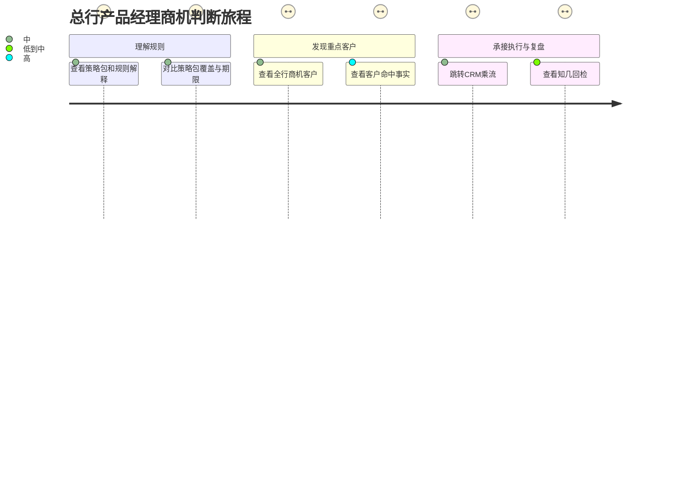
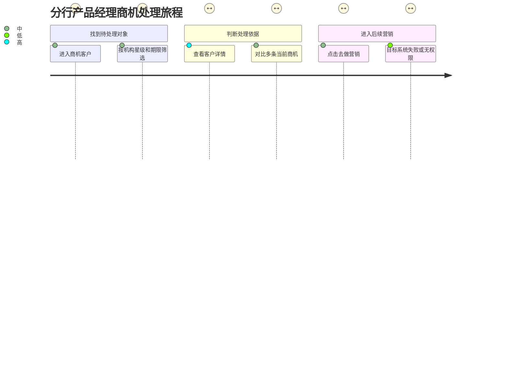

# 商机中心体验蓝图

> 项目名：商机中心  
> 上游：`spark-output/uxb_output.md`、`spark-output/context/uxb.json`  
> 设计范围：企业财富+商机中心 MVP。CRM 乘流内部不展开，但保留“去做营销”跳转入口。

## §0 本次关键设计判断

本次体验方案以“先理解，再判断，再行动”为主线：让产品经理在企业财富+内完成规则理解、客户筛选、商机判断和期限确认，确认后可从“做营销”Tab 跳转 CRM 乘流。

### 判断一：把客户汇总和单条商机事实分成两层

- 主要影响：商机客户列表、客户详情、策略包详情。
- 建议方案：列表承担“先看谁”的客户级判断；详情承担“为什么是他”的单条商机解释。多条商机必须保留各自策略包、命中事实、首次命中和最晚过期时间。
- 不建议方案：把多条商机压成一个综合分数或一句模糊摘要，因为本期没有综合评分，且会损失可追溯依据。
- 关键待确认：策略解释文本和字段口径需在数据评审前冻结。

### 判断二：把商机状态与营销执行状态分开表达

- 主要影响：做营销 Tab、客户详情、去做营销入口、异常反馈。
- 建议方案：企业财富+明确表达新进入、持续命中、即将过期和已退出等商机语义；营销发起只在后续 CRM 有有效策略证据时成立。
- 不建议方案：点击详情、点击去做营销或成功跳转后直接变为“营销中”。
- 关键待确认：本期是否接入 CRM 执行记录，决定营销状态和效果入口的展示深度。

### 判断三：把“去做营销”设计为明确的跨系统承接

- 主要影响：做营销 Tab、跳转说明、跳转失败和返回路径。
- 建议方案：入口保留；跳转前说明企业财富+只负责发现商机，CRM 负责执行营销；目标系统不可用或无权限时留在当前页面并保留查询上下文。
- 不建议方案：在企业财富+模拟 CRM 选客、渠道配置或执行状态。
- 关键待确认：窗口方式、返回行为和认证失效后的回跳方式。

## §1 旅程消费摘要

本项目未单独执行旅程分析，以下内容基于 UXB 的角色、任务和风险结论推导，作为本蓝图的简化旅程摘要。

### 总行产品经理：识别规则价值

- 信心最低点：客户为何命中、营销是否真正发起、数据是否覆盖。
- 关键转折：从策略包理解转到客户判断时，需要把规则解释和客户事实同时承接。
- 流失风险：用户看到大量客户但无法快速判断优先级，或跳转 CRM 后无法确认当前行为是否生效。

### 分行产品经理：从待处理客户到营销入口

- 信心最低点：筛选结果是否是最新数据、客户状态是否因日任务变化、跳转后是否产生执行记录。
- 关键转折：从“查看”到“行动”时，必须明确跳转不等于营销发起。
- 流失风险：入口说明过长、失败后丢失筛选条件、客户详情没有直接回到原列表的路径。

## §2 交互流程总览

### 角色一：总行产品经理

1. 进入商机策略包 → 查看策略包列表 → 查看策略包详情 → 查看该策略包下的商机客户。
2. 进入商机客户 → 使用数量概览、组织、星级、策略包、命中状态和期限筛选 → 查看客户详情。
3. 从做营销 Tab 点击“去做营销” → 阅读跨系统说明 → 确认跳转 → 进入 CRM 乘流。
4. 进入数据回检 → 查看数据范围和更新时间 → 跳转知几。

### 角色二：分行产品经理

1. 进入商机客户，默认落在待营销范围。
2. 通过排序和筛选找到需要处理的客户。
3. 查看客户当前商机的事实、解释、命中状态和期限。
4. 点击“去做营销”，跳转 CRM 乘流；失败时留在企业财富+并重试或申请权限。

### 单列异常流程

- 规则或数据未更新：进入页面后先展示更新时间和受影响范围，用户可等待、刷新或联系责任人。
- 客户权限变化：查询或详情请求重新校验权限，不展示缓存敏感数据。
- 商机在查看期间变化：刷新后以最新快照为准，提示用户重新判断。
- CRM 跳转失败：不改变商机或营销状态，保留当前筛选和滚动位置。
- 回检数据未知：显示未知和覆盖率，不将未知归入失败。

## §3 主交互流程

### 主流程 A：理解策略包并进入客户判断

#### A1. 查看策略包列表

- 用户动作：进入商机中心的策略包入口。
- 系统反馈：展示 13 个只读策略包、规则摘要、优先级、跟进期限、建议渠道/物料、当前客户、新进入和即将过期数量，并显示数据更新时间。
- 前置解释：页面顶部说明“策略包由系统预置，当前不可编辑；客户数量为当前数据批次结果”。
- 建议文案：`策略包用于说明什么客户变化值得经营，以及建议在什么期限内处理。`
- 下一步：用户可搜索、筛选策略包或进入详情。

#### A2. 查看策略包详情

- 用户动作：点击某个策略包的“详情”。
- 系统反馈：展示规则、客户分层、优先级、跟进期限、建议渠道、建议物料、解释话术和当前统计；内容只读。
- 前置解释：规则说明必须同时包含“触发条件”和“为什么值得经营”，避免只展示技术条件。
- 建议文案：`以下规则为本次命中的业务依据，客户数量来自最近一次成功更新的数据。`
- 下一步：点击“查看商机客户”，带入策略包筛选进入客户列表。

#### A3. 从策略包进入客户列表

- 用户动作：点击“查看商机客户”。
- 系统反馈：打开做营销 Tab 的商机客户列表，保留策略包筛选；如果无权限客户，展示空状态而不扩大范围。
- 前置解释：告知用户筛选条件已带入，但列表仍受当前权限和最新数据限制。
- 建议文案：`当前列表仅展示你有权限查看、且仍符合该策略包的客户。`
- 下一步：查看客户、调整筛选或返回策略包详情。

### 主流程 B：从商机客户找到并判断优先对象

#### B1. 进入商机客户

- 用户动作：进入商机客户入口。
- 系统反馈：默认展示待营销范围或本期定义的待处理范围，显示客户总数、星级分布、新进入和即将过期数量，列表按公金五星、最近过期、新进入、客户名称排序。
- 前置解释：明确默认排序依据，不暗示这是综合评分。
- 建议文案：`默认按公金五星、最近过期时间和新进入状态排序，便于先查看更紧迫的客户。`
- 下一步：筛选、切换状态范围、展开命中商机或进入详情。

#### B2. 筛选和排序

- 用户动作：选择分行、综支机构、客户经理、策略包、公金星级、企业财富星级、命中状态或最近过期范围，点击查询；也可点击数量概览增加条件。
- 系统反馈：筛选组之间按 AND 生效，多选项内部按 OR 生效；数量、列表、状态和更新时间同步刷新。
- 前置解释：机构筛选按层级联动；改变筛选后，已应用条件显示为可移除标签。
- 建议文案：`已按当前权限和最新数据筛选，共找到 {数量} 位客户。`
- 下一步：查看客户、重置筛选或切换 Tab。

#### B3. 展开客户的命中商机

- 用户动作：点击客户行内的“等 N 项”或命中商机摘要。
- 系统反馈：展开该客户全部当前商机，按策略包列出优先级、命中状态、首次命中、期限、最晚过期、命中事实和解释。
- 前置解释：说明客户级排序不等于单条商机优先级；每条商机保持独立事实。
- 建议文案：`该客户当前命中 {N} 条商机，以下信息分别来自对应策略包和本轮命中快照。`
- 下一步：进入客户详情或策略包详情。

#### B4. 查看客户详情

- 用户动作：点击客户名称或“详情”。
- 系统反馈：展示客户身份与组织、两套星级、余额信息、当前商机和可确认的 CRM 营销记录；显示数据来源和更新时间。
- 前置解释：当前商机只展示有效商机，不展示历史商机；营销记录缺少稳定 ID时显示暂无法确认。
- 建议文案：`当前商机表示本次数据更新后仍有效的命中结果；历史命中不在本期展示。`
- 下一步：查看策略包详情、返回列表或点击去做营销。

### 主流程 C：保留入口并跳转 CRM 乘流

#### C1. 点击去做营销

- 用户动作：在做营销 Tab 点击“去做营销”。
- 系统反馈：首次使用时展示跨系统说明；已保存不再提示后，可直接进入权限校验。
- 前置解释：说明企业财富+当前浏览页的客户和筛选不会自动带入 CRM；CRM 乘流负责后续选择和执行。
- 建议文案：`企业财富+用于发现和解释商机；进入 CRM 乘流后，请在 CRM 中完成客户选择和营销配置。点击进入不代表营销已发起。`
- 下一步：取消并留在当前页，或确认跳转。

#### C2. 权限校验并跳转

- 用户动作：点击“已知晓，去做营销”。
- 系统反馈：先校验乘流访问权限和目标地址，再进入 CRM；按钮进入处理中状态，避免重复点击。
- 前置解释：跳转前显示目标系统名称和当前职责边界。
- 建议文案：`正在进入 CRM 乘流，请稍候。`
- 下一步：成功则进入 CRM；失败则回到企业财富+当前上下文。

#### C3. 返回企业财富+

- 用户动作：从 CRM 返回或跳转失败后回到企业财富+。
- 系统反馈：保留原 Tab、筛选条件和滚动位置；不因返回或跳转成功改变营销状态。
- 建议文案：`已返回商机中心。仅完成跳转不会改变营销状态，营销发起以 CRM 有效策略记录为准。`
- 下一步：重试跳转、查看客户详情或继续处理其他客户。

## §4 次交互流程

### 次流程一：切换客户状态范围

- 触发条件：用户点击不同状态范围。
- 用户动作：切换待处理、营销中、已完成营销或未营销已过期等范围。
- 系统反馈：只刷新对应范围的数量和列表，保留全局机构和筛选条件；若当前状态依赖的 CRM 数据未接入，显示暂无法确认或按已确认的商机范围展示。
- 下一步：继续筛选或返回默认待处理范围。

### 次流程二：点击数量概览

- 触发条件：用户希望快速查看某类客户。
- 用户动作：点击某个数量卡。
- 系统反馈：在当前筛选条件上增加对应条件，数量卡显示激活状态；如果组合条件无结果，展示空状态和重置入口。
- 下一步：移除条件、重置或查看详情。

### 次流程三：刷新和数据更新时间

- 触发条件：用户点击刷新或页面检测到数据批次变化。
- 用户动作：刷新列表或重新查询。
- 系统反馈：展示加载状态；完成后同步更新数量、列表、星级、期限和状态。若客户已不再符合条件，说明数据已变化并移除旧结果。
- 下一步：按最新结果重新判断。

### 次流程四：查看数据回检入口

- 触发条件：用户进入看效果。
- 用户动作：查看回检说明并点击“去知几查看”。
- 系统反馈：展示分析范围、数据日期、各数据源更新时间和未知/观察中说明；有知几权限时跳转，无权限时给申请路径。
- 下一步：进入知几查看，或返回商机中心继续处理。

### 次流程五：策略包无客户

- 触发条件：策略包当前没有授权范围内的命中客户。
- 用户动作：进入策略包详情并点击查看商机客户。
- 系统反馈：展示空状态，说明是当前权限范围或当前数据批次没有客户，不暗示规则失效。
- 下一步：返回策略包列表、调整权限范围或等待下一次数据更新。

## §5 异常与阻断流程

### 规则字段缺失

- 发生时机：每日规则任务运行或用户查看策略包/客户列表。
- 触发条件：规则必需字段缺失、来源不可用或覆盖不足。
- 判断依据：规则任务返回字段缺失原因和受影响策略包。
- 反馈形式：页面级数据状态区；必要时提供规则影响说明。
- 系统反馈：不生成错误商机，不用昨日结果冒充今日；对受影响策略包标记暂不可用。
- 用户下一步：查看影响范围、等待补跑或联系业务/数据负责人。

### 数据延迟或部分更新

- 发生时机：列表、详情或数量加载完成。
- 触发条件：不同数据源更新时间不一致或当前批次未完成。
- 判断依据：数据源截止时间和任务状态。
- 反馈形式：持续可见的数据更新时间区。
- 系统反馈：展示企业财富+、CRM、渠道、购买数据各自更新时间；未完成的数据不作确定结论。
- 用户下一步：刷新、等待更新或基于已确认数据继续判断。

### 客户权限失效

- 发生时机：查询、进入详情或刷新期间。
- 触发条件：服务端重新校验发现用户不再有客户权限。
- 判断依据：当前机构、管户和客户权限结果。
- 反馈形式：页面级无权限状态或详情加载失败状态。
- 系统反馈：不返回客户敏感内容；列表重新计算授权范围。
- 用户下一步：返回商机列表或申请对应权限。

### 商机在查看期间变化

- 发生时机：用户打开详情、准备跳转或返回列表时。
- 触发条件：最新快照显示客户已退出、期限已变化或不再满足当前筛选。
- 判断依据：最新数据批次与页面加载批次不一致。
- 反馈形式：状态变化提示，必要时要求用户重新确认当前结果。
- 系统反馈：以最新快照为准，不静默沿用旧期限或旧解释。
- 用户下一步：刷新并重新判断，或返回列表查看其他客户。

### CRM 无权限或不可用

- 发生时机：用户确认去做营销后。
- 触发条件：无乘流权限、单点登录失效、目标地址不可用、超时或维护。
- 判断依据：权限服务、认证服务和目标系统返回结果。
- 反馈形式：操作结果反馈或页面级失败状态。
- 系统反馈：说明当前无法进入 CRM，给出申请权限、重新认证或稍后重试；不改变营销状态。
- 用户下一步：申请权限、重新认证、重试或继续查看其他客户。

### 无 CRM 执行关联证据

- 发生时机：客户详情或知几回检读取营销记录时。
- 触发条件：缺少稳定策略 ID、活动 ID或客户级关联。
- 判断依据：关联数据为空或仅存在名称/时间近似。
- 反馈形式：字段级“暂无法确认”和数据覆盖说明。
- 系统反馈：不把跳转、购买或时间接近关系推断成营销发起/完成。
- 用户下一步：等待数据关联、查看证据来源或联系 CRM/数据负责人。

### 回检数据未知或观察中

- 发生时机：查看客户、策略包或渠道效果。
- 触发条件：渠道无结构化回传、数据覆盖不足或 30 天观察期未结束。
- 判断依据：可确认人数、未知人数、观察中人数和数据截止时间。
- 反馈形式：指标结果区和明细状态。
- 系统反馈：未知不计为失败，观察中不计为未购买；展示覆盖率。
- 用户下一步：查看覆盖范围、等待观察期结束或调整后续判断。

## §6 页面 / 弹窗 / 抽屉设计

### 页面 P1：商机策略包列表

- 页面目标：帮助用户理解有哪些预置商机规则，以及每条规则当前覆盖情况。
- 进入条件：用户拥有策略包查看权限。
- 页面结构：页面标题与数据更新时间；策略包搜索和筛选；策略包列表；每行展示规则摘要、优先级、跟进期限、建议渠道/物料、当前客户、新进入、即将过期和详情入口。
- 关键按钮：`详情`。
- 成功反馈：打开策略包详情。
- 失败反馈：无权限不展示菜单；数据加载失败时显示“暂时无法获取策略包，请稍后重试”。
- 空状态：`当前权限范围内暂无可查看的策略包。`
- 加载状态：`正在加载策略包和最新客户数量。`

### 页面 P2：策略包详情

- 页面目标：让用户理解一条规则的触发条件、经营意义和当前覆盖。
- 进入条件：从策略包列表进入。
- 页面结构：返回入口；策略包名称、优先级和只读标识；规则与解释；跟进期限、建议渠道和建议物料；当前客户、新进入、即将过期、未营销已过期等统计；查看商机客户入口。
- 关键按钮：`查看商机客户`、`返回策略包列表`。
- 成功反馈：带入策略包筛选进入商机客户列表。
- 失败反馈：策略包内容不可用时展示受影响原因和返回路径。
- 只读说明：`策略包由系统预置，当前不支持编辑。`

### 页面 P3：商机客户列表

- 页面目标：帮助用户按统一口径找到需要优先判断的客户。
- 进入条件：用户拥有商机客户查看权限；默认进入待处理范围。
- 页面结构：页面标题和数据更新时间；客户数量、星级分布、新进入和即将过期概览；状态范围；机构、客户经理、策略包、星级、命中状态、期限筛选；客户列表；分页和加载状态。
- 列表层级：客户名、客户号、命中商机摘要、最近过期、状态、公金星级、企业财富星级、资产、归属和详情。
- 关键按钮：`查询`、`重置`、`详情`、`去做营销`（仅做营销 Tab）。
- 成功反馈：查询后统一刷新数量、列表和更新时间。
- 失败反馈：筛选失败保留原结果，提示重试；权限变化重新计算授权范围。
- 空状态：`当前条件下暂无商机客户。可调整筛选条件，或等待下一次数据更新。`
- 数据状态区：`数据更新时间：{时间}；本次结果基于同一数据批次计算。`
- 未来扩展约束：当前列表的数据权限、筛选、排序和字段定义必须可被后续 CRM 乘流复用；本期普通浏览态不展示选客复选框。

### 页面 P4：客户详情

- 页面目标：让用户在行动前完成对客户当前商机的判断。
- 进入条件：用户对客户有查看权限。
- 页面结构：返回商机客户；客户身份和组织；两套星级和资产摘要；当前商机列表；可确认的 CRM 营销记录；数据来源和更新时间。
- 当前商机信息：策略包名称、优先级、命中状态、首次命中、跟进期限、最晚过期、命中事实、解释、建议渠道和物料。
- 营销记录信息：策略/活动/渠道、执行状态、触达/响应时间、来源和更新时间；无稳定关联时显示暂无法确认。
- 关键按钮：`返回商机客户`、`包详情`、`去做营销`。
- 成功反馈：进入策略包详情或 CRM 跳转说明。
- 失败反馈：客户权限失效时不展示缓存敏感内容，提示返回列表。
- 空状态：`当前没有有效商机。客户可能已退出本轮规则，请刷新后查看最新结果。`

### 页面 P5：数据回检入口

- 页面目标：把用户从商机判断承接到知几效果分析。
- 进入条件：用户进入看效果入口。
- 页面结构：说明企业财富+、CRM 和知几的职责；数据日期；各源更新时间；指标覆盖和未知说明；去知几查看入口。
- 关键按钮：`去知几查看`。
- 成功反馈：进入知几默认客户维度。
- 失败反馈：无知几权限时显示申请路径；知几不可用时留在当前页并提供重试。
- 建议文案：`知几用于分析营销发起、触达、响应和购买结果；未知数据不会被当作失败。`

### 弹窗 D1：去做营销前说明

- 目标：让用户在跨系统前知道职责边界、客户选择方式和状态含义。
- 触发条件：首次点击“去做营销”。
- 结构：说明用途、当前页面与 CRM 的职责边界、当前筛选不会自动带入、点击跳转不计营销发起。
- 文案：`企业财富+用于发现和解释商机；CRM 乘流用于客户选择、营销配置和执行。进入 CRM 后，请在 CRM 中完成后续操作。`
- 操作：`取消`、`已知晓，去做营销`、`不再显示此提示`。
- 成功反馈：保存偏好并进入权限校验。
- 失败反馈：取消不记录营销发起；跳转失败返回当前页。

### 弹窗 D2：数据变化确认

- 目标：防止用户在筛选或查看过程中误用过期数据。
- 触发条件：刷新后客户已不符合原条件、期限或权限发生变化。
- 文案：`客户名单或商机状态已更新，请按最新结果重新判断。`
- 操作：`查看最新结果`、`返回列表`。
- 成功反馈：刷新并展示最新数据。
- 失败反馈：最新数据仍不可用时进入数据异常状态。

### 弹窗 D3：CRM 跳转失败

- 目标：解释跳转失败并提供恢复路径。
- 触发条件：无权限、认证失效、目标系统不可用或超时。
- 文案：`暂时无法进入 CRM 乘流。你的商机状态未发生变化，可重新认证、申请权限或稍后重试。`
- 操作：`重新认证`、`申请权限`、`稍后重试`、`返回商机中心`。
- 成功反馈：进入对应恢复路径。
- 失败反馈：重复失败时保留请求号，避免展示技术堆栈。

## §7 状态与反馈文案

| 状态/反馈 key | 用户可见口径 | 触发条件 | 下一步 |
| --- | --- | --- | --- |
| `new_hit` | 新进入：今日命中，昨日未命中 | 相邻日快照判断成立 | 查看命中事实和本轮期限 |
| `continuing` | 持续命中：本轮首次命中于 {日期} | 今日和昨日均命中 | 按原期限判断处理时间 |
| `exited` | 已退出当前商机 | 今日不再命中 | 返回列表或等待后续重入 |
| `due_soon` | 即将到期：还剩 {N} 天 | 未完成商机进入预设期限范围 | 优先查看详情 |
| `overdue` | 已超过最晚处理时间 {日期} | 当前商机超过期限 | 查看是否已有可确认执行记录 |
| `unknown` | 暂无法确认 | 缺少稳定关联或渠道回传 | 查看数据来源或等待更新 |
| `observing` | 观察中：购买观察期还剩 {N} 天 | 30 天观察期未结束 | 等待观察期结束 |
| `data_loading` | 正在加载最新商机数据 | 页面请求中 | 等待加载完成 |
| `data_delayed` | 数据更新较慢，当前结果截至 {时间} | 数据源未同步 | 刷新或稍后查看 |
| `no_permission` | 你暂时没有查看该客户的权限 | 服务端权限校验失败 | 返回可见范围或申请权限 |
| `crm_checking` | 正在确认 CRM 访问权限 | 点击确认跳转后 | 等待校验完成，避免重复点击 |
| `crm_unavailable` | 暂时无法进入 CRM 乘流 | CRM 不可用、无权限或认证失效 | 重新认证、申请权限或稍后重试 |
| `navigation_only` | 已完成页面跳转，不代表营销已发起 | 跳转成功但无执行证据 | 以 CRM 有效策略记录为准 |
| `rule_unavailable` | 当前策略暂时无法生成商机 | 规则字段缺失或任务失败 | 查看受影响范围或联系责任人 |
| `empty_result` | 当前条件下暂无商机客户 | 查询无结果 | 调整条件或等待更新 |

## §8 待确认问题

以下问题不阻断本次推荐的页面与任务展开，默认按当前蓝图推进；确认后需回写对应节点。

1. 本期是否可读取 CRM 已有营销记录？影响 P4 的营销记录区和状态范围展示；确认方：企业财富产品、CRM 产品、数据团队。
2. CRM 跳转采用当前窗口还是新窗口？影响 C2、C3 的返回与上下文保持；确认方：企业财富产品、CRM 产品。
3. 认证失效后是否支持自动回跳企业财富+？影响 D3 的恢复路径；确认方：统一认证、CRM 技术。
4. 历史最高余额的统计区间、金额精度和脱敏规则是什么？影响 P3、P4 字段可信表达；确认方：业务、数据安全、前端。
5. 知几回检入口本期是否开放，还是待 CRM 数据关联后开放？影响 P5 的入口状态；确认方：企业财富产品、知几、CRM 产品。
6. 后续乘流是否需要复用当前列表筛选/排序/字段的完整契约？当前按需要复用推进；确认方：企业财富技术、CRM 乘流。

## §9 附录：设计指南消费说明

### 设计准则消费

| 使用依据 | 转换结果 | 正文落点 | 是否新增补充 |
| --- | --- | --- | --- |
| 信息架构：信息气味、分块、单一语义源 | 用规则摘要、客户汇总和单条事实分层表达；同一商机定义在列表、详情和策略包中保持一致 | §3 A、B；§6 P1-P4 | 承接 UXB |
| 反馈与引导：先前置说明、反馈解释结果、明确下一步 | 把 CRM 职责边界、数据更新时间、权限限制和跳转风险放在动作前或持续状态区 | §3 C；§5；§6 D1-D3；§7 | 体验阶段具体化 |
| 交互模式：任务开始前引导、操作结果反馈、页面级失败、恢复与下一步 | 首次跳转用任务前说明；跨系统失败用结果反馈；权限和数据异常保留页面恢复路径 | §3 C；§5；§6 | 体验阶段新增补充 |

### 业务知识消费

| 知识来源 | 关键规则/事实 | 转换成的体验策略 | 正文落点 | raw 读取情况 |
| --- | --- | --- | --- | --- |
| 权限管理/00_领域概述、14_角色边界 | 可见边界与可操作边界不同；权限受角色、组织和应用范围影响 | 查询、详情和 CRM 跳转分别校验，不因入口可见推断可执行 | §3 C；§5；§6 P3-P4、D3 | 已读 raw |
| 权限管理/25_审计契约 | 批量和跨系统操作需要记录操作者、对象、范围、时间、结果和快照 | 记录跳转来源、权限结果、请求号和稳定对象 ID，不展示敏感技术信息 | §3 C；§8；§9 | 已读 raw |
| 工作台与全局入口/00_领域概述、11_全局导航与服务入口 | 全局入口负责承接业务，不替代业务域能力 | 企业财富+只承接 CRM 入口，CRM 内部任务不在本蓝图展开 | §0；§2；§3 C | 已读 raw |
| 设计准则/信息架构、反馈与引导 | 入口线索需可预测，限制可前置说明，反馈要给结果和下一步 | 规则、期限、跳转边界和异常恢复均在任务节点中明确 | §3；§5；§6；§7 | 已读 raw |

### UXB 承接追踪

| UXB 判断 | 对体验意味着什么 | 体验设计决策 | 落点章节 |
| --- | --- | --- | --- |
| 前台按客户聚合多个商机 | 需要同时支持客户级优先判断和商机级事实核对 | 列表看客户，详情看单条商机 | §3 B；§6 P3-P4 |
| 商机状态不能与营销执行状态混用 | 查看和跳转不能改变营销状态 | 分开定义命中状态、跳转状态和执行证据 | §3 C；§5；§7 |
| 保留去做营销入口，CRM 内部不建设 | 企业财富+需要提供边界清晰、可恢复的跨系统承接 | 首次跳转说明、权限校验、失败返回和上下文保持 | §3 C；§5；§6 D1-D3 |
| 稳定 ID决定后续回检可信度 | 用户和系统都需要知道数据来自哪里 | 详情和回检保留来源、更新时间和关联状态 | §3 B、D；§6 P4-P5 |
| 未知和观察中不是失败 | 结果页面不能制造确定结论 | 统一状态口径和覆盖率说明 | §5；§7 |

### 知识缺口及影响

- CRM 执行记录接入范围未定：影响 P4 的营销记录区、状态范围和 P5 回检入口。
- CRM 跳转窗口及回跳方式未定：影响 C2、C3 和 D3 的恢复链路。
- 规则字段与金额字段口径未定：影响 P1-P4 的规则解释和资产信息可信度。
- 快照保留策略未定：影响未来乘流扩展、审计追踪和历史关联。
